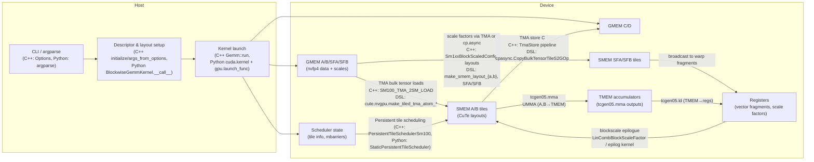
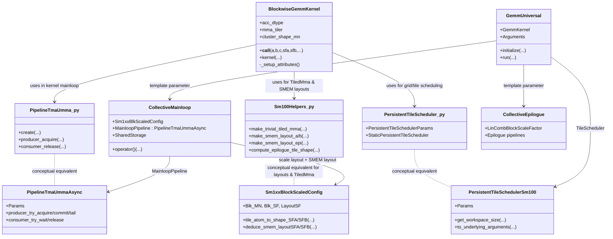

Blackwell Blockwise GEMM: CuTe DSL ↔ CUTLASS C++
=================================================

This document traces, frame‑by‑frame, two implementations of a Blackwell NVFP4 block‑scaled GEMM:

- CUTLASS C++ example `72b_blackwell_nvfp4_nvfp4_gemm.cu`, which instantiates a `GemmUniversal` kernel using block‑scaled UMMA collectives.
- CuTe DSL example `blockwise_gemm.py`, which implements `BlockwiseGemmKernel` in Python and JIT‑compiles it to the same class of SM100 instructions (`tcgen05.mma`, TMA, TMEM, persistent tile scheduler).

We show:

- The execution traces for each implementation (host → kernel → mainloop/epilogue).
- A mapping from CuTe DSL constructs to their CuTe / CUTLASS C++ counterparts.
- How the DSL pipeline lowers to MLIR/NVVM/PTX that closely resembles the C++ kernel.
- Commentary on performance trade‑offs between the two approaches.

All paths and line numbers are relative to the repo root (`/home/jeromeku/cutlass`).

-----------------------------------------------------------------------
Big picture and key files
-----------------------------------------------------------------------

- **C++ example (NVFP4 block‑scaled GEMM)**
  - Example entry: [`examples/72_blackwell_narrow_precision_gemm/72b_blackwell_nvfp4_nvfp4_gemm.cu#L94`](../examples/72_blackwell_narrow_precision_gemm/72b_blackwell_nvfp4_nvfp4_gemm.cu#L94)
    - Type aliases, `GemmKernel` and `Gemm` typedefs, host testbed (`Options`, `initialize`, `args_from_options`, `run`, `main`).
  - Block‑scaled layouts and scale‑factor config:
    - [`include/cutlass/detail/sm100_blockscaled_layout.hpp#L62`](../include/cutlass/detail/sm100_blockscaled_layout.hpp#L62) – `Sm1xxBlockScaledConfig<SFVecSize>`.
  - Mainloop builder and pipeline wiring:
    - [`include/cutlass/gemm/collective/collective_builder.hpp#L32`](../include/cutlass/gemm/collective/collective_builder.hpp#L32) – includes all SM100 builders.
    - [`include/cutlass/gemm/collective/builders/sm100_blockscaled_umma_builder.inl#L160`](../include/cutlass/gemm/collective/builders/sm100_blockscaled_umma_builder.inl#L160) – chooses TMA copy atoms, SMEM layouts, and pipeline storage for A/B/SF.
    - [`include/cutlass/gemm/collective/sm100_blockscaled_mma_warpspecialized.hpp#L196`](../include/cutlass/gemm/collective/sm100_blockscaled_mma_warpspecialized.hpp#L196) – `MainloopPipeline = cutlass::PipelineTmaUmmaAsync<...>`, `SharedStorage`.
  - Kernel wrapper and scheduler:
    - [`include/cutlass/gemm/kernel/gemm_universal.hpp#L32`](../include/cutlass/gemm/kernel/gemm_universal.hpp#L32) – includes SM100 GEMM kernels.
    - [`include/cutlass/gemm/kernel/sm100_gemm_tma_warpspecialized.hpp`](../include/cutlass/gemm/kernel/sm100_gemm_tma_warpspecialized.hpp) – warp‑specialized SM100 GEMM kernel using the blockscaled mainloop.
    - [`include/cutlass/gemm/kernel/tile_scheduler.hpp#L36`](../include/cutlass/gemm/kernel/tile_scheduler.hpp#L36) – selects `PersistentTileSchedulerSm100` for SM100 kernels.
  - Device adapter:
    - [`include/cutlass/gemm/device/gemm_universal_adapter.h`](../include/cutlass/gemm/device/gemm_universal_adapter.h) – host‐side `GemmUniversalAdapter` wrapper (`initialize`, `run`, workspace handling).

- **CuTe DSL example (blockwise GEMM, Python)**
  - User‑facing kernel and harness:
    - [`examples/python/CuTeDSL/blackwell/blockwise_gemm/blockwise_gemm.py#L112`](../examples/python/CuTeDSL/blackwell/blockwise_gemm/blockwise_gemm.py#L112) – `class BlockwiseGemmKernel`.
      - `__init__` (`#L151`) – kernel configuration (MMA tiler, cluster shape, warp roles).
      - `_setup_attributes` (`#L242`) – builds `TiledMma`, CTA tile shape, cluster layout, shared‑memory layouts, stage counts.
      - `__call__` (decorated with `@cute.jit`, `#L384`) – host JIT stub: builds TMA atoms, tensor views, tile scheduler params, shared storage type; launches `kernel`.
      - `kernel` (decorated with `@cute.kernel`, `#L625`) – GPU kernel; sets up pipelines, persistent scheduling, TMA loads, UMMA compute, scale application, epilogue, TMA stores.
    - CLI and benchmarking harness:
      - `run` (`#L2618`) – creates tensors, instantiates `BlockwiseGemmKernel`, calls `cute.compile`, launches the kernel, verifies reference, benchmarks.
      - `if __name__ == "__main__":` (`#L2821`) – argument parsing and call to `run`.
  - CuTe DSL front‑end:
    - [`python/CuTeDSL/cutlass/cute/__init__.py#L96`](../python/CuTeDSL/cutlass/cute/__init__.py#L96) – `jit = _dsl.CuTeDSL.jit`, `kernel = _dsl.CuTeDSL.kernel`, `compile = _dsl.CompileCallable()`.
    - [`python/CuTeDSL/cutlass/base_dsl/dsl.py#L273`](../python/CuTeDSL/cutlass/base_dsl/dsl.py#L273) – `BaseDSL`, `jit`, `kernel`, `jit_runner`, MLIR function generation (`generate_mlir`, `generate_execution_arguments`).
    - [`python/CuTeDSL/cutlass/cutlass_dsl/cutlass.py#L200`](../python/CuTeDSL/cutlass/cutlass_dsl/cutlass.py#L200) – `CutlassBaseDSL`: GPU module construction, pipeline string (`cute-to-nvvm{...}`), CUDA kernel launch lowering.
  - Blackwell‑specific helpers and pipelines:
    - [`python/CuTeDSL/cutlass/utils/blackwell_helpers.py#L661`](../python/CuTeDSL/cutlass/utils/blackwell_helpers.py#L661) – `make_smem_layout_a/b`, `make_smem_layout_epi`, `make_trivial_tiled_mma`, `make_blockscaled_trivial_tiled_mma`, `compute_epilogue_tile_shape`, TMA atom selection.
    - [`python/CuTeDSL/cutlass/pipeline/sm100.py#L33`](../python/CuTeDSL/cutlass/pipeline/sm100.py#L33) – `PipelineTmaUmma`, `PipelineAsyncUmma`, `PipelineUmmaAsync`.
    - [`python/CuTeDSL/cutlass/utils/static_persistent_tile_scheduler.py#L56`](../python/CuTeDSL/cutlass/utils/static_persistent_tile_scheduler.py#L56) – `PersistentTileSchedulerParams`, `StaticPersistentTileScheduler`.

- **Background CuTe DSL docs**
  - TensorSSA and JIT pipeline: [`codex/tensorssa.md`](../codex/tensorssa.md).
  - Hopper GEMM DSL ↔ C++ mapping: [`codex/cuteDSL_cpp.md`](../codex/cuteDSL_cpp.md).
  - Deep SM100 GEMM C++ trace: [`claude/blackwell-narrow-precision-gemm/DEEP_EXECUTION_TRACE.md`](../claude/blackwell-narrow-precision-gemm/DEEP_EXECUTION_TRACE.md).

-----------------------------------------------------------------------
Call‑chain overview (both implementations)
-----------------------------------------------------------------------

```mermaid
sequenceDiagram
    autonumber

    box C++ Path
      participant CxxBin as 72b_blackwell_nvfp4_nvfp4_gemm (C++)
      participant MainC as main()
      participant RunC as run<Gemm>()
      participant GemmDev as GemmUniversalAdapter
      participant KernelC as GemmKernel (__global__)
      participant MainloopC as CollectiveMainloop<br/>(blockscaled UMMA)
      participant EpiC as CollectiveEpilogue
    end

    box DSL Path
      participant Py as blockwise_gemm.py
      participant RunPy as run()
      participant DSL as CuTeDSL.jit/kernel
      participant HostStub as BlockwiseGemmKernel.__call__
      participant KernelPy as BlockwiseGemmKernel.kernel
      participant MLIR as MLIR cute/nvgpu
      participant NVVM as NVVM/PTX + CUDA driver
    end

    %% C++ path
    CxxBin->>MainC: parse argv, device checks<br/>(main())
    MainC->>RunC: Options options; run<Gemm>(options)
    RunC->>RunC: initialize(options)<br/>(alloc & fill HostTensor)
    RunC->>RunC: args_from_options(options)<br/>(Gemm::Arguments)
    RunC->>GemmDev: Gemm gemm; gemm.initialize(args, workspace)
    RunC->>GemmDev: gemm.run()
    GemmDev->>KernelC: launch __global__ GemmKernel<<<grid,block,cluster,smem>>>()
    KernelC->>MainloopC: mainloop(params.mainloop,...)
    KernelC->>EpiC: epilogue(params.epilogue,...)

    %% DSL path
    Py->>RunPy: run(..., args)
    RunPy->>RunPy: create_tensors(...) (torch + CuTe runtime)
    RunPy->>HostStub: gemm = BlockwiseGemmKernel(...config...)
    RunPy->>DSL: cute.compile(gemm, a,b,c,sfa,sfb,max_clusters,stream)
    DSL->>MLIR: generate func.func + cuda.kernel<br/>(jit, kernel)
    MLIR->>NVVM: cute-to-nvvm{cubin-format=bin...}
    NVVM-->>DSL: compiled_gemm (JIT handle)
    RunPy->>compiled_gemm: compiled_gemm(a,b,c,sfa,sfb,stream)
    compiled_gemm->>HostStub: BlockwiseGemmKernel.__call__(...)
    HostStub->>KernelPy: self.kernel(...).launch(grid,block,cluster,smem,stream)
    KernelPy->>MLIR: cute/nvgpu ops (TMA, UMMA,<br/>pipelines, TMEM, TMA store)
    MLIR->>NVVM: lower to NVVM + PTX
    NVVM-->>Py: execute kernel on GPU
```

At a high level, both paths:

- Build **layout and tensor descriptors** for A/B/C/SF:
  - C++ via CuTe C++ functions like `cute::make_layout`, `cute::make_tensor`, `Sm1xxBlockScaledConfig::tile_atom_to_shape_*`.
  - DSL via CuTe DSL ops `cute.make_layout`, `cute.make_tensor`, `sm100_utils.make_smem_layout_*`, `make_trivial_tiled_mma`.
- Configure **persistent tile scheduling**:
  - C++ via `PersistentTileSchedulerSm100` selected in [`tile_scheduler.hpp`](../include/cutlass/gemm/kernel/tile_scheduler.hpp#L120).
  - DSL via `StaticPersistentTileScheduler` and `PersistentTileSchedulerParams` ([`static_persistent_tile_scheduler.py#L56`](../python/CuTeDSL/cutlass/utils/static_persistent_tile_scheduler.py#L56)).
- Wire **TMA ↔ UMMA pipelines**:
  - C++ via `cutlass::PipelineTmaUmmaAsync` (`MainloopPipeline`) and its `SharedStorage` ([`sm100_blockscaled_mma_warpspecialized.hpp#L196`](../include/cutlass/gemm/collective/sm100_blockscaled_mma_warpspecialized.hpp#L196)).
  - DSL via `PipelineTmaUmma` ([`pipeline/sm100.py#L33`](../python/CuTeDSL/cutlass/pipeline/sm100.py#L33)) and the `SharedStorage` `@cute.struct` in `BlockwiseGemmKernel.__call__` ([`blockwise_gemm.py#L537`](../examples/python/CuTeDSL/blackwell/blockwise_gemm/blockwise_gemm.py#L537)).

-----------------------------------------------------------------------
Dataflow overview (GMEM/SMEM/TMEM) – C++ and DSL
-----------------------------------------------------------------------



Both implementations stage A/B tiles and scale factors in shared memory, accumulate into tensor memory (TMEM) via `tcgen05.mma`, then read TMEM back, apply block‑wise scales in the epilogue, and TMA‑store the result to global memory. The Python DSL version does this explicitly in Python with CuTe DSL objects; the C++ version does it through CUTLASS collectives and their CuTe templates.

-----------------------------------------------------------------------
Class relationships: DSL vs C++ primitives
-----------------------------------------------------------------------



The rest of the document makes these relationships concrete by walking the actual call paths and showing code on both sides.

-----------------------------------------------------------------------
Trace 1 – C++ NVFP4 block‑scaled GEMM (`72b_blackwell_nvfp4_nvfp4_gemm.cu`)
-----------------------------------------------------------------------

### Frame C1: Kernel type configuration and aliases

Location: [`72b_blackwell_nvfp4_nvfp4_gemm.cu#L94`](../examples/72_blackwell_narrow_precision_gemm/72b_blackwell_nvfp4_nvfp4_gemm.cu#L94)

```cpp
// Element and layout configuration
using         ElementA    = cutlass::nv_float4_t<cutlass::float_e2m1_t>;
using         LayoutATag  = cutlass::layout::RowMajor;
constexpr int AlignmentA  = 32;

using         ElementB    = cutlass::nv_float4_t<cutlass::float_e2m1_t>;
using         LayoutBTag  = cutlass::layout::ColumnMajor;
constexpr int AlignmentB  = 32;

using         ElementD    = cutlass::float_e2m1_t;
using         ElementSFD  = cutlass::float_ue8m0_t;
using         ElementC    = float;
using         LayoutCTag  = cutlass::layout::RowMajor;
using         LayoutDTag  = cutlass::layout::RowMajor;
```

- `ElementA/B` are NVFP4 vector types (`nv_float4_t<float_e2m1_t>`), matching the Python example’s `ab_dtype=cutlass.Float8E4M3FN` but with a block‑scaled FP4 representation.
- `LayoutATag` / `LayoutBTag` encode `RowMajor`/`ColumnMajor`; the DSL mirrors this via `LayoutEnum.from_tensor(a/b)` ([`blockwise_gemm.py#L427`](../examples/python/CuTeDSL/blackwell/blockwise_gemm/blockwise_gemm.py#L427)).
- `ElementC`, `ElementD`, and `ElementSFD` match the output and scale‑factor element types; the DSL’s `c_dtype` and `scale_dtype` are chosen similarly from CLI arguments (`run(..., c_dtype, scale_dtype)` in [`blockwise_gemm.py#L2618`](../examples/python/CuTeDSL/blackwell/blockwise_gemm/blockwise_gemm.py#L2618)).

The GEMM kernel wiring:

```cpp
using ArchTag       = cutlass::arch::Sm100;
using OperatorClass = cutlass::arch::OpClassBlockScaledTensorOp;
using MmaTileShape  = Shape<_128,_128,_256>;
using ClusterShape  = Shape<_1,_1,_1>;

using FusionOperation = cutlass::epilogue::fusion::LinCombBlockScaleFactor<
    OutputSFVectorSize, ElementD, ElementCompute,
    ElementSFD, LayoutSFDTag,
    ElementC>;

using CollectiveEpilogue = typename cutlass::epilogue::collective::CollectiveBuilder<...>::CollectiveOp;
using CollectiveMainloop = typename cutlass::gemm::collective::CollectiveBuilder<...>::CollectiveOp;

using GemmKernel = cutlass::gemm::kernel::GemmUniversal<
    Shape<int,int,int,int>, CollectiveMainloop, CollectiveEpilogue, void>;
using Gemm = cutlass::gemm::device::GemmUniversalAdapter<GemmKernel>;
```

- `CollectiveMainloop` and `CollectiveEpilogue` are fully specified by `ArchTag`, `OperatorClass`, element/layout types, and `MmaTileShape`.
- The **builder** (`CollectiveBuilder`) picks `sm100_blockscaled_umma_builder.inl` for the mainloop:
  - It defines `Sm1xxBlkScaledConfig = cutlass::detail::Sm1xxBlockScaledConfig<SFVectorSize>` ([`sm100_blockscaled_umma_builder.inl#L173`](../include/cutlass/gemm/collective/builders/sm100_blockscaled_umma_builder.inl#L173)).
  - It computes SMEM layouts for A/B/SF via `Sm1xxBlkScaledConfig::deduce_smem_layoutSFA/SFB` and `sm100_smem_selector` ([`sm100_blockscaled_umma_builder.inl#L213`](../include/cutlass/gemm/collective/builders/sm100_blockscaled_umma_builder.inl#L213)).
- The **epilogue** uses `LinCombBlockScaleFactor` to apply scale factors and write `ElementD` and `ElementSFD`.

This is exactly what the DSL reproduces in Python using `make_trivial_tiled_mma` + `make_smem_layout_a/b/epi` and a hand‑written epilogue over TMEM.

### Frame C2: Host testbed and problem setup

Location: `Options` and `initialize` in [`72b_blackwell_nvfp4_nvfp4_gemm.cu#L229`](../examples/72_blackwell_narrow_precision_gemm/72b_blackwell_nvfp4_nvfp4_gemm.cu#L229).

Key steps:

- `Options` parses CLI arguments (`--m`, `--n`, `--k`, `--alpha`, `--beta`, `--swizzle`, `--iterations`) and computes GFLOP/s.
- `initialize(const Options&)`:
  - Computes **strides** using CuTe helpers, mirroring the DSL’s `make_layout` and `make_tensor`:

    ```cpp
    stride_A = cutlass::make_cute_packed_stride(StrideA{}, {options.m, options.k, 1});
    layout_A = make_layout(make_shape(options.m, options.k, 1), stride_A);
    // similarly layout_B/C/D
    layout_SFA = Sm1xxBlkScaledConfig::tile_atom_to_shape_SFA(
        cute::make_shape(options.m, options.n, options.k, 1));
    layout_SFB = Sm1xxBlkScaledConfig::tile_atom_to_shape_SFB(
        cute::make_shape(options.m, options.n, options.k, 1));
    ```

    The DSL computes the same logical shapes via:

    - `tiled_mma.partition_shape_A/B` and `make_smem_layout_a/b` ([`blackwell_helpers.py#L661`](../python/CuTeDSL/cutlass/utils/blackwell_helpers.py#L661)).
    - `sfa_smem_layout_staged` / `sfb_smem_layout_staged` ([`blockwise_gemm.py#L356`](../examples/python/CuTeDSL/blackwell/blockwise_gemm/blockwise_gemm.py#L356)).

  - Allocates `HostTensor` buffers for A/B/C/D/SF and fills them with random values using `initialize_block` and `TensorFillRandomUniform`.
  - Copies host data to device (`block_A.sync_device()`, etc.).

### Frame C3: Packing `Gemm::Arguments`

Location: [`72b_blackwell_nvfp4_nvfp4_gemm.cu#L410`](../examples/72_blackwell_narrow_precision_gemm/72b_blackwell_nvfp4_nvfp4_gemm.cu#L410)

```cpp
typename Gemm::Arguments args_from_options(const Options &options) {
  typename Gemm::Arguments arguments {
    cutlass::gemm::GemmUniversalMode::kGemm,
    {options.m, options.n, options.k, 1},
    { // Mainloop arguments
      block_A.device_data(), stride_A,
      block_B.device_data(), stride_B,
      block_SFA.device_data(), layout_SFA,
      block_SFB.device_data(), layout_SFB
    },
    { // Epilogue arguments
      { options.alpha, options.beta },
      block_C.device_data(), stride_C,
      block_D.device_data(), stride_D
    }
  };

  if constexpr (IsBlockScaleSupported) {
    arguments.epilogue.thread.block_scale_factor_ptr = block_SFD.device_data();
    arguments.epilogue.thread.norm_constant_ptr      = block_Normconst.device_data();
  }

  arguments.scheduler.max_swizzle_size = options.swizzle;
  return arguments;
}
```

- The **mainloop args** pack GMEM pointers and CuTe layouts/strides for A/B/SFA/SFB, which the mainloop collective will interpret as `cute::Tensor` objects internally.
- The **epilogue args** pass scalars (`alpha`, `beta`) and GMEM pointers for C/D, plus scale‑factor output and norm constant when enabled.
- `arguments.scheduler.max_swizzle_size` configures the SM100 persistent tile scheduler; the DSL exposes a similar knob via `swizzle` in `PersistentTileSchedulerParams` (the Blackwell examples currently call it with the default).

The DSL builds an equivalent argument struct in `BlockwiseGemmKernel.__call__`:

- A/B/SF GMEM `cute.Tensor` wrappers (`a`, `b`, `sfa`, `sfb`) plus SMEM layouts.
- C GMEM tensor and epilogue tiler `epi_tile`.
- Tile scheduler params (`self.tile_sched_params`) and `max_active_clusters`.

### Frame C4: `run<Gemm>` and `GemmUniversalAdapter`

Location: [`72b_blackwell_nvfp4_nvfp4_gemm.cu#L485`](../examples/72_blackwell_narrow_precision_gemm/72b_blackwell_nvfp4_nvfp4_gemm.cu#L485)

```cpp
template <typename Gemm>
int run(Options &options) {
  initialize(options);
  Gemm gemm;                                // GemmUniversalAdapter<GemmKernel>
  auto arguments = args_from_options(options);

  size_t workspace_size = Gemm::get_workspace_size(arguments);
  cutlass::device_memory::allocation<uint8_t> workspace(workspace_size);

  CUTLASS_CHECK(gemm.can_implement(arguments));
  CUTLASS_CHECK(gemm.initialize(arguments, workspace.get()));
  CUTLASS_CHECK(gemm.run());
  cudaDeviceSynchronize();

  Result result;
  result.passed = verify(options);
  ...
}
```

- `Gemm::get_workspace_size` queries:
  - Epilogue workspace (for CLC, tile metadata, etc.).
  - Tile scheduler workspace (persistent scheduler state, fixup barriers).
- `gemm.initialize` populates underlying kernel params and launches any setup work (e.g., building tensor maps).
- `gemm.run` launches the SM100 GEMM kernel (`GemmKernel`) with:
  - `CollectiveMainloop` instance for the UMMA/TMA mainloop.
  - `CollectiveEpilogue` for TMEM load + epilogue + TMA store.
  - `TileScheduler` for persistent tiling.

The Python DSL mirrors this pattern:

- `cute.compile(gemm, a,b,c,sfa,sfb,max_active_clusters,stream)` ([`blockwise_gemm.py#L2710`](../examples/python/CuTeDSL/blackwell/blockwise_gemm/blockwise_gemm.py#L2710)):
  - Creates an MLIR `gpu.module` with a `cuda.kernel` for `BlockwiseGemmKernel.kernel`.
  - Builds an MLIR `func.func` host stub for `BlockwiseGemmKernel.__call__`.
  - Runs the `cute-to-nvvm{cubin-format=bin ...}` pipeline ([`cutlass.py#L214`](../python/CuTeDSL/cutlass/cutlass_dsl/cutlass.py#L214)) to produce a CUBIN/PTX.
- The returned `compiled_gemm` object encapsulates **both** initialization and launch; subsequent calls reuse the compiled kernel, akin to reusing `GemmUniversalAdapter` across launches.

### Frame C5: Device kernel – mainloop, pipelines, and scheduler

The full SM100 GEMM kernel is implemented in `sm100_gemm_tma_warpspecialized.hpp` and the block‑scaled mainloop in `sm100_blockscaled_mma_warpspecialized.hpp`. The relevant pieces:

- `MainloopPipeline = cutlass::PipelineTmaUmmaAsync<DispatchPolicy::Stages, ClusterShape, AtomThrShapeMNK>` ([`sm100_blockscaled_mma_warpspecialized.hpp#L196`](../include/cutlass/gemm/collective/sm100_blockscaled_mma_warpspecialized.hpp#L196)).
  - Backed by `PipelineTmaUmmaAsync` in [`include/cutlass/pipeline/sm100_pipeline.hpp`](../include/cutlass/pipeline/sm100_pipeline.hpp).
  - Provides `producer_try_acquire/producer_acquire` for TMA producers and `consumer_try_wait/consumer_release` for UMMA consumers.
- `SharedStorage` couples **tensor buffers** and **pipeline state**:

  ```cpp
  struct SharedStorage {
    struct TensorStorage : cute::aligned_struct<128, _0> {
      cute::ArrayEngine<SmemAllocTypeA, cute::cosize_v<SmemLayoutA>> smem_A;
      cute::ArrayEngine<SmemAllocTypeB, cute::cosize_v<SmemLayoutB>> smem_B;
      cute::ArrayEngine<ElementSF, cute::cosize_v<SmemLayoutSFA>> smem_SFA;
      cute::ArrayEngine<ElementSF, cute::cosize_v<SmemLayoutSFB>> smem_SFB;
    } tensors;

    using PipelineStorage = typename MainloopPipeline::SharedStorage;
    PipelineStorage pipeline;
  };
  ```

  This is structurally the same as the DSL’s `SharedStorage` `@cute.struct` (see next section).

- Within `GemmKernel` (`sm100_gemm_tma_warpspecialized.hpp`):
  - `CollectiveMainloop` constructs its own `MainloopPipeline` over `shared_storage.pipelines.mainloop`.
  - Warp roles (`WarpCategory::MainloopLoad`, `WarpCategory::MMA`, `WarpCategory::EpilogueLoad`, `WarpCategory::Epilogue`) are assigned similarly to the DSL’s `acc_update_warp_id`, `epilog_warp_id`, `mma_warp_id`, `tma_warp_id`, `scale_warp_id`, `sched_warp_id` in [`blockwise_gemm.py#L191`](../examples/python/CuTeDSL/blackwell/blockwise_gemm/blockwise_gemm.py#L191).
  - The persistent tile scheduler is instantiated via `TileSchedulerSelector<..., arch::Sm100>` ([`tile_scheduler.hpp#L120`](../include/cutlass/gemm/kernel/tile_scheduler.hpp#L120)) and drives which M,N,L tile each CTA processes.

For a deep, instruction‑by‑instruction trace of the C++ kernel (TMEM allocation, load/compute/store warp behavior, epilogue pipeline), see [`DEEP_EXECUTION_TRACE.md`](../claude/blackwell-narrow-precision-gemm/DEEP_EXECUTION_TRACE.md), which focuses on the same SM100 GEMM building blocks.

-----------------------------------------------------------------------
Trace 2 – CuTe DSL `BlockwiseGemmKernel` (`blockwise_gemm.py`)
-----------------------------------------------------------------------

### Frame P1: Host harness and kernel object construction

Location: [`blockwise_gemm.py#L2618`](../examples/python/CuTeDSL/blackwell/blockwise_gemm/blockwise_gemm.py#L2618)

```python
def run(mnkl, ab_dtype, c_dtype, acc_dtype, scale_dtype,
        a_major, b_major, c_major,
        mma_tiler_mn, cluster_shape_mn,
        use_2cta_instrs, tolerance,
        warmup_iterations=0, iterations=1,
        skip_ref_check=False, use_cold_l2=False):
    ...
    (a_tensor, b_tensor, c_tensor,
     sfa_tensor, sfb_tensor, ..., c_torch_gpu) = create_tensors(...)

    # Configure GEMM kernel
    gemm = BlockwiseGemmKernel(acc_dtype, use_2cta_instrs,
                               mma_tiler_mn, cluster_shape_mn)

    hardware_info = cutlass.utils.HardwareInfo()
    max_active_clusters = hardware_info.get_max_active_clusters(
        cluster_shape_mn[0] * cluster_shape_mn[1])

    torch_stream = torch.cuda.current_stream()
    current_stream = cuda.CUstream(torch_stream.cuda_stream)

    compiled_gemm = cute.compile(
        gemm,
        a_tensor, b_tensor, c_tensor, sfa_tensor, sfb_tensor,
        max_active_clusters, current_stream,
    )
    compiled_gemm(a_tensor, b_tensor, c_tensor, sfa_tensor, sfb_tensor, current_stream)
```

Key points:

- `create_tensors` uses `cutlass.torch.matrix` and `cutlass_torch.cute_tensor_like` to create **runtime** CuTe tensors (`cutlass.cute.runtime._Tensor`) that own device pointers and layout metadata.
- `BlockwiseGemmKernel` is the Python analogue of a CUTLASS C++ kernel configuration:
  - Stores `acc_dtype`, tile and cluster shapes, warp IDs, register budgets, SMEM/TMEM capacity, and named barriers.
  - Roughly corresponds to the combination of `GemmKernel`, `CollectiveMainloop`, `CollectiveEpilogue`, and SMEM/TMEM helper structs in C++.
- `cute.compile` triggers the CuTe DSL JIT:
  - Uses `CuTeDSL.jit` (`cute.jit`) and `CuTeDSL.kernel` (`cute.kernel`) paths described in [`tensorssa.md`](../codex/tensorssa.md) and [`cuteDSL_cpp.md`](../codex/cuteDSL_cpp.md).
  - Produces a CUBIN/PTX for `BlockwiseGemmKernel.kernel` plus a host stub that calls `BlockwiseGemmKernel.__call__`.

### Frame P2: Kernel configuration (`__init__`)

Location: [`blockwise_gemm.py#L151`](../examples/python/CuTeDSL/blackwell/blockwise_gemm/blockwise_gemm.py#L151)

```python
class BlockwiseGemmKernel:
    def __init__(self,
                 acc_dtype: Type[cutlass.Numeric],
                 use_2cta_instrs: bool,
                 mma_tiler_mn: Tuple[int, int],
                 cluster_shape_mn: Tuple[int, int]):
        self.acc_dtype = acc_dtype
        self.use_2cta_instrs = use_2cta_instrs
        self.cluster_shape_mn = cluster_shape_mn
        self.mma_tiler = (*mma_tiler_mn, 1)      # K filled in later
        self.cta_group = (
            tcgen05.CtaGroup.TWO if use_2cta_instrs else tcgen05.CtaGroup.ONE
        )
        self.occupancy = 1
        # Warp specialization
        self.acc_update_warp_id = (0, 1, 2, 3)
        self.epilog_warp_id     = (4, 5, 6, 7)
        self.mma_warp_id        = 8
        self.tma_warp_id        = 9
        self.scale_warp_id      = 10
        self.sched_warp_id      = 11
        self.threads_per_warp = 32
        self.threads_per_cta = self.threads_per_warp * len(
            (*self.acc_update_warp_id, *self.epilog_warp_id,
             self.mma_warp_id, self.tma_warp_id,
             self.scale_warp_id, self.sched_warp_id)
        )
        ...
        self.epilog_sync_barrier = pipeline.NamedBarrier(
            barrier_id=1, num_threads=32 * len(self.epilog_warp_id))
        self.tmem_alloc_barrier = pipeline.NamedBarrier(
            barrier_id=2,
            num_threads=32 * len((self.mma_warp_id,
                                  *self.epilog_warp_id,
                                  *self.acc_update_warp_id)))
        self.sched_sync_barrier = pipeline.NamedBarrier(
            barrier_id=3, num_threads=self.threads_per_warp)
        self.num_smem_capacity = utils.get_smem_capacity_in_bytes("sm_100")
        self.tmem_final_offset = 384
```

This mirrors the C++ kernel’s warp categories and barriers:

- Warp IDs map to roles just like `WarpCategory::{MMA, MainloopLoad, EpilogueLoad, Epilogue, Sched}` in the SM100 GEMM kernel.
- `NamedBarrier` corresponds to C++ `mbarrier` arrays in `PipelineTmaUmmaAsync::SharedStorage` and epilogue pipelines.
- `num_smem_capacity` is the SM’s per‑CTA SMEM capacity; C++ uses the same value via `sm100_smem_capacity_bytes` when computing stage counts.

### Frame P3: Attribute setup (`_setup_attributes`)

Location: [`blockwise_gemm.py#L242`](../examples/python/CuTeDSL/blackwell/blockwise_gemm/blockwise_gemm.py#L242)

```python
def _setup_attributes(self):
    # 1) Configure tiled MMA (tcgen05)
    tiled_mma = sm100_utils.make_trivial_tiled_mma(
        self.a_dtype, self.a_major_mode, self.b_major_mode,
        self.acc_dtype, self.cta_group, self.mma_tiler[:2],
    )

    # 2) Compute mma/cluster/tile shapes
    mma_inst_shape_k = cute.size(tiled_mma.shape_mnk, mode=[2])
    mma_inst_tile_k = 4
    self.mma_tiler = (
        self.mma_tiler[0],
        self.mma_tiler[1],
        mma_inst_shape_k * mma_inst_tile_k,
    )
    self.cta_tile_shape_mnk = (
        self.mma_tiler[0] // cute.size(tiled_mma.thr_id.shape),
        self.mma_tiler[1],
        self.mma_tiler[2],
    )

    # 3) Cluster layout (vmnk)
    self.cluster_layout_vmnk = cute.tiled_divide(
        cute.make_layout((*self.cluster_shape_mn, 1)),
        (tiled_mma.thr_id.shape,),
    )

    # 4) Scale granularity and tiles
    self.scale_granularity_m = 1
    self.scale_granularity_n = 128
    self.scale_granularity_k = 128
    self.scale_m_per_tile = self.cta_tile_shape_mnk[0] // self.scale_granularity_m
    self.scale_n_per_tile = self.cta_tile_shape_mnk[1] // self.scale_granularity_n
    self.scale_k_per_tile = self.cta_tile_shape_mnk[2] // self.scale_granularity_k
    ...

    # 5) Stage counts
    (self.num_acc_stage, self.num_ab_stage,
     self.num_c_stage, self.num_scale_stage,
     self.num_tile_stage) = self._compute_stages(
        tiled_mma, self.mma_tiler,
        self.a_dtype, self.b_dtype,
        self.epi_tile, self.c_dtype, self.c_layout,
        self.sfa_dtype, self.sfb_dtype,
        self.scale_m_per_tile * self.scale_k_per_tile,
        self.scale_n_per_tile * self.scale_k_per_tile,
        self.num_smem_capacity, self.occupancy,
    )

    # 6) SMEM layouts
    self.a_smem_layout_staged = sm100_utils.make_smem_layout_a(
        tiled_mma, self.mma_tiler, self.a_dtype, self.num_ab_stage)
    self.b_smem_layout_staged = sm100_utils.make_smem_layout_b(
        tiled_mma, self.mma_tiler, self.b_dtype, self.num_ab_stage)
    self.c_smem_layout_staged = sm100_utils.make_smem_layout_epi(
        self.c_dtype, self.c_layout, self.epi_tile, self.num_c_stage)
    self.sfa_smem_layout_staged = cute.make_layout(
        ((self.scale_granularity_m, self.scale_m_per_tile),
         (self.scale_granularity_k, self.scale_k_per_tile),
         self.num_scale_stage),
        stride=((0, self.scale_k_per_tile),
                (0, 1),
                self.scale_k_per_tile * self.scale_m_per_tile),
    )
    self.sfb_smem_layout_staged = cute.make_layout(
        ((self.scale_granularity_n, self.scale_n_per_tile),
         (self.scale_granularity_k, self.scale_k_per_tile),
         self.num_scale_stage),
        stride=((0, self.scale_k_per_tile),
                (0, 1),
                self.scale_k_per_tile * self.scale_n_per_tile),
    )
    self.num_tmem_alloc_cols = 512
```

How this maps to C++:

- `make_trivial_tiled_mma` ([`blackwell_helpers.py#L867`](../python/CuTeDSL/cutlass/utils/blackwell_helpers.py#L867)):
  - Chooses an SM100 `tcgen05` MMA op (`MmaFP8Op`, `MmaMXF4Op`, `MmaMXF4NVF4Op`, etc.) and wraps it in `cute.make_mma_atom`/`cute.make_tiled_mma`, producing a `cute.TiledMma` DSL object.
  - C++ analog: the builder picks a `TiledMma` type for UMMA instructions (e.g., `typename TiledMma = decltype(cute::make_tiled_mma(...))`) inside `sm100_blockscaled_umma_builder.inl`.
- `cta_tile_shape_mnk` and `cluster_layout_vmnk` directly mirror the C++ mainloop’s `TileShape_MNK` and `ClusterShape`:
  - In C++, they are template parameters (`TileShape`, `ClusterShape`) used when instantiating `CollectiveMainloop`.
  - In Python, they are computed at JIT‑time using DSL ops (`cute.size`, `cute.tiled_divide`) that emit MLIR `cute.size` / `cute.tiled_divide` instructions.
- The `sfa_smem_layout_staged` / `sfb_smem_layout_staged` layouts correspond to `Sm1xxBlockScaledConfig::deduce_smem_layoutSFA/SFB` ([`sm100_blockscaled_layout.hpp#L106`](../include/cutlass/detail/sm100_blockscaled_layout.hpp#L106)):
  - Both choose **basic blocks** with `(Blk_MN, Blk_SF)` shapes and tile them over M/N/K with a staging dimension.
  - The DSL explicitly constructs `make_layout` and strides to express the same tiling pattern, but in Python/MLIR instead of C++ templates.

### Frame P4: JIT entry (`__call__` with `@cute.jit`)

Location: [`blockwise_gemm.py#L384`](../examples/python/CuTeDSL/blackwell/blockwise_gemm/blockwise_gemm.py#L384)

`BlockwiseGemmKernel.__call__` is a **host** function that:

1. Binds runtime tensor types and layouts:

   ```python
   self.a_dtype = a.element_type
   self.b_dtype = b.element_type
   self.c_dtype = c.element_type
   self.sfa_dtype = sfa.element_type
   self.sfb_dtype = sfb.element_type
   self.a_major_mode = utils.LayoutEnum.from_tensor(a).mma_major_mode()
   self.b_major_mode = utils.LayoutEnum.from_tensor(b).mma_major_mode()
   self.c_layout     = utils.LayoutEnum.from_tensor(c)
   ```

   The CuTe DSL JIT (`@cute.jit`) tracks these values either as static attributes or dynamic MLIR values depending on whether they are `Constexpr`/`Integer`/`IntTuple`. This is conceptually the same information the C++ builder uses at compile‑time.

2. Re‑runs `_setup_attributes` to specialize to this problem’s shapes and dtypes.

3. Creates TMA load/store atoms and staged SMEM tensors:

   ```python
   a_op = self._get_tma_atom_kind(atom_thr_size, self.is_a_mcast)
   a_smem_layout = cute.slice_(self.a_smem_layout_staged, (None, None, None, 0))
   tma_atom_a, tma_tensor_a = cute.nvgpu.make_tiled_tma_atom_A(
       a_op, a, a_smem_layout, self.mma_tiler,
       tiled_mma, self.cluster_layout_vmnk.shape,
       internal_type=(cutlass.TFloat32 if a.element_type is cutlass.Float32 else None),
   )
   ...
   tma_atom_c, tma_tensor_c = cpasync.make_tiled_tma_atom(
       cpasync.CopyBulkTensorTileS2GOp(), c,
       epi_smem_layout, c_cta_v_layout,
   )
   ```

   - `make_tiled_tma_atom_A/B` emit MLIR ops in the `cute.nvgpu` dialect that encode SM100 TMA descriptors, analogous to C++ `SM100_TMA_2SM_LOAD` and friends chosen in `sm100_blockscaled_umma_builder.inl`.
   - `cpasync.make_tiled_tma_atom(CopyBulkTensorTileS2GOp, ...)` is the DSL counterpart of the C++ epilogue’s TMA store pipeline (`EpiStorePipeline` in `sm100_gemm_tma_warpspecialized.hpp`).

4. Re‑tensors SFA/SFB using the block‑scale layout computed in `_setup_attributes`:

   ```python
   tensor_sfa = cute.make_tensor(
       sfa.iterator,
       cute.make_layout(
           ((self.scale_granularity_m, sfa.shape[0]),
            (self.scale_granularity_k, sfa.shape[1]),
            sfa.shape[2]),
           stride=((0, sfa.layout.stride[0]),
                   (0, sfa.layout.stride[1]),
                   sfa.layout.stride[2]),
       ),
   )
   ```

5. Computes **persistent tile scheduler** params:

   ```python
   self.tile_sched_params, grid = self._compute_grid(
       c, self.cta_tile_shape_mnk, self.cluster_shape_mn, max_active_clusters
   )
   ```

   `_compute_grid` uses `PersistentTileSchedulerParams` and `StaticPersistentTileScheduler.get_grid_shape` ([`static_persistent_tile_scheduler.py#L231`](../python/CuTeDSL/cutlass/utils/static_persistent_tile_scheduler.py#L231)), mirroring the C++ `PersistentTileSchedulerSm100` interface.

6. Defines a `SharedStorage` struct in SMEM and launches the GPU kernel:

   ```python
   @cute.struct
   class SharedStorage:
       sInfo: cute.struct.Align[
           cute.struct.MemRange[cutlass.Int32, 4 * self.num_tile_stage], 1
       ]
       ab_mbar_ptr:    cute.struct.MemRange[cutlass.Int64, self.num_ab_stage * 2]
       scale_mbar_ptr: cute.struct.MemRange[cutlass.Int64, self.num_scale_stage * 2]
       acc_mbar_ptr:   cute.struct.MemRange[cutlass.Int64, self.num_acc_stage * 2]
       tile_info_mbar_ptr: cute.struct.MemRange[cutlass.Int64, self.num_tile_stage * 2]
       epi_mbar_ptr:   cute.struct.MemRange[cutlass.Int64, 1 * 2]
       tmem_dealloc_mbar_ptr: cutlass.Int64
       tmem_holding_buf:      cutlass.Int32
       sC:  cute.struct.Align[cute.struct.MemRange[self.c_dtype, c_smem_size], self.buffer_align_bytes]
       sA:  cute.struct.Align[cute.struct.MemRange[self.a_dtype, cute.cosize(self.a_smem_layout_staged.outer)], self.buffer_align_bytes]
       sB:  cute.struct.Align[cute.struct.MemRange[self.b_dtype, cute.cosize(self.b_smem_layout_staged.outer)], self.buffer_align_bytes]
       sSFA: cute.struct.Align[cute.struct.MemRange[self.sfa_dtype, cute.cosize(self.sfa_smem_layout_staged)], self.buffer_align_bytes]
       sSFB: cute.struct.Align[cute.struct.MemRange[self.sfb_dtype, cute.cosize(self.sfb_smem_layout_staged)], self.buffer_align_bytes]

   self.shared_storage = SharedStorage
   self.kernel(...).launch(grid=grid,
                           block=[self.threads_per_cta,1,1],
                           cluster=(*self.cluster_shape_mn,1),
                           smem=self.shared_storage.size_in_bytes(),
                           stream=stream,
                           min_blocks_per_mp=1)
   ```

This `SharedStorage` is the **DSL mirror** of the C++ `SharedStorage` struct in `sm100_blockscaled_mma_warpspecialized.hpp`, but expressed using CuTe’s `struct` DSL types instead of `aligned_struct`/`ArrayEngine`.

### Frame P5: Device kernel (`@cute.kernel`) – pipelines and persistent scheduling

Location: [`blockwise_gemm.py#L625`](../examples/python/CuTeDSL/blackwell/blockwise_gemm/blockwise_gemm.py#L625)

At a high level, the DSL kernel does the same three‑phase work as the C++ kernel:

1. **Mainloop load (TMA producers):**

   ```python
   warp_idx = cute.arch.warp_idx()
   warp_idx = cute.arch.make_warp_uniform(warp_idx)
   lane_idx = cute.arch.lane_idx()
   ...
   if warp_idx == self.tma_warp_id:
       cpasync.prefetch_descriptor(tma_atom_a)
       cpasync.prefetch_descriptor(tma_atom_b)
       cpasync.prefetch_descriptor(tma_atom_c)
   ...
   smem = utils.SmemAllocator()
   storage = smem.allocate(self.shared_storage)

   # Mainloop AB pipeline
   ab_pipeline_producer_group = pipeline.CooperativeGroup(pipeline.Agent.Thread)
   num_tma_producer = self.num_mcast_ctas_a + self.num_mcast_ctas_b - 1
   ab_pipeline_consumer_group = pipeline.CooperativeGroup(
       pipeline.Agent.Thread, num_tma_producer
   )
   ab_pipeline = pipeline.PipelineTmaUmma.create(
       barrier_storage=storage.ab_mbar_ptr.data_ptr(),
       num_stages=self.num_ab_stage,
       producer_group=ab_pipeline_producer_group,
       consumer_group=ab_pipeline_consumer_group,
       tx_count=self.num_tma_load_bytes,
       cta_layout_vmnk=cluster_layout_vmnk,
       defer_sync=True,
   )
   ```

   - This is the Python counterpart of `MainloopPipeline mainloop_pipeline(shared_storage.pipelines.mainloop, ...)` in C++.
   - `PipelineTmaUmma.create` wraps `PipelineAsync._make_sync_object` and emits MLIR for `mbarrier.init`, `arrive`, `wait`, etc. ([`pipeline/sm100.py#L101`](../python/CuTeDSL/cutlass/pipeline/sm100.py#L101)).

   The TMA load loop mirrors the C++ mainloop:

   ```python
   tAgA_slice = tAgA[(None, mma_tile_coord_mnl[0], None, mma_tile_coord_mnl[2])]
   tBgB_slice = tBgB[(None, mma_tile_coord_mnl[1], None, mma_tile_coord_mnl[2])]
   ...
   for k_tile in cutlass.range(0, k_tile_cnt, 1, unroll=1):
       tAgA_k = tAgA_slice[(None, ab_producer_state.count)]
       tBgB_k = tBgB_slice[(None, ab_producer_state.count)]
       tAsA_pipe = tAsA[(None, ab_producer_state.index)]
       tBsB_pipe = tBsB[(None, ab_producer_state.index)]

       tma_bar = ab_pipeline.producer_get_barrier(ab_producer_state)

       ab_pipeline.producer_acquire(ab_producer_state, peek_ab_empty_status)
       ...
       cute.copy(tma_atom_a, tAgA_k, tAsA_pipe,
                 tma_bar_ptr=tma_bar, mcast_mask=a_full_mcast_mask)
       cute.copy(tma_atom_b, tBgB_k, tBsB_pipe,
                 tma_bar_ptr=tma_bar, mcast_mask=b_full_mcast_mask)
   ...
   ab_pipeline.producer_tail(ab_producer_state)
   ```

   The `cute.copy` calls here are the DSL analogues of the C++ mainloop’s calls into `TmaCopy` atoms inside `CollectiveMainloop`.

2. **Scale load (SFA/SFB pipeline) and MMA compute:**

   - A dedicated **scale warp** (`warp_idx == self.scale_warp_id`) runs a `PipelineCpAsync` to stream SFA/SFB from GMEM into SMEM, using `cute.copy` with cp.async primitives.
   - MMA warps (`warp_idx == self.mma_warp_id`) run UMMA (`tcgen05.mma`) operations:

     ```python
     # In MMA warp: UMMA pipeline
     acc_pipeline = pipeline.PipelineUmmaAsync.create(
         barrier_storage=storage.acc_mbar_ptr.data_ptr(),
         num_stages=self.num_acc_stage,
         producer_group=acc_pipeline_producer_group,
         consumer_group=acc_pipeline_consumer_group,
         cta_layout_vmnk=cluster_layout_vmnk,
         defer_sync=True,
     )
     ...
     cute.copy(tiled_mma, tAsA_mma, tBsB_mma, tRT_rAcc)
     ```

   - `PipelineUmmaAsync` is the DSL analog of C++ `PipelineUmmaAsync` in `sm100_pipeline.hpp` and is used for TMEM async store/fence operations.

3. **Epilogue: TMEM → registers → SMEM → GMEM:**

   - Epilogue warps allocate TMEM, wait for accumulator buffers to be filled, and partition TMEM & SMEM tiles for vectorized load and store:

     ```python
     tmem.allocate(self.num_tmem_alloc_cols)
     tmem.wait_for_alloc()
     tmem_ptr = tmem.retrieve_ptr(self.acc_dtype)
     tCtAcc_base_ = cute.make_tensor(tmem_ptr, tCtAcc_fake.layout)
     tCtAcc_final = cute.make_tensor(
         tCtAcc_base_.iterator + self.tmem_final_offset,
         tCtAcc_base_.layout,
     )
     ...
     cute.copy(tiled_copy_t2r, tTR_tAcc_mn, tTR_rAcc)
     acc_vec = tiled_copy_r2s.retile(tTR_rAcc).load()
     acc_vec = epilogue_op(acc_vec.to(self.c_dtype))
     tRS_rC.store(acc_vec)
     ...
     cute.copy(tiled_copy_r2s, tRS_rC, tRS_sC[(None, None, None, c_buffer)])
     self.epilog_sync_barrier.arrive_and_wait()
     if warp_idx == self.epilog_warp_id[0]:
         cute.copy(tma_atom_c, bSG_sC[(None, c_buffer)],
                   bSG_gC[(None, subtile_idx)])
         c_pipeline.producer_commit()
     ```

   - This is the Python/DSL equivalent of:
     - `CollectiveEpilogue::apply` (reading TMEM, applying `LinCombBlockScaleFactor`, writing C to SMEM).
     - Epilogue pipelines (`EpiLoadPipeline`, `EpiStorePipeline`) in SM100 C++ kernels.

4. **Persistent tile scheduling in the kernel:**

   - Scheduler warps (`warp_idx == self.sched_warp_id`) use `StaticPersistentTileScheduler.create(...)` and a `tile_info` buffer in SMEM (via `sInfo`) to drive which CTAs and MMAs process which M/N tile, exactly like the C++ `PersistentTileSchedulerSm100`.

Taken together, the DSL kernel is a **direct structural translation** of CUTLASS’s SM100 mainloop and epilogue logic into Python + CuTe DSL, with almost one‑to‑one correspondence at the level of pipelines, SMEM layouts, TMEM usage, and warp roles.

-----------------------------------------------------------------------
CuTe DSL → CuTe C++ primitive map
-----------------------------------------------------------------------

The table below lists the most important DSL operations used in `BlockwiseGemmKernel` and their C++ equivalents:

| DSL construct | Location | C++ primitive | Location / notes |
|--------------|----------|---------------|------------------|
| `cute.make_layout(shape, stride)` | [`core.py#L335`](../python/CuTeDSL/cutlass/cute/core.py#L335) → `_pack_shape/_pack_stride` | `cute::make_layout(shape, stride)` | [`include/cute/layout.hpp#L332`](../include/cute/layout.hpp#L332) |
| `cute.make_tensor(ptr, layout)` | [`tensor.py#L118`](../python/CuTeDSL/cutlass/cute/tensor.py#L118) | `cute::make_tensor(ptr, layout)` | [`include/cute/tensor.hpp`](../include/cute/tensor.hpp) via `tensor_impl.hpp` |
| `sm100_utils.make_trivial_tiled_mma` | [`blackwell_helpers.py#L867`](../python/CuTeDSL/cutlass/utils/blackwell_helpers.py#L867) | `cute::TiledMma` + SM100 UMMA atom | built via `make_mma_atom` / `make_tiled_mma` in C++ (used inside `sm100_blockscaled_umma_builder.inl`) |
| `sm100_utils.make_smem_layout_a/b/epi` | [`blackwell_helpers.py#L661`](../python/CuTeDSL/cutlass/utils/blackwell_helpers.py#L661) | `Sm1xxBlockScaledConfig::deduce_smem_layoutSFA/SFB`, `sm100_smem_selector`, `tile_to_mma_shape` | [`sm100_blockscaled_layout.hpp#L106`](../include/cutlass/detail/sm100_blockscaled_layout.hpp#L106), [`sm100_blockscaled_umma_builder.inl#L213`](../include/cutlass/gemm/collective/builders/sm100_blockscaled_umma_builder.inl#L213) |
| `PipelineTmaUmma.create` | [`pipeline/sm100.py#L101`](../python/CuTeDSL/cutlass/pipeline/sm100.py#L101) | `cutlass::PipelineTmaUmmaAsync` | [`include/cutlass/pipeline/sm100_pipeline.hpp`](../include/cutlass/pipeline/sm100_pipeline.hpp) (`MainloopPipeline` aliases) |
| `PipelineUmmaAsync.create` | [`pipeline/sm100.py#L214`](../python/CuTeDSL/cutlass/pipeline/sm100.py#L214) | `cutlass::PipelineUmmaAsync` | same header; used for TMEM sync between UMMA and epilogue |
| `StaticPersistentTileScheduler` | [`static_persistent_tile_scheduler.py#L77`](../python/CuTeDSL/cutlass/utils/static_persistent_tile_scheduler.py#L77) | `PersistentTileSchedulerSm100` | selected via `TileSchedulerSelector<..., arch::Sm100>` in [`tile_scheduler.hpp#L120`](../include/cutlass/gemm/kernel/tile_scheduler.hpp#L120) |
| `cute.struct.MemRange` / `cute.struct.Align` | [`blockwise_gemm.py#L537`](../examples/python/CuTeDSL/blackwell/blockwise_gemm/blockwise_gemm.py#L537) | `cute::ArrayEngine` + aligned SMEM structs | see `SharedStorage` in [`sm100_blockscaled_mma_warpspecialized.hpp#L216`](../include/cutlass/gemm/collective/sm100_blockscaled_mma_warpspecialized.hpp#L216) |
| `cute.nvgpu.make_tiled_tma_atom_A/B` | [`blockwise_gemm.py#L451`](../examples/python/CuTeDSL/blackwell/blockwise_gemm/blockwise_gemm.py#L451) | SM100 TMA load atoms (`SM100_TMA_2SM_LOAD` / `_MULTICAST`) | chosen in `sm100_blockscaled_umma_builder.inl` via `sm100_cluster_shape_to_tma_atom_*` |
| `cpasync.make_tiled_tma_atom(CopyBulkTensorTileS2GOp, ...)` | [`blockwise_gemm.py#L489`](../examples/python/CuTeDSL/blackwell/blockwise_gemm/blockwise_gemm.py#L489) | Epilogue TMA store atom | epilogue `EpiStorePipeline` in `sm100_gemm_tma_warpspecialized.hpp` |
| `utils.compute_epilogue_tile_shape` | [`blackwell_helpers.py#L40`](../python/CuTeDSL/cutlass/utils/blackwell_helpers.py#L40) | epilogue tile selection logic | mimics tile heuristics for epilogue load/store tiles in C++ epilogue collectives |

From an IR perspective:

- Each DSL call annotated with `@dsl_user_op` (`make_trivial_tiled_mma`, `make_smem_layout_a`, `PipelineTmaUmma.create`, etc.) directly emits an MLIR op in either the `cute` or `cute.nvgpu` dialect.
- The C++ templates instantiate the same **conceptual objects** (`Layout`, `Tensor`, `TiledMma`, `PipelineTmaUmmaAsync`) but the IR is implicit inside NVCC/LLVM; in the DSL, the IR is explicit and inspectable as MLIR.

-----------------------------------------------------------------------
IR and PTX correspondence
-----------------------------------------------------------------------

### DSL lowering path

For `BlockwiseGemmKernel.kernel`:

1. **CuTe DSL front‑end:**
   - `@cute.kernel` directs calls into `CuTeDSL.kernel` ([`cute/__init__.py#L96`](../python/CuTeDSL/cutlass/cute/__init__.py#L96), [`dsl.py#L504`](../python/CuTeDSL/cutlass/base_dsl/dsl.py#L504)).
   - `KernelLauncher` and `_CutlassIrKernelGenHelper` in `CutlassBaseDSL._kernel_helper` build:
     - A `cuda.kernel` (`KernelOp`) with argument types derived from DSL types (e.g., `cute.TiledMma`, `cute.Tensor`, pipeline states).
     - A `gpu.launch_func` that launches the kernel with `grid/block/cluster/smem` parameters ([`cutlass.py#L620`](../python/CuTeDSL/cutlass/cutlass_dsl/cutlass.py#L620)).

2. **MLIR cute/nvgpu dialect:**
   - `make_trivial_tiled_mma` produces:
     - `cute.make_mma_atom` (`!cute.mma_atom` for SM100 UMMA op).
     - `cute.make_tiled_mma` (`!cute.tiled_mma`).
   - `make_smem_layout_a/b/epi` uses `cute.make_layout`, `cute.tile_to_shape`, `cute.coalesce`, etc., which lower to `arith`/`vector`/`llvm` operations on integer shape/stride vectors.
   - `make_tiled_tma_atom_*` emits `cute.nvgpu.cp.async.*` style ops that lower to SM100 TMA NVVM intrinsics and eventually `cp.async.bulk.tensor.2d` SASS.
   - Pipelines (`PipelineTmaUmma`, `PipelineUmmaAsync`) emit `cute.arch.mbarrier_*` and `nvgpu.mbarrier.*` ops that lower to SM100 barrier instructions.

3. **`cute-to-nvvm` pipeline:**
   - `CutlassBaseDSL._get_pipeline` chooses `builtin.module(cute-to-nvvm{cubin-format=bin ...})` ([`cutlass.py#L214`](../python/CuTeDSL/cutlass/cutlass_dsl/cutlass.py#L214)).
   - This pass pipeline:
     - Lowers `cute`/`cute.nvgpu` dialect to `nvvm` (NVVM IR).
     - Runs standard LLVM optimizations.
     - Produces PTX/CUBIN with `tcgen05.mma`, TMEM loads/stores, and TMA operations.

### C++ lowering path

For `GemmKernel`:

1. NVCC instantiates templates from:
   - `sm100_blockscaled_umma_builder.inl` (mainloop).
   - `sm100_blockscaled_mma_warpspecialized.hpp` (mainloop kernel wrapper).
   - `sm100_gemm_tma_warpspecialized.hpp` (GEMM kernel wrapper with scheduler and epilogue).
2. These use the same **CuTe C++ building blocks**:
   - `cute::make_layout`, `cute::make_tensor`, `cute::TiledMma`, `tile_to_mma_shape`.
   - `PipelineTmaUmmaAsync`, `PipelineUmmaAsync`, and SMEM/TMEM helpers in `sm100_pipeline.hpp`.
3. NVCC’s front‑end (Clang/LLVM) ultimately emits NVVM IR containing:
   - The same TMA intrinsics (e.g., `llvm.nvvm.cp.async.bulk.tensor.2d`).
   - The same UMMA intrinsics for `tcgen05.mma`.
   - The same barrier and TMEM intrinsics.

Thus, at the **NVVM/PTX level**, the DSL and C++ implementations converge:

- For identical configuration (MMA tile, cluster shape, dtypes, stage counts, swizzle), the **sequence of TMA / UMMA / TMEM / barrier operations** is effectively the same.
- Differences arise mainly from:
  - How much information is available at compile‑time vs. JIT‑time (e.g., certain shapes may be dynamic in DSL).
  - Minor naming / symbol differences in kernel entrypoints (e.g., `cutlass_BlockwiseGemmKernel_*` vs. `cutlass_sm100_gemm_*`).

-----------------------------------------------------------------------
Performance considerations: C++ vs CuTe DSL
-----------------------------------------------------------------------

- **Kernel inner loop performance:**
  - Both paths rely on the same CuTe primitives and CUTLASS mainloop/epilogue patterns:
    - Same TMA transaction sizes and SMEM layouts (`Sm1xxBlockScaledConfig` vs. `make_smem_layout_*`).
    - Same UMMA fragment shapes and TMEM usage (`TiledMma` and TMEM load/store pipelines).
    - Same persistent tile scheduler algorithm (Sm100 persistent scheduler vs. `StaticPersistentTileScheduler`).
  - For a given configuration (`mma_tiler_mn`, `cluster_shape_mn`, problem size), the resulting PTX should be **very close in instruction mix, memory traffic, and achieved occupancy**.

- **JIT vs. ahead‑of‑time (AOT) compilation:**
  - C++:
    - All templates are instantiated at build time; compile time can be high, but runtime overhead is minimal.
    - Binaries are fixed to the problem configurations compiled in (or use runtime dispatch within the CUTLASS API).
  - DSL:
    - First call to `cute.compile` pays a JIT cost (MLIR → NVVM → PTX → CUBIN load).
    - Subsequent launches reuse the compiled kernel; runtime cost is similar to the C++ version.
    - JIT allows specialization to exact runtime shapes and dtypes (e.g., different `mma_tiler_mn` per run) without rebuilding C++.

- **Flexibility vs. compile‑time reasoning:**
  - DSL:
    - Easier to express complex kernels (like this blockwise GEMM) and to experiment with new scheduling policies, scale layouts, or epilogues in Python.
    - MLIR gives a **first‑class IR** for analysis, transformation, and tooling (profiling, debugging, auto‑tuning).
    - Some optimizations that rely on `constexpr` reasoning in C++ must instead be expressed explicitly in DSL code (e.g., `_compute_stages` is Python math instead of template meta‑programming).
  - C++:
    - Template metaprogramming can yield very aggressive compile‑time specialization (e.g., unrolling, static checks).
    - Tooling (profilers, debuggers) is well‑integrated with compiled C++ kernels but less introspectable at the IR level compared to MLIR.

- **Practical guidance:**
  - For **library authors** implementing new SM100 primitives or mainloops, C++ remains the ground truth, but the DSL provides a friendlier environment to prototype and validate architectures.
  - For **application developers** who want to compose or slightly tweak existing kernels, the CuTe DSL version can deliver near‑identical performance with much higher productivity, especially when combined with the MLIR tooling pipeline.

In short, `BlockwiseGemmKernel` in CuTe DSL is a faithful Python re‑expression of the SM100 block‑scaled GEMM implemented in CUTLASS C++: the DSL exposes the same CuTe building blocks at the Python level, compiles them through an explicit MLIR pipeline, and ultimately generates PTX that closely matches the C++ example `72b_blackwell_nvfp4_nvfp4_gemm.cu` for equivalent configurations.

