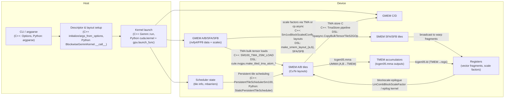
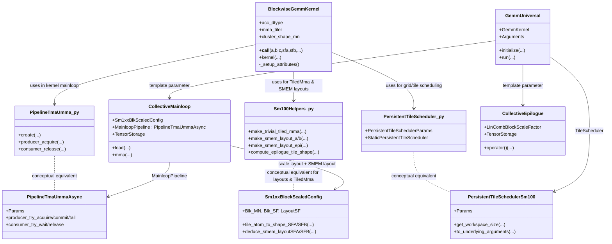
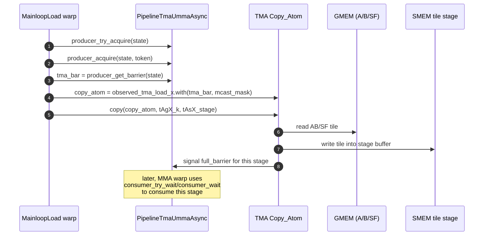
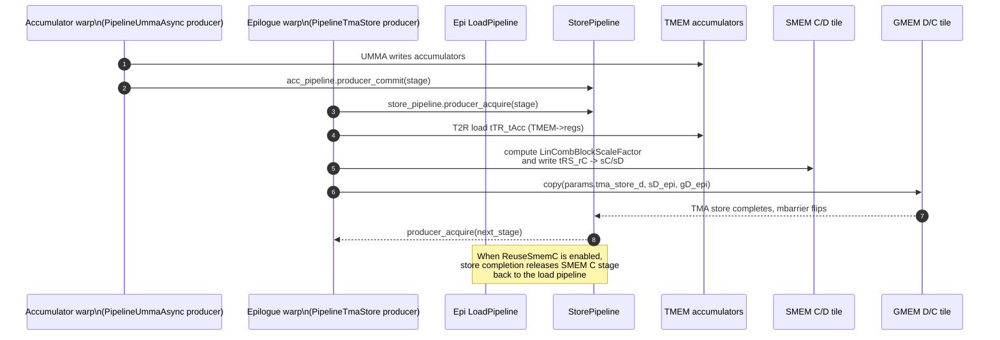

Blackwell Blockwise GEMM: CuTe DSL ↔ CUTLASS C++
=================================================

This document provides a **complete, frame‑by‑frame trace** of two Blackwell block‑scaled GEMM implementations:

- A **CUTLASS C++** example `72b_blackwell_nvfp4_nvfp4_gemm.cu` (NVFP4 block‑scaled GEMM).
- A **CuTe DSL (Python)** example `blockwise_gemm.py` (`BlockwiseGemmKernel`).

We:

- Trace both code paths **from host entry → kernel launch → device mainloop/epilogue**.
- Map **CuTe DSL operations** to their **CuTe / CUTLASS C++ primitives**.
- Show how the DSL lowers to **MLIR → NVVM → PTX** that mirrors the C++ kernel.
- Compare performance characteristics and trade‑offs.

All paths and line numbers are relative to repo root (`/home/jeromeku/cutlass`).

-----------------------------------------------------------------------
Key files map
-----------------------------------------------------------------------

**C++ NVFP4 block‑scaled GEMM**

- Example & host testbed:
  - [72b_blackwell_nvfp4_nvfp4_gemm.cu](../examples/72_blackwell_narrow_precision_gemm/72b_blackwell_nvfp4_nvfp4_gemm.cu)
- Block‑scaled scale‑factor layout:
  - [sm100_blockscaled_layout.hpp](../include/cutlass/detail/sm100_blockscaled_layout.hpp)
- Mainloop builder & block‑scaled UMMA:
  - [collective_builder.hpp](../include/cutlass/gemm/collective/collective_builder.hpp)
  - [sm100_blockscaled_umma_builder.inl](../include/cutlass/gemm/collective/builders/sm100_blockscaled_umma_builder.inl)
  - [sm100_blockscaled_mma_warpspecialized.hpp](../include/cutlass/gemm/collective/sm100_blockscaled_mma_warpspecialized.hpp)
- GEMM kernel wrapper & tile scheduler:
  - [gemm_universal.hpp](../include/cutlass/gemm/kernel/gemm_universal.hpp)
  - [sm100_gemm_tma_warpspecialized.hpp](../include/cutlass/gemm/kernel/sm100_gemm_tma_warpspecialized.hpp)
  - [tile_scheduler.hpp](../include/cutlass/gemm/kernel/tile_scheduler.hpp)
- Device adapter:
  - [gemm_universal_adapter.h](../include/cutlass/gemm/device/gemm_universal_adapter.h)

**CuTe DSL blockwise GEMM**

- Example & harness:
  - [blockwise_gemm.py](../examples/python/CuTeDSL/blackwell/blockwise_gemm/blockwise_gemm.py)
- CuTe DSL front‑end & JIT:
  - [cutlass/cute/__init__.py](../python/CuTeDSL/cutlass/cute/__init__.py)
  - [base_dsl/dsl.py](../python/CuTeDSL/cutlass/base_dsl/dsl.py)
  - [cutlass_dsl/cutlass.py](../python/CuTeDSL/cutlass/cutlass_dsl/cutlass.py)
  - [base_dsl/compiler.py](../python/CuTeDSL/cutlass/base_dsl/compiler.py)
  - [cutlass_dsl/cuda_jit_executor.py](../python/CuTeDSL/cutlass/cutlass_dsl/cuda_jit_executor.py)
  - [base_dsl/jit_executor.py](../python/CuTeDSL/cutlass/base_dsl/jit_executor.py)
- Blackwell helpers & pipelines:
  - [utils/blackwell_helpers.py](../python/CuTeDSL/cutlass/utils/blackwell_helpers.py)
  - [pipeline/sm100.py](../python/CuTeDSL/cutlass/pipeline/sm100.py)
  - [utils/static_persistent_tile_scheduler.py](../python/CuTeDSL/cutlass/utils/static_persistent_tile_scheduler.py)

-----------------------------------------------------------------------
Key functions index
-----------------------------------------------------------------------

| Function / Type | File | Purpose |
|-----------------|------|---------|
| `main` | `examples/72_blackwell_narrow_precision_gemm/72b_blackwell_nvfp4_nvfp4_gemm.cu:553` | CLI parsing, device check, calls `run<Gemm>` |
| `run<Gemm>` | `72b_blackwell_nvfp4_nvfp4_gemm.cu:485` | Allocates tensors, instantiates `Gemm`, launches kernel, verifies |
| `initialize(const Options&)` | `72b_blackwell_nvfp4_nvfp4_gemm.cu:360` | Builds CuTe layouts for A/B/C/D/SF; allocates and fills `HostTensor`s |
| `args_from_options` | `72b_blackwell_nvfp4_nvfp4_gemm.cu:411` | Builds `Gemm::Arguments` from host tensors and options |
| `GemmUniversalAdapter<GemmKernel>::get_workspace_size` | `include/cutlass/gemm/device/gemm_universal_adapter.h:160` | Computes workspace needed by underlying GEMM kernel |
| `GemmUniversalAdapter<GemmKernel>::initialize` | `gemm_universal_adapter.h` | Converts `Arguments` to `Params`, initializes kernel state |
| `GemmUniversalAdapter<GemmKernel>::run` | `gemm_universal_adapter.h` | Launches `GemmKernel` with computed grid / block / cluster |
| `GemmUniversal<...>::to_underlying_arguments` | `sm100_gemm_tma_warpspecialized.hpp:260` | Lowers high‑level arguments to `CollectiveMainloop` / `CollectiveEpilogue` / tile scheduler params |
| `CollectiveMainloop::to_underlying_arguments` | `sm100_blockscaled_mma_warpspecialized.hpp:260` | Builds TMA descriptors, SMEM layouts, block‑scaled SF metadata |
| `CollectiveMainloop::load` | `sm100_blockscaled_mma_warpspecialized.hpp:340` | Producer view: TMA loads A/B/SFA/SFB into staged SMEM buffers |
| `CollectiveMainloop::mma` | `sm100_blockscaled_mma_warpspecialized.hpp:380` | Consumer view: UMMA compute using TMEM accumulators and scales |
| `CollectiveEpilogue::operator()` | `include/cutlass/epilogue/collective/...` | TMEM load, apply `LinCombBlockScaleFactor`, TMA store C/SF |
| `BlockwiseGemmKernel.__init__` | `examples/python/CuTeDSL/blackwell/blockwise_gemm/blockwise_gemm.py:151` | Configures acc dtype, MMA tiler, cluster shape, warp roles, barriers |
| `BlockwiseGemmKernel._setup_attributes` | `blockwise_gemm.py:242` | Builds `TiledMma`, CTA tile shape, cluster layout, SMEM layouts, stage counts |
| `BlockwiseGemmKernel.__call__` (`@cute.jit`) | `blockwise_gemm.py:384` | Host stub: attaches dtypes/layouts, re‑computes attributes, builds TMA atoms, tile scheduler, shared storage, launches `kernel` |
| `BlockwiseGemmKernel.kernel` (`@cute.kernel`) | `blockwise_gemm.py:625` | GPU kernel: warp‑specialized TMA → UMMA → TMEM → epilogue → TMA store |
| `CuTeDSL.jit` / `.kernel` | `python/CuTeDSL/cutlass/base_dsl/dsl.py:460` | Decorators that wrap Python functions into MLIR‑building callables |
| `BaseDSL._func` | `dsl.py:1498` | Core JIT driver: generates MLIR, compiles via `Compiler`, JITs with `ExecutionEngine`, runs kernel |
| `Compiler.compile_and_jit` | `compiler.py:151` | Applies `cute-to-nvvm` pipeline and builds `ExecutionEngine` |
| `CudaDialectJitCompiledFunction.to` | `cuda_jit_executor.py:260` | Binds JIT’d kernel to CUDA device, returns `JitExecutor` |
| `JitExecutor.run_compiled_program` | `jit_executor.py` | Loads CUBIN from MLIR module, resolves kernels, launches via CUDA driver |

-----------------------------------------------------------------------
Call‑chain overview (both implementations)
-----------------------------------------------------------------------

```mermaid
sequenceDiagram
    autonumber

    box C++ Path
      participant CxxBin as 72b_blackwell_nvfp4_nvfp4_gemm (C++)
      participant MainC as main()
      participant RunC as run<Gemm>()
      participant GemmDev as GemmUniversalAdapter
      participant KernelC as GemmKernel (__global__)
      participant MainloopC as CollectiveMainloop<br/>(blockscaled UMMA)
      participant EpiC as CollectiveEpilogue
    end

    box DSL Path
      participant Py as blockwise_gemm.py
      participant RunPy as run()
      participant DSL as CuTeDSL.jit/kernel
      participant HostStub as BlockwiseGemmKernel.__call__
      participant KernelPy as BlockwiseGemmKernel.kernel
      participant MLIR as MLIR cute/nvgpu
      participant NVVM as NVVM/PTX + CUDA driver
    end

    %% C++ path
    CxxBin->>MainC: parse argv, device checks<br/>(main)
    MainC->>RunC: run<Gemm>(options)
    RunC->>RunC: initialize(options)
    RunC->>RunC: args_from_options(options)
    RunC->>GemmDev: Gemm gemm; gemm.initialize(args, workspace)
    RunC->>GemmDev: gemm.run()
    GemmDev->>KernelC: launch GemmKernel<<<grid,block,cluster,smem>>>()
    KernelC->>MainloopC: mainloop(params.mainloop,...)
    KernelC->>EpiC: epilogue(params.epilogue,...)

    %% DSL path
    Py->>RunPy: run(..., args)
    RunPy->>RunPy: create_tensors(...) (torch + CuTe runtime)
    RunPy->>HostStub: gemm = BlockwiseGemmKernel(...)
    RunPy->>DSL: cute.compile(gemm, a,b,c,sfa,sfb,max_clusters,stream)
    DSL->>MLIR: generate func.func + cuda.kernel<br/>(jit, kernel)
    MLIR->>NVVM: cute-to-nvvm{cubin-format=bin...}
    NVVM-->>DSL: compiled_gemm (JIT handle)
    RunPy->>compiled_gemm: compiled_gemm(a,b,c,sfa,sfb,stream)
    compiled_gemm->>HostStub: BlockwiseGemmKernel.__call__(...)
    HostStub->>KernelPy: kernel(...).launch(...)
    KernelPy->>MLIR: cute/nvgpu ops (TMA, UMMA,<br/>pipelines, TMEM, TMA store)
    MLIR->>NVVM: lower to NVVM + PTX
    NVVM-->>Py: execute on GPU
```

-----------------------------------------------------------------------
Dataflow overview (GMEM / SMEM / TMEM)
-----------------------------------------------------------------------



-----------------------------------------------------------------------
Module relationships: DSL vs C++ primitives
-----------------------------------------------------------------------



-----------------------------------------------------------------------
Trace 1 – C++ NVFP4 block‑scaled GEMM (`72b_blackwell_nvfp4_nvfp4_gemm.cu`)
-----------------------------------------------------------------------

### Frame C0: `main` – CLI, device checks, and entry to `run<Gemm>`

Location: [`examples/72_blackwell_narrow_precision_gemm/72b_blackwell_nvfp4_nvfp4_gemm.cu#L553`](../examples/72_blackwell_narrow_precision_gemm/72b_blackwell_nvfp4_nvfp4_gemm.cu#L553)

```cpp
int main(int argc, char const **args) {
  if (__CUDACC_VER_MAJOR__ < 12 || (__CUDACC_VER_MAJOR__ == 12 && __CUDACC_VER_MINOR__ < 8)) {
    std::cerr << "This example requires CUDA 12.8 or newer." << std::endl;
    return 0;
  }

  cudaDeviceProp props;
  int current_device_id;
  CUDA_CHECK(cudaGetDevice(&current_device_id));
  CUDA_CHECK(cudaGetDeviceProperties(&props, current_device_id));

  if (props.major != 10 || (props.minor != 0 && props.minor != 1 && props.minor != 3)) {
    std::cerr << "This example requires a GPU with compute capability 100a|f, 101a|f, or 103a|f)." << std::endl;
    return 0;
  }

  Options options;
  options.parse(argc, args);
  if (options.help) { options.print_usage(std::cout) << std::endl; return 0; }

#if defined(CUTLASS_ARCH_MMA_SM100_SUPPORTED)
  run<Gemm>(options);
#endif
  return 0;
}
```

**State & flow:**

- Validates CUDA toolkit version and that the current GPU is Blackwell (`props.major == 10`).
- Constructs `Options`, parses CLI arguments (`m`, `n`, `k`, `alpha`, `beta`, `iterations`, `swizzle`).
- Calls `run<Gemm>(options)` where `Gemm` is `GemmUniversalAdapter<GemmKernel>`.

### Frame C1: GEMM type configuration and collectives

Location: [`72b_blackwell_nvfp4_nvfp4_gemm.cu#L94`](../examples/72_blackwell_narrow_precision_gemm/72b_blackwell_nvfp4_nvfp4_gemm.cu#L94)

```cpp
using ElementA   = cutlass::nv_float4_t<cutlass::float_e2m1_t>;
using LayoutATag = cutlass::layout::RowMajor;
constexpr int AlignmentA = 32;

using ElementB   = cutlass::nv_float4_t<cutlass::float_e2m1_t>;
using LayoutBTag = cutlass::layout::ColumnMajor;
constexpr int AlignmentB = 32;

using ElementD   = cutlass::float_e2m1_t;
using ElementSFD = cutlass::float_ue8m0_t;
using ElementC   = float;
using LayoutCTag = cutlass::layout::RowMajor;
using LayoutDTag = cutlass::layout::RowMajor;

using ArchTag       = cutlass::arch::Sm100;
using OperatorClass = cutlass::arch::OpClassBlockScaledTensorOp;
using MmaTileShape  = Shape<_128,_128,_256>;
using ClusterShape  = Shape<_1,_1,_1>;
```

- `ElementA/B` are NVFP4 packed vectors (4 × FP4) – the block‑scaled input type.
- `LayoutATag`/`LayoutBTag` encode row‑major A, column‑major B, matching the Python example’s `a_major="k"`, `b_major="k"` layout semantics.
- `MmaTileShape = (128,128,256)` is the CTA tile; `ClusterShape = (1,1,1)` uses single‑CTA clusters.

The collectives and GEMM kernel are wired as:

```cpp
using FusionOperation = cutlass::epilogue::fusion::LinCombBlockScaleFactor<
    OutputSFVectorSize, ElementD, ElementCompute,
    ElementSFD, LayoutSFDTag, ElementC>;

using CollectiveEpilogue = typename cutlass::epilogue::collective::CollectiveBuilder<
    ArchTag, OperatorClass, MmaTileShape, ClusterShape,
    cutlass::epilogue::collective::EpilogueTileAuto,
    ElementAccumulator, ElementAccumulator,
    ElementC, LayoutCTag, AlignmentC,
    ElementD, LayoutDTag, AlignmentD,
    cutlass::epilogue::collective::EpilogueScheduleAuto,
    FusionOperation>::CollectiveOp;

using CollectiveMainloop = typename cutlass::gemm::collective::CollectiveBuilder<
    ArchTag, OperatorClass,
    ElementA, LayoutATag, AlignmentA,
    ElementB, LayoutBTag, AlignmentB,
    ElementAccumulator,
    MmaTileShape, ClusterShape,
    cutlass::gemm::collective::StageCountAutoCarveout<
      static_cast<int>(sizeof(typename CollectiveEpilogue::SharedStorage))>,
    cutlass::gemm::collective::KernelScheduleAuto>::CollectiveOp;

using GemmKernel = cutlass::gemm::kernel::GemmUniversal<
    Shape<int,int,int,int>, CollectiveMainloop, CollectiveEpilogue, void>;
using Gemm = cutlass::gemm::device::GemmUniversalAdapter<GemmKernel>;
```

**Key effects:**

- `CollectiveBuilder` selects `sm100_blockscaled_umma_builder.inl` as the mainloop implementation for `(ArchTag=Sm100, OperatorClass=OpClassBlockScaledTensorOp)`.
- That builder:
  - Defines `Sm1xxBlkScaledConfig = cutlass::detail::Sm1xxBlockScaledConfig<SFVectorSize>` ([`sm100_blockscaled_umma_builder.inl#L173`](../include/cutlass/gemm/collective/builders/sm100_blockscaled_umma_builder.inl#L173)).
  - Chooses TMA copy atoms for A/B/SF and SMEM layout atoms via `sm100_smem_selector`.
  - Constructs the block‑scaled `CollectiveMainloop` implementation defined in [`sm100_blockscaled_mma_warpspecialized.hpp`](../include/cutlass/gemm/collective/sm100_blockscaled_mma_warpspecialized.hpp).
- `CollectiveEpilogue` uses `LinCombBlockScaleFactor` to apply block‑wise scales and write D + scale outputs.

At this point, the **complete kernel type** is fixed at compile‑time; the rest of the example just provides data and launches it.

### Frame C2: `initialize` – Host tensor shapes & layouts

Location: [`72b_blackwell_nvfp4_nvfp4_gemm.cu#L360`](../examples/72_blackwell_narrow_precision_gemm/72b_blackwell_nvfp4_nvfp4_gemm.cu#L360)

```cpp
void initialize(const Options &options) {
  using Sm1xxBlkScaledConfig =
    typename Gemm::GemmKernel::CollectiveMainloop::Sm1xxBlkScaledConfig;

  stride_A = cutlass::make_cute_packed_stride(StrideA{}, {options.m, options.k, 1});
  stride_B = cutlass::make_cute_packed_stride(StrideB{}, {options.n, options.k, 1});
  stride_C = cutlass::make_cute_packed_stride(StrideC{}, {options.m, options.n, 1});
  stride_D = cutlass::make_cute_packed_stride(StrideD{}, {options.m, options.n, 1});

  layout_A = make_layout(make_shape(options.m, options.k, 1), stride_A);
  layout_B = make_layout(make_shape(options.n, options.k, 1), stride_B);
  layout_C = make_layout(make_shape(options.m, options.n, 1), stride_C);
  layout_D = make_layout(make_shape(options.m, options.n, 1), stride_D);

  layout_SFA = Sm1xxBlkScaledConfig::tile_atom_to_shape_SFA(
      cute::make_shape(options.m, options.n, options.k, 1));
  layout_SFB = Sm1xxBlkScaledConfig::tile_atom_to_shape_SFB(
      cute::make_shape(options.m, options.n, options.k, 1));
  ...
  block_A.resize(cutlass::make_Coord(options.m * options.k));
  block_SFA.resize(cutlass::make_Coord(cute::cosize(layout_SFA)));
  block_B.resize(cutlass::make_Coord(options.n * options.k));
  block_SFB.resize(cutlass::make_Coord(cute::cosize(layout_SFB)));
  block_C.resize(cutlass::make_Coord(options.m * options.n));
  block_D.resize(cutlass::make_Coord(options.m * options.n));
  block_SFD.resize(cutlass::make_Coord(cute::cosize(layout_SFA)));
  block_reference_D.resize_like(block_D);
  block_reference_SFD.resize_like(block_SFD);
  block_Normconst.resize(cutlass::make_Coord(1));
  ...
  initialize_block(block_A.host_view(), seed + 2021);
  initialize_block(block_B.host_view(), seed + 2022);
  initialize_block(block_C.host_view(), seed + 2023);
  initialize_block(block_SFA.host_view(), seed + 2024);
  initialize_block(block_SFB.host_view(), seed + 2025);
  block_Normconst.at(cutlass::make_Coord(0)) = 2;

  block_A.sync_device();
  block_B.sync_device();
  block_C.sync_device();
  block_D.sync_device();
  block_SFA.sync_device();
  block_SFB.sync_device();
  block_SFD.sync_device();
  block_Normconst.sync_device();
}
```

**State & mapping to DSL:**

- Builds **CuTe layouts** for GMEM:
  - `layout_A/B/C/D` are `cute::Layout` objects that encode dense shapes/strides.
  - `layout_SFA/SFB` are the block‑scaled scale‑factor layouts derived from `Sm1xxBlkScaledConfig`, matching the DSL’s hand‑built `sfa_smem_layout_staged` / `sfb_smem_layout_staged`.
- Allocates `HostTensor`s for:
  - A/B/C/D values.
  - SFA/SFB (input scales) and SFD (output scales).
  - `block_Normconst` as a single scaling constant.
- Calls `initialize_block` to fill host buffers, then copies everything to device (`sync_device`).

The CuTe DSL path mirrors this logic via `cutlass_torch.matrix` + `cute_tensor_like` and `LayoutEnum.from_tensor` in `blockwise_gemm.run`.

### Frame C3: `args_from_options` – building `Gemm::Arguments`

Location: [`72b_blackwell_nvfp4_nvfp4_gemm.cu#L411`](../examples/72_blackwell_narrow_precision_gemm/72b_blackwell_nvfp4_nvfp4_gemm.cu#L411)

```cpp
typename Gemm::Arguments args_from_options(const Options &options) {
  typename Gemm::Arguments arguments {
    cutlass::gemm::GemmUniversalMode::kGemm,
    {options.m, options.n, options.k, 1},
    { // Mainloop arguments
      block_A.device_data(), stride_A,
      block_B.device_data(), stride_B,
      block_SFA.device_data(), layout_SFA,
      block_SFB.device_data(), layout_SFB
    },
    { // Epilogue arguments
      { options.alpha, options.beta },
      block_C.device_data(), stride_C,
      block_D.device_data(), stride_D
    }
  };

  if constexpr (IsBlockScaleSupported) {
    arguments.epilogue.thread.block_scale_factor_ptr = block_SFD.device_data();
    arguments.epilogue.thread.norm_constant_ptr      = block_Normconst.device_data();
  }

  arguments.scheduler.max_swizzle_size = options.swizzle;
  return arguments;
}
```

**Key points:**

- Packs:
  - **Mainloop**: GMEM pointers + strides/layouts for A/B/SFA/SFB.
  - **Epilogue**: `alpha`, `beta`, GMEM pointers + strides for C/D, plus SFD/norm constant.
  - **Scheduler**: `max_swizzle_size` for the SM100 persistent tile scheduler.
- The DSL path’s `BlockwiseGemmKernel.__call__` builds the same logical arguments using runtime `cute.Tensor` wrappers and `PersistentTileSchedulerParams`.

### Frame C4: `run<Gemm>` – adapter usage and verification

Location: [`72b_blackwell_nvfp4_nvfp4_gemm.cu#L485`](../examples/72_blackwell_narrow_precision_gemm/72b_blackwell_nvfp4_nvfp4_gemm.cu#L485)

```cpp
template <typename Gemm>
int run(Options &options) {
  initialize(options);

  Gemm gemm;                                // GemmUniversalAdapter<GemmKernel>
  auto arguments = args_from_options(options);

  size_t workspace_size = Gemm::get_workspace_size(arguments);
  cutlass::device_memory::allocation<uint8_t> workspace(workspace_size);

  CUTLASS_CHECK(gemm.can_implement(arguments));
  CUTLASS_CHECK(gemm.initialize(arguments, workspace.get()));
  CUTLASS_CHECK(gemm.run());
  cudaDeviceSynchronize();

  Result result;
  result.passed = verify(options);
  ...
}
```

**State transitions:**

- Calls static `Gemm::get_workspace_size` → internally delegates to `GemmKernel::get_workspace_size` (see Frame C5).
- Allocates workspace once for the kernel.
- `gemm.can_implement(arguments)` ensures:
  - Problem shape is compatible with block‑scaled UMMA.
  - SFA/SFB layouts match `Sm1xxBlkScaledConfig::tile_atom_to_shape_SFA/SFB`.
  - Scheduler configuration is valid.
- `gemm.initialize(arguments, workspace)` creates a `Params` struct with underlying mainloop/epilogue/scheduler params.
- `gemm.run()` launches the SM100 GEMM kernel.
- After the warmup run, `verify(options)` runs a host reference block‑scaled GEMM (`Gemm3x`) and compares results.

The CuTe DSL `cute.compile(...)` and the first call to `compiled_gemm(...)` play the role of `initialize` and warmup run in the Python path.

### Frame C5: `GemmUniversalAdapter` – lowering `Arguments` to kernel `Params`

Location: [`include/cutlass/gemm/device/gemm_universal_adapter.h#L160`](../include/cutlass/gemm/device/gemm_universal_adapter.h#L160) and [`include/cutlass/gemm/kernel/sm100_gemm_tma_warpspecialized.hpp#L260`](../include/cutlass/gemm/kernel/sm100_gemm_tma_warpspecialized.hpp#L260)

The 3.x specialization of `GemmUniversalAdapter` (for `GemmKernel = GemmUniversal<...>`):

```cpp
using Arguments = typename GemmKernel::Arguments;
using Params    = typename GemmKernel::Params;

static Status can_implement(Arguments const& args) {
  return GemmKernel::can_implement(args) ? Status::kSuccess : Status::kInvalid;
}

static size_t get_workspace_size(Arguments const& args) {
  size_t workspace_bytes = 0;
  if (args.mode == GemmUniversalMode::kGemmSplitKParallel) { ... }
  workspace_bytes += GemmKernel::get_workspace_size(args);
  return workspace_bytes;
}
```

and, in `GemmKernel` (`sm100_gemm_tma_warpspecialized.hpp`):

```cpp
struct Arguments {
  GemmUniversalMode mode{};
  ProblemShape problem_shape{};
  MainloopArguments mainloop{};
  EpilogueArguments epilogue{};
  KernelHardwareInfo hw_info{};
  TileSchedulerArguments scheduler{};
};

struct Params {
  GemmUniversalMode mode{};
  ProblemShape problem_shape{};
  MainloopParams mainloop{};
  EpilogueParams epilogue{};
  TileSchedulerParams scheduler{};
  KernelHardwareInfo hw_info{};
};

static Params to_underlying_arguments(Arguments const& args, void* workspace) {
  auto problem_shape = args.problem_shape;
  auto problem_shape_MNKL = append<4>(problem_shape, 1);
  ...
  // Epilogue workspace
  void* epilogue_workspace = workspace_ptr + workspace_offset;
  workspace_offset += CollectiveEpilogue::get_workspace_size(args.problem_shape, args.epilogue);
  ...
  // Tile scheduler workspace
  void* scheduler_workspace = workspace_ptr + workspace_offset;
  workspace_offset += TileScheduler::template get_workspace_size<ProblemShape, ElementAccumulator>(...);
  ...
  return {
    args.mode,
    args.problem_shape,
    CollectiveMainloop::to_underlying_arguments(
      args.problem_shape, args.mainloop, mainloop_workspace, args.hw_info),
    CollectiveEpilogue::to_underlying_arguments(
      args.problem_shape, args.epilogue, epilogue_workspace),
    TileScheduler::to_underlying_arguments(
      problem_shape_MNKL, TileShape{}, AtomThrShapeMNK{}, ClusterShape{},
      args.hw_info, args.scheduler, scheduler_workspace),
    args.hw_info
  };
}
```

**Summary:**

- `GemmUniversalAdapter` defers the real work to `GemmUniversal<...>::to_underlying_arguments`.
- Under the hood, `CollectiveMainloop` and `CollectiveEpilogue` each compute:
  - TMA descriptors and SMEM layouts (`SmemLayoutA/B`, `SmemLayoutSFA/SFB`, epilogue SMEM tiler).
  - Pipeline storage sizes for their internal `PipelineTmaUmmaAsync` / epilogue pipelines.
- `TileScheduler::to_underlying_arguments` builds persistent scheduling params, analogous to the DSL’s `PersistentTileSchedulerParams`.

### Frame C6: `GemmKernel::get_workspace_size` and scheduler workspace

Location: [`sm100_gemm_tma_warpspecialized.hpp#L260`](../include/cutlass/gemm/kernel/sm100_gemm_tma_warpspecialized.hpp#L260)

```cpp
static size_t get_workspace_size(Arguments const& args) {
  size_t workspace_size = 0;

  // Epilogue
  workspace_size += CollectiveEpilogue::get_workspace_size(args.problem_shape, args.epilogue);
  workspace_size = round_nearest(workspace_size, MinWorkspaceAlignment);

  // Tile scheduler
  workspace_size += TileScheduler::template get_workspace_size<ProblemShape, ElementAccumulator>(
    args.scheduler, args.problem_shape, args.hw_info,
    NumFixupBarriers, NumEpilogueSubTiles, CollectiveEpilogue::NumAccumulatorMtxs);
  workspace_size = round_nearest(workspace_size, MinWorkspaceAlignment);

  return workspace_size;
}
```

This is the C++ counterpart of the DSL’s `_compute_stages` + `StaticPersistentTileScheduler.get_grid_shape` logic:

- The **epilogue workspace** tracks partial accumulators, fixup barriers, and tile metadata.
- The **scheduler workspace** holds persistent scheduling state (e.g., current tile, work distribution, cluster responses), similar to `PersistentTileSchedulerParams` storing layout and fast‑divmod divisors.

### Frame C7: Device entry – warp specialization and pipelines

The body of the SM100 GEMM kernel is implemented in `GemmUniversal<...>::operator()` inside [`sm100_gemm_tma_warpspecialized.hpp`](../include/cutlass/gemm/kernel/sm100_gemm_tma_warpspecialized.hpp). At a high level:

1. **Thread / warp categorization:**

   ```cpp
   enum class WarpCategory { MMA, Sched, MainloopLoad, EpilogueLoad, Epilogue };
   ...
   WarpCategory warp_category = ...; // based on warp index
   bool lane_predicate = (lane_idx < 32);
   ```

   Warps are split into:

   - MMA compute warps.
   - Scheduler warp (`WarpCategory::Sched`).
   - Mainloop TMA load warp.
   - Epilogue load warp.
   - Epilogue (TMEM → C → GMEM) warps.

   This matches the DSL’s explicit warp IDs (`acc_update_warp_id`, `epilog_warp_id`, `mma_warp_id`, `tma_warp_id`, `scale_warp_id`, `sched_warp_id`) in [`blockwise_gemm.py#L191`](../examples/python/CuTeDSL/blackwell/blockwise_gemm/blockwise_gemm.py#L191).

2. **Shared storage instantiation:**

   ```cpp
   extern __shared__ char smem_buf[];
   SharedStorage& shared_storage = *reinterpret_cast<SharedStorage*>(smem_buf);
   ```

   where `SharedStorage` is:

   ```cpp
   struct SharedStorage {
     struct PipelineStorage : cute::aligned_struct<16, _1> {
       MainloopPipelineStorage mainloop;
       EpiLoadPipelineStorage epi_load;
       LoadOrderBarrierStorage load_order;
       CLCPipelineStorage clc;
       AccumulatorPipelineStorage accumulator;
       CLCThrottlePipelineStorage clc_throttle;
       arch::ClusterBarrier tmem_dealloc;
     } pipelines;

     typename TileScheduler::CLCResponse clc_response[SchedulerPipelineStageCount];
     uint32_t tmem_base_ptr;

     struct TensorStorage : cute::aligned_struct<128, _1> {
       typename CollectiveEpilogue::TensorStorage epilogue;
       typename CollectiveMainloop::TensorStorage mainloop;
     } tensors;
   };
   ```

   This corresponds directly to the DSL’s `SharedStorage` `@cute.struct` in `BlockwiseGemmKernel.__call__`.

3. **Pipeline construction (per warp category):**

   - `MainloopPipeline` (TMA→UMMA) from `CollectiveMainloop::MainloopPipeline` (alias of `PipelineTmaUmmaAsync`).
   - `EpiLoadPipeline` and `EpiStorePipeline` from `CollectiveEpilogue`.
   - `AccumulatorPipeline` (`PipelineUmmaAsync`) for TMEM accumulators.
   - `CLCPipeline` and `CLCThrottlePipeline` for tile scheduler responses and throttling.

   Example snippet (simplified) for mainloop and accumulator pipelines:

   ```cpp
   MainloopPipeline mainloop_pipeline(shared_storage.pipelines.mainloop,
                                      mainloop_pipeline_params,
                                      cluster_shape,
                                      cute::true_type{},   // init barriers
                                      cute::false_type{}); // delay mask calc
   ...
   AccumulatorPipeline accumulator_pipeline(shared_storage.pipelines.accumulator,
                                            accumulator_pipeline_params,
                                            cluster_shape,
                                            cute::true_type{},
                                            cute::false_type{});
   ```

4. **Tile scheduler and TMEM allocation:**

   ```cpp
   TileScheduler scheduler(&shared_storage.clc_response[0], params.scheduler, block_id_in_cluster);
   auto work_tile_info = scheduler.initial_work_tile_info(cluster_shape);
   auto cta_coord_mnkl = scheduler.work_tile_to_cta_coord(work_tile_info);

  auto tmem_storage = collective_mainloop.template init_tmem_tensors<EpilogueTile, IsOverlappingAccum>(EpilogueTile{});
  ```

   This matches the DSL’s `StaticPersistentTileScheduler.create(...)` and `collective_mainloop.init_tmem_tensors` equivalent (`BlockwiseGemmKernel.kernel` allocates TMEM using `TmemAllocator`).

   **Additional device‑entry details (matching DSL kernel):**

   - Warp roles are computed from `warp_idx` into a `WarpCategory` enum and then collapsed into an `IsParticipant` struct:

     ```cpp
     WarpCategory warp_category = warp_idx < static_cast<int>(WarpCategory::Epilogue)
                                    ? WarpCategory(warp_idx)
                                    : WarpCategory::Epilogue;

     IsParticipant is_participant = {
       (warp_category == WarpCategory::MMA),                                 // mma
       (warp_category == WarpCategory::Sched) && is_first_cta_in_cluster,    // sched
       (warp_category == WarpCategory::MainloopLoad),                        // main_load
       (warp_category == WarpCategory::EpilogueLoad) && is_epi_load_needed,  // epi_load
       (warp_category == WarpCategory::Epilogue)                             // epilogue
     };
     ```

     This is the C++ analogue of the explicit `if warp_idx == self.mma_warp_id / self.tma_warp_id / ...` checks in the DSL kernel.

   - Pipeline roles are assigned from `warp_category`:

     ```cpp
     if (WarpCategory::MainloopLoad == warp_category) {
       mainloop_pipeline_params.role = MainloopPipeline::ThreadCategory::Producer;
     }
     if (WarpCategory::MMA == warp_category) {
       mainloop_pipeline_params.role = MainloopPipeline::ThreadCategory::Consumer;
     }
     if (WarpCategory::EpilogueLoad == warp_category) {
       epi_load_pipeline_params.role = EpiLoadPipeline::ThreadCategory::Producer;
     }
     if (WarpCategory::Epilogue == warp_category) {
       epi_load_pipeline_params.role = EpiLoadPipeline::ThreadCategory::Consumer;
     }
     ```

   - A `TmemAllocator` instance plus named barriers (`tmem_allocation_result_barrier`, `tmem_deallocation_result_barrier`) coordinate TMEM allocation and deallocation between MMA and epilogue warps, mirroring the DSL’s `TmemAllocator` + `tmem_alloc_barrier` + `tmem_holding_buf` flow.

We now unpack the **full warp‑specialized execution path**, warp by warp.

#### Frame C7.1: Mainloop‑load warp (`WarpCategory::MainloopLoad`)

Entry: [`sm100_gemm_tma_warpspecialized.hpp#L539`](../include/cutlass/gemm/kernel/sm100_gemm_tma_warpspecialized.hpp#L539)

```cpp
if (WarpCategory::MainloopLoad == warp_category) {
  bool do_load_order_arrive = true;

  bool requires_clc_query = true;
  int k_tile_prologue = TileScheduler::get_work_k_tile_start(work_tile_info);
  if constexpr (IsSchedDynamicPersistent) {
    cutlass::arch::wait_on_dependent_grids();
  }

  do {
    if constexpr (IsSchedDynamicPersistent) {
      // Throttle CLC queries
      if (requires_clc_query) {
        clc_throttle_pipeline.consumer_wait(clc_pipe_throttle_consumer_state);
        clc_throttle_pipeline.consumer_release(clc_pipe_throttle_consumer_state);
        ++clc_pipe_throttle_consumer_state;
        clc_pipe_producer_state = scheduler.advance_to_next_work(clc_pipeline, clc_pipe_producer_state);
      }
    }

    auto [next_work_tile_info, increment_pipe] = scheduler.fetch_next_work(
      work_tile_info, clc_pipeline, clc_pipe_consumer_state);
    work_tile_info = next_work_tile_info;
    requires_clc_query = increment_pipe;
    if (increment_pipe) {
      ++clc_pipe_consumer_state;
    }

    // Compute K‑tile count and iterator for this work tile
    auto k_tile_count = TileScheduler::get_work_k_tile_count(
      work_tile_info, problem_shape_MNKL, CtaShape_MNK{});
    auto k_tile_iter = TileScheduler::get_k_tile_iterator(
      work_tile_info, problem_shape_MNKL, CtaShape_MNK{}, tile_shape);

    // Build load parameters (GMEM and SMEM tensors for A/B/SFA/SFB)
    auto load_inputs = collective_mainloop.get_load_params(
      problem_shape_MNKL, TileShape{}, tiled_mma, params.mainloop,
      shared_storage.tensors.mainloop, cta_coord_mnkl);

    // Start mainloop prologue loads, arrive on load_order barrier, then continue
    auto [mainloop_producer_state_next, k_tile_iter_next] =
      collective_mainloop.load(
        mainloop_pipeline,
        mainloop_pipe_producer_state,
        load_inputs,
        cta_coord_mnkl,
        k_tile_iter, k_tile_prologue);
    mainloop_pipe_producer_state = mainloop_producer_state_next;

    if (do_load_order_arrive) {
      load_order_barrier.arrive();
      do_load_order_arrive = false;
    }

    auto [mainloop_producer_state_next_, unused_] =
      collective_mainloop.load(
        mainloop_pipeline,
        mainloop_pipe_producer_state,
        load_inputs,
        cta_coord_mnkl,
        k_tile_iter_next, k_tile_count - k_tile_prologue);
    mainloop_pipe_producer_state = mainloop_producer_state_next_;

    __syncwarp();
    auto [next_work_tile_info2, increment_pipe2] = scheduler.fetch_next_work(
      work_tile_info, clc_pipeline, clc_pipe_consumer_state);
    work_tile_info = next_work_tile_info2;
    cta_coord_mnkl = scheduler.work_tile_to_cta_coord(work_tile_info);
    requires_clc_query = increment_pipe2;
    if (increment_pipe2) {
      ++clc_pipe_consumer_state;
    }
  } while (work_tile_info.is_valid());

  collective_mainloop.load_tail(mainloop_pipeline, mainloop_pipe_producer_state);
}
```

**Nested frame: `CollectiveMainloop::load`** (see Frame C8.1 for full code)  
For each `k_tile`:

- Acquires a producer stage from `MainloopPipeline` (double‑buffered SMEM tiles).
- Extracts per‑CTA GMEM views `tAgA`, `tBgB`, `tAgSFA`, `tBgSFB`.
- Issues four TMA copies guarded by a per‑stage TMA barrier:

  ```cpp
  copy(observed_tma_load_a_->with(*tma_barrier, mcast_mask_a), tAgA(_,*k_tile_iter), tAsA(_,write_stage));
  copy(observed_tma_load_b_->with(*tma_barrier, mcast_mask_b), tBgB(_,*k_tile_iter), tBsB(_,write_stage));
  copy(observed_tma_load_sfa_->with(*tma_barrier, mcast_mask_sfa), tAgSFA(_,*k_tile_iter), tAsSFA(_,write_stage));
  copy(observed_tma_load_sfb_->with(*tma_barrier, mcast_mask_sfb), tBgSFB(_,*k_tile_iter), tBsSFB(_,write_stage));
  ```

This is exactly the C++ counterpart of the DSL **TMA warp** loop in `BlockwiseGemmKernel.kernel`.

#### Frame C7.2: Scheduler warp (`WarpCategory::Sched`)

Entry: [`sm100_gemm_tma_warpspecialized.hpp#L542`](../include/cutlass/gemm/kernel/sm100_gemm_tma_warpspecialized.hpp#L542)

```cpp
else if (is_participant.sched) {
  if constexpr (IsSchedDynamicPersistent) {
    bool requires_clc_query = true;

    cutlass::arch::wait_on_dependent_grids();

    do {
      if (requires_clc_query) {
        // Throttle CLC query to mitigate skew
        clc_throttle_pipeline.consumer_wait(clc_pipe_throttle_consumer_state);
        clc_throttle_pipeline.consumer_release(clc_pipe_throttle_consumer_state);
        ++clc_pipe_throttle_consumer_state;

        // Query next CLC ID and update producer state
        clc_pipe_producer_state = scheduler.advance_to_next_work(
          clc_pipeline, clc_pipe_producer_state);
      }

      auto [next_work_tile_info, increment_pipe] = scheduler.fetch_next_work(
        work_tile_info, clc_pipeline, clc_pipe_consumer_state);

      requires_clc_query = increment_pipe;
      if (increment_pipe) {
        ++clc_pipe_consumer_state;
      }

      work_tile_info = next_work_tile_info;
    } while (work_tile_info.is_valid());

    clc_pipeline.producer_tail(clc_pipe_producer_state);
  }
}
```

For the **static persistent scheduler** used by this example, `IsSchedDynamicPersistent` is `false`, so:

- The `Sched` warp’s only responsibilities are:
  - Prefetch mainloop TMA descriptors (earlier in the function).
  - Participate in `CLCPipeline` barrier accounting (consumer counts in `clc_pipeline_params`).
  - It does **not** issue CLC queries (no dynamic stream‑K / multi‑grid behavior).

The underlying scheduler implementation (`PersistentTileSchedulerSm100`) is defined in [`sm100_tile_scheduler.hpp`](../include/cutlass/gemm/kernel/sm100_tile_scheduler.hpp) and ultimately derives from `StaticTileScheduler` / `StaticPersistentTileScheduler100` ([`sm100_static_tile_scheduler.hpp`](../include/cutlass/gemm/kernel/sm100_static_tile_scheduler.hpp)):

- `initial_work_tile_info` chooses the first `(M_idx, N_idx, L_idx)` tile for a given CTA:  
  [`sm100_tile_scheduler.hpp#L320`](../include/cutlass/gemm/kernel/sm100_tile_scheduler.hpp#L320)
- `swizzle_and_rasterize` applies cluster‑swizzle and serpentine rasterization over the logical grid (`gridDim`) to map `(cta_m, cta_n, cta_l)` to a `WorkTileInfo` (`M_idx`, `N_idx`, `L_idx`) ([`sm100_tile_scheduler.hpp#L320`](../include/cutlass/gemm/kernel/sm100_tile_scheduler.hpp#L320) onward).
- `fetch_next_work` (static scheduler) either:
  - Continues current work (for stream‑K / grouped cases), or
  - Calls `advance_to_next_work()` and returns the next `WorkTileInfo` ([`static_tile_scheduler.hpp#L55`](../include/cutlass/gemm/kernel/static_tile_scheduler.hpp#L55)).

In this example (plain persistent GEMM, no split‑K, no stream‑K), `fetch_next_work` simply walks tiles in the swizzled raster order.

#### Frame C7.3: MMA warp (`WarpCategory::MMA`)

Entry: [`sm100_gemm_tma_warpspecialized.hpp#L561`](../include/cutlass/gemm/kernel/sm100_gemm_tma_warpspecialized.hpp#L561)

```cpp
else if (is_participant.mma) {
  // TMEM allocation handshake with epilogue
  tmem_allocator.allocate(TmemAllocator::Sm100TmemCapacityColumns, &shared_storage.tmem_base_ptr);
  __syncwarp();
  tmem_allocation_result_barrier.arrive();
  uint32_t tmem_base_ptr = shared_storage.tmem_base_ptr;
  collective_mainloop.set_tmem_offsets(tmem_storage, tmem_base_ptr);

  auto mma_inputs = collective_mainloop.mma_init(
    tmem_storage,
    shared_storage.tensors.mainloop);

  do {
    auto k_tile_count = TileScheduler::get_work_k_tile_count(
      work_tile_info, problem_shape_MNKL, CtaShape_MNK{});

    auto [next_work_tile_info, increment_pipe] = scheduler.fetch_next_work(
      work_tile_info, clc_pipeline, clc_pipe_consumer_state);
    if (increment_pipe) {
      ++clc_pipe_consumer_state;
    }

    // Select accumulator stage (double‑buffering / overlap)
    int acc_stage = [&] () {
      if constexpr (IsOverlappingAccum) {
        return accumulator_pipe_producer_state.phase() ^ 1;
      }
      else {
        return accumulator_pipe_producer_state.index();
      }
    }();

    if (is_mma_leader_cta) {
      mainloop_pipe_consumer_state = collective_mainloop.mma(
        cute::make_tuple(mainloop_pipeline, accumulator_pipeline),
        cute::make_tuple(mainloop_pipe_consumer_state,
                         accumulator_pipe_producer_state),
        collective_mainloop.slice_accumulator(tmem_storage, acc_stage),
        mma_inputs,
        cta_coord_mnkl,
        k_tile_count);
      accumulator_pipeline.producer_commit(accumulator_pipe_producer_state);
    }
    ++accumulator_pipe_producer_state;
    work_tile_info = next_work_tile_info;
    cta_coord_mnkl = scheduler.work_tile_to_cta_coord(work_tile_info);
  } while (work_tile_info.is_valid());
  ...
}
```

**Nested frame: `CollectiveMainloop::mma`** (consumer perspective, [`sm100_blockscaled_mma_warpspecialized.hpp#L880`](../include/cutlass/gemm/collective/sm100_blockscaled_mma_warpspecialized.hpp#L880)):

- Waits on `MainloopPipeline` for a K‑tile’s AB+SFA/SFB to become ready (`consumer_try_wait` / `consumer_wait`).
- Copies scale factors SFA/SFB from SMEM to TMEM using UTCCP copy ops.
- For each K‑block within the tile:

  ```cpp
  for (int k_block = 0; k_block < size<2>(tCrA); ++k_block) {
    cute::gemm(
      tiled_mma.with(tiled_mma.accumulate_, tCtSFA(_,_,k_block), tCtSFB_mma(_,_,k_block)),
      tCrA(_,_,k_block,read_stage),
      tCrB(_,_,k_block,read_stage),
      accumulators);   // TMEM‑resident accumulator tensor
    tiled_mma.accumulate_ = UMMA::ScaleOut::One;
  }
  ```

- Releases the mainloop pipeline stage (`consumer_release`), advances the consumer state, and repeats until all K tiles for this work tile are processed.

The MMA warp is thus responsible for **all UMMA compute** (tcgen05.mma) and **TMEM accumulation** for its share of tiles.

```mermaid
sequenceDiagram
    autonumber
    participant MMA as MMA warp\n(PipelineUmmaAsync producer)
    participant Epi as Epilogue warp\n(PipelineUmmaAsync consumer)
    participant AccPipe as PipelineUmmaAsync
    participant TMEM as TMEM accumulator buffer

    Note over MMA,Epi: AccumulatorPipeline = PipelineUmmaAsync&lt;Stages&gt;

    rect rgb(245,245,255)
      MMA->>AccPipe: producer_try_acquire(acc_state)
      MMA->>AccPipe: producer_acquire(acc_state, token)
      MMA->>TMEM: write accumulators for tile\n(tcgen05.mma)
      MMA->>AccPipe: producer_commit(acc_state)
    end

    rect rgb(245,255,245)
      Epi->>AccPipe: consumer_try_wait(acc_consumer_state)
      Epi->>AccPipe: consumer_wait(acc_consumer_state, token)
      Epi->>TMEM: read accumulators for epilogue\n(TMEM → regs)
      Epi->>AccPipe: consumer_release(acc_consumer_state)
    end

    Note over AccPipe: Impl = PipelineAsync&lt;Stages&gt;<br/>backed by SM100 UMMA mbarriers
```

At the CuTe level, this `cute::gemm` call dispatches into the register‑level GEMM in [`algorithm/gemm.hpp#L260`](../include/cute/algorithm/gemm.hpp#L260), which:

- Converts SMEM tiles into register fragments (`MMA_Atom<MMA>::make_fragment_A/B`).
- Loops over the K‑dimension and, for each K‑slice, invokes the architecture‑specific MMA atom.

For SM100 block‑scaled NVFP4, that atom is backed by `SM100_MMA_MXF4*_SS` in [`mma_sm100_umma.hpp`](../include/cute/arch/mma_sm100_umma.hpp); its `fma` method is a thin inline‑asm wrapper around the actual tensor core instruction, e.g. ([`mma_sm100_umma.hpp#L1490`](../include/cute/arch/mma_sm100_umma.hpp#L1490)):

```cpp
asm volatile(
  "{\n\t"
  ".reg .pred p;\n\t"
  "setp.ne.b32 p, %4, 0;\n\t"
  "tcgen05.mma.cta_group::2.kind::mxf4nvf4.block_scale.block16 "
  "[%0], %1, %2, %3, [%5], [%6], p; \n\t"
  "}\n"
  :
  : "r"(tmem_c), "l"(desc_a), "l"(desc_b),
    "r"(uint32_t(idescE>>32)), "r"(scaleC),
    "r"(tsfa_addr), "r"(tsfb_addr));
```

This inline PTX is the bottom of the UMMA call stack: the point where the high‑level SM100 MMA abstraction becomes a single `tcgen05.mma` instruction.

#### Frame C7.4: Epilogue‑load warp (`WarpCategory::EpilogueLoad`)

Entry: [`sm100_gemm_tma_warpspecialized.hpp#L600`](../include/cutlass/gemm/kernel/sm100_gemm_tma_warpspecialized.hpp#L600)

```cpp
else if (is_participant.epi_load) {
  cutlass::arch::wait_on_dependent_grids();

  bool do_load_order_wait = true;
  bool do_tail_load = false;
  int current_wave = 0;

  do {
    bool compute_epilogue =
      TileScheduler::compute_epilogue(work_tile_info, params.scheduler);

    auto [next_work_tile_info, increment_pipe] = scheduler.fetch_next_work(
      work_tile_info, clc_pipeline, clc_pipe_consumer_state);
    work_tile_info = next_work_tile_info;
    if (increment_pipe) {
      ++clc_pipe_consumer_state;
    }

    if (compute_epilogue) {
      if (do_load_order_wait) {
        load_order_barrier.wait();
        do_load_order_wait = false;
      }

      bool reverse_epi_n = IsOverlappingAccum && (current_wave % 2 == 0);
      epi_load_pipe_producer_state =
        collective_epilogue.template load<IsOverlappingAccum>(
          epi_load_pipeline,
          epi_load_pipe_producer_state,
          problem_shape_MNKL,
          CtaShape_MNK{},
          cta_coord_mnkl,
          TileShape{},
          TiledMma{},
          shared_storage.tensors.epilogue,
          reverse_epi_n);

      do_tail_load = true;
    }
    current_wave++;
    cta_coord_mnkl = scheduler.work_tile_to_cta_coord(work_tile_info);
  } while (work_tile_info.is_valid());

  if (do_tail_load) {
    collective_epilogue.load_tail(
      epi_load_pipeline, epi_load_pipe_producer_state,
      epi_store_pipeline, epi_store_pipe_producer_state);
  }
}
```

**Nested frame: `CollectiveEpilogue::load`** (producer perspective, [`sm100_epilogue_tma_warpspecialized.hpp`](../include/cutlass/epilogue/collective/sm100_epilogue_tma_warpspecialized.hpp)):

- Computes the **epilogue tile bounding box** (`EpiTile_M`, `EpiTile_N`) inside the CTA tile.
- Forms GMEM and SMEM tensors for C and for any aux inputs.
- Uses `params.tma_load_c` / `TMA_C` to issue TMA loads (GMEM C → SMEM C) into `SmemLayoutStageC`, staged per epilogue pipeline.
- Coordinates with `EpiLoadPipeline` (producer side) via `producer_acquire` / `producer_commit` so that epilogue **consumer warps** later can wait on these stages.

For this NVFP4 example, the epilogue load warp prepares:

- Source C (if `beta != 0`).
- Any block‑scale metadata needed by `LinCombBlockScaleFactor` callbacks (norm constants, block‑scale tensors).

#### Frame C7.5: Epilogue warp (`WarpCategory::Epilogue`)

Entry: [`sm100_gemm_tma_warpspecialized.hpp#L760`](../include/cutlass/gemm/kernel/sm100_gemm_tma_warpspecialized.hpp#L760)

```cpp
else if (is_participant.epilogue) {
  tmem_allocation_result_barrier.arrive_and_wait();
  uint32_t tmem_base_ptr = shared_storage.tmem_base_ptr;
  collective_mainloop.set_tmem_offsets(tmem_storage, tmem_base_ptr);

  bool do_tail_store = false;
  do {
    auto [next_work_tile_info, increment_pipe] = scheduler.fetch_next_work(
      work_tile_info, clc_pipeline, clc_pipe_consumer_state);
    if (increment_pipe) {
      ++clc_pipe_consumer_state;
    }

    int acc_stage = [&] () {
      if constexpr (IsOverlappingAccum) {
        return accumulator_pipe_consumer_state.phase();
      }
      else {
        return accumulator_pipe_consumer_state.index();
      }
    }();

    auto accumulator =
      get<0>(collective_mainloop.slice_accumulator(tmem_storage, acc_stage));

    accumulator_pipe_consumer_state =
      scheduler.template fixup<IsComplex>(
        TiledMma{}, work_tile_info, accumulator,
        accumulator_pipeline, accumulator_pipe_consumer_state,
        typename CollectiveEpilogue::CopyOpT2R{});

    if (scheduler.compute_epilogue(work_tile_info)) {
      auto [load_state_next, store_state_next, acc_state_next] =
        collective_epilogue.template store<IsOverlappingAccum>(
          epi_load_pipeline,
          epi_load_pipe_consumer_state,
          epi_store_pipeline,
          epi_store_pipe_producer_state,
          accumulator_pipeline,
          accumulator_pipe_consumer_state,
          problem_shape_MNKL,
          CtaShape_MNK{},
          cta_coord_mnkl,
          TileShape{},
          TiledMma{},
          accumulator,
          shared_storage.tensors.epilogue);

      epi_load_pipe_consumer_state = load_state_next;
      epi_store_pipe_producer_state = store_state_next;
      accumulator_pipe_consumer_state = acc_state_next;
      do_tail_store = true;
    }

    work_tile_info = next_work_tile_info;
    cta_coord_mnkl = scheduler.work_tile_to_cta_coord(work_tile_info);
  } while (work_tile_info.is_valid());
  ...
}
```

**Nested frame: `CollectiveEpilogue::store`** (consumer perspective, [`sm100_epilogue_tma_warpspecialized.hpp`](../include/cutlass/epilogue/collective/sm100_epilogue_tma_warpspecialized.hpp)):

- Treats `accumulator` as a TMEM‑resident tile partitioned into epilogue tiles (`TmaEpilogueTile`), e.g. `(EPI_M, EPI_N)` subtiles.
- Uses `AccumulatorPipeline` (`acc_pipeline` in the kernel) to ensure that accumulators are **full** before reading.
- Builds tmem‑to‑register copy ops (`tiled_t2r`) and register‑to‑SMEM copy ops for C (`tiled_r2s`), much like the DSL `tmem_copy` helpers.
- For each epilogue subtile:
  1. Issues TMEM load → register (T2R).
  2. Applies the fusion callbacks `FusionCallbacks`:

     - For this example: `LinCombBlockScaleFactor<SFVecSize, ElementD, ElementCompute, ElementSFD, ...>`.
     - The generated callbacks compute:  
       `D_tile = alpha * Acc_tile + beta * C_tile` and simultaneously generate block‑scale factors SFD.

  3. Writes D (and/or C) into SMEM C buffer (`sD_epi` / `sC_epi`).
  4. TMA‑stores SMEM tiles back to GMEM using `params.tma_store_d` (`CopyOpS2G`), via `EpiStorePipeline`.

- After all tiles for the work unit are processed, `store_tail` waits for outstanding TMA stores to complete and releases pipeline barriers.

This epilogue warp is the C++ mirror of the DSL **epilogue warps** in `BlockwiseGemmKernel.kernel`: both consume TMEM accumulators, apply a block‑scaled linear combination, and TMA‑store the final outputs to GMEM.

### Frame C8: `CollectiveMainloop` – TMA loads and UMMA compute

Location: [`sm100_blockscaled_mma_warpspecialized.hpp#L140`](../include/cutlass/gemm/collective/sm100_blockscaled_mma_warpspecialized.hpp#L140) and below.

**Type setup:**

```cpp
using Sm1xxBlkScaledConfig = cutlass::detail::Sm1xxBlockScaledConfig<SFVecSize>;
using SmemLayoutA   = decltype(UMMA::tile_to_mma_shape(...));
using SmemLayoutB   = decltype(UMMA::tile_to_mma_shape(...));
using SmemLayoutSFA = decltype(make_layout(...)); // block‑scaled SFA in SMEM
using SmemLayoutSFB = decltype(make_layout(...)); // block‑scaled SFB in SMEM

struct SharedStorage {
  struct TensorStorage : cute::aligned_struct<128, _0> {
    cute::ArrayEngine<SmemAllocTypeA, cute::cosize_v<SmemLayoutA>>   smem_A;
    cute::ArrayEngine<SmemAllocTypeB, cute::cosize_v<SmemLayoutB>>   smem_B;
    cute::ArrayEngine<ElementSF,      cute::cosize_v<SmemLayoutSFA>> smem_SFA;
    cute::ArrayEngine<ElementSF,      cute::cosize_v<SmemLayoutSFB>> smem_SFB;
  } tensors;

  using PipelineStorage = typename MainloopPipeline::SharedStorage;
  PipelineStorage pipeline;
};
```

**TMA descriptor construction:**

```cpp
template <class ProblemShape>
static constexpr Params to_underlying_arguments(
  ProblemShape const& problem_shape, Arguments const& args, void* workspace,
  cutlass::KernelHardwareInfo const& hw_info) {
  auto problem_shape_MNKL = append<4>(problem_shape, 1);
  auto [M,N,K,L] = problem_shape_MNKL;

  Tensor tensor_a = make_tensor(ptr_A, make_layout(make_shape(M,K,L), args.dA));
  Tensor tensor_b = make_tensor(ptr_B, make_layout(make_shape(N,K,L), args.dB));
  auto cluster_shape = cutlass::detail::select_cluster_shape(ClusterShape{}, hw_info.cluster_shape);
  auto cluster_layout_vmnk = tiled_divide(make_layout(cluster_shape), make_tile(typename TiledMma::AtomThrID{}));
  ...
  typename Params::TMA_A tma_load_a = make_tma_atom_A_sm100<TmaInternalElementA>(
      GmemTiledCopyA{}, tensor_a, SmemLayoutA{}(_,_,_,Int<0>{}),
      TileShape{}, TiledMma{}, cluster_layout_vmnk);
  // Similarly for B, SFA, SFB and their fallback descriptors
  ...
  return {...};
}
```

**Nested frame C8.0: `make_tma_atom_A_sm100` / `make_tma_copy_atom` – building the TMA atom**

Implementation lives in [`copy_traits_sm100_tma.hpp#L404`](../include/cute/atom/copy_traits_sm100_tma.hpp#L404) and [`copy_traits_sm90_tma.hpp#L1122`](../include/cute/atom/copy_traits_sm90_tma.hpp#L1122):

```cpp
template <class TmaInternalType = void,
          class CopyOp,
          class GEngine, class GLayout,
          class SLayout, class MMA_Tiler,
          class... Args, class ClusterShapeVMNK>
CUTE_HOST
auto
make_tma_atom_A_sm100(CopyOp                  const& copy_op,
                      Tensor<GEngine,GLayout> const& gtensor,
                      SLayout                 const& slayout,
                      MMA_Tiler               const& mma_tiler,
                      TiledMMA<Args...>       const& mma,
                      ClusterShapeVMNK        const& cluster_shape)
{
  auto mma_tiler_mk = remove<1>(mma_tiler);
  auto g_tile = make_identity_layout(shape(gtensor)).compose(mma_tiler_mk);
  auto cta_v_tile = layout<1>(mma.thrfrg_A(g_tile))(_, repeat<rank(g_tile)>(_));

  auto num_multicast = [&](){
    if constexpr (is_same_v<CopyOp, SM90_TMA_LOAD_MULTICAST> ||
                  is_same_v<CopyOp, SM100_TMA_2SM_LOAD_MULTICAST>) {
      return size<2>(cluster_shape);
    } else if constexpr (is_same_v<CopyOp, SM90_TMA_LOAD> ||
                         is_same_v<CopyOp, SM90_TMA_STORE> ||
                         is_same_v<CopyOp, SM100_TMA_2SM_LOAD>) {
      return Int<1>{};
    } else {
      static_assert(dependent_false<CopyOp>, "Unsupported TMA");
    }
  }();

  using TmaType = conditional_t<is_same<void, TmaInternalType>::value,
                                typename GEngine::value_type,
                                TmaInternalType>;
  return detail::make_tma_copy_atom<TmaType>(copy_op, gtensor, slayout, num_multicast, cta_v_tile);
}
```

`detail::make_tma_copy_atom` then:

- Strips the swizzle from the SMEM layout.
- Constructs a TMA GBasis mapping GMEM → SMEM.
- Allocates a TMA descriptor and aux params (`make_tma_copy_desc`).
- Wraps them in a `Copy_Atom<Copy_Traits<CopyOp,...>>` that is later passed to `cute::copy`.

**Nested frame C8.0: `make_tma_atom_A_sm100` / `make_tma_copy_atom` – building the TMA copy atom**

TMA atoms are built in [`copy_traits_sm100_tma.hpp#L404`](../include/cute/atom/copy_traits_sm100_tma.hpp#L404):

```cpp
template <class TmaInternalType = void,
          class CopyOp,
          class GEngine, class GLayout,
          class SLayout, class MMA_Tiler,
          class... Args,
          class ClusterShapeVMNK>
CUTE_HOST
auto
make_tma_atom_A_sm100(CopyOp                  const& copy_op,
                      Tensor<GEngine,GLayout> const& gtensor,
                      SLayout                 const& slayout,
                      MMA_Tiler               const& mma_tiler,
                      TiledMMA<Args...>       const& mma,
                      ClusterShapeVMNK        const& cluster_shape)
{
  auto mma_tiler_mk = remove<1>(mma_tiler);
  auto g_tile = make_identity_layout(shape(gtensor)).compose(mma_tiler_mk);  // (TILE_M, TILE_K, ...)
  auto cta_v_tile = layout<1>(mma.thrfrg_A(g_tile))(_, repeat<rank(g_tile)>(_));

  auto num_multicast = [&](){
    if constexpr (is_same_v<CopyOp, SM90_TMA_LOAD_MULTICAST> ||
                  is_same_v<CopyOp, SM100_TMA_2SM_LOAD_MULTICAST>) {
      return size<2>(cluster_shape);
    } else if constexpr (is_same_v<CopyOp, SM90_TMA_LOAD> ||
                         is_same_v<CopyOp, SM90_TMA_STORE> ||
                         is_same_v<CopyOp, SM100_TMA_2SM_LOAD>) {
      return Int<1>{};
    } else {
      static_assert(dependent_false<CopyOp>, "Unsupported TMA");
    }
  }();

  using TmaType = conditional_t<is_same<void, TmaInternalType>::value,
                                typename GEngine::value_type,
                                TmaInternalType>;
  return detail::make_tma_copy_atom<TmaType>(
      copy_op, gtensor, slayout, num_multicast, cta_v_tile);
}
```

The helper `make_tma_copy_atom` (implemented generically for SM90/SM100) lives in [`copy_traits_sm90_tma.hpp#L1122`](../include/cute/atom/copy_traits_sm90_tma.hpp#L1122):

```cpp
template <class TmaInternalType, class CopyOp,
          class GEngine, class GLayout,
          class SLayout,
          class VShape, class VStride>
CUTE_HOST_RTC
auto
make_tma_copy_atom(CopyOp,
                   Tensor<GEngine,GLayout> const& gtensor,
                   SLayout                 const& slayout,
                   uint32_t                const& num_multicast,
                   Layout<VShape,VStride>  const& cta_v_map)
{
  auto smem_swizzle = get_swizzle_portion(slayout);
  auto smem_layout  = get_nonswizzle_portion(slayout);

  auto tma_gbasis =
    detail::construct_tma_gbasis<TmaInternalType>(gtensor, smem_layout, cta_v_map);

  auto [tma_desc, aux_params] =
    detail::make_tma_copy_desc<TmaInternalType>(
      gtensor, tma_gbasis, smem_swizzle, num_multicast);

  constexpr int num_bits_per_tma = size(tma_gbasis) * sizeof_bits_v<TmaInternalType>;
  using Traits = Copy_Traits<CopyOp, cute::C<num_bits_per_tma>, decltype(aux_params)>;
  using Atom   = Copy_Atom<Traits, typename GEngine::value_type>;

  Traits tma_traits{tma_desc, aux_params};
  return Atom{tma_traits};
}
```

So `Params::TMA_A` / `TMA_B` / `TMA_SFA` / `TMA_SFB` are `Copy_Atom`s that encapsulate:

- A **TMA descriptor** (`tma_desc`) plus aux metadata (swizzle, strides, multicast size).
- A `CopyOp` (e.g., `SM100_TMA_2SM_LOAD` or multicast variant) that determines which PTX `tma.load` opcode to emit.

These atoms are the objects passed into `cute::copy` in the mainloop‑load warp.

**TMA producer (`load`) path:**

Location: `CollectiveMma::load` in [`sm100_blockscaled_mma_warpspecialized.hpp#L340`](../include/cutlass/gemm/collective/sm100_blockscaled_mma_warpspecialized.hpp#L340)

```cpp
template <class LoadParams, class TileCoordMNKL, class KTileIterator>
CUTLASS_DEVICE auto
load(MainloopPipeline mainloop_pipeline,
     MainloopPipelineState mainloop_pipe_producer_state,
     LoadParams const& load_inputs,
     TileCoordMNKL const& cta_coord_mnkl,
     KTileIterator k_tile_iter, int k_tile_count) {

  auto [unused_k_tiles,
        tAgA_mkl, tBgB_nkl, tAsA, tBsB,
        tAgSFA_mkl, tBgSFB_nkl, tAsSFA, tBsSFB,
        mcast_mask_a, mcast_mask_b,
        mcast_mask_sfa, mcast_mask_sfb] = load_inputs;

  Tensor tAgA   = tAgA_mkl(_, get<0>(cta_coord_mnkl) / size(typename TiledMma::AtomThrID{}), _, get<3>(cta_coord_mnkl));
  Tensor tBgB   = tBgB_nkl(_, get<1>(cta_coord_mnkl), _, get<3>(cta_coord_mnkl));
  Tensor tAgSFA = tAgSFA_mkl(_, get<0>(cta_coord_mnkl) / size(typename TiledMma::AtomThrID{}), _, get<3>(cta_coord_mnkl));
  Tensor tBgSFB = tBgSFB_nkl(_, get<1>(cta_coord_mnkl), _, get<3>(cta_coord_mnkl));

  auto barrier_token = mainloop_pipeline.producer_try_acquire(mainloop_pipe_producer_state);

  while (k_tile_count > 0) {
    mainloop_pipeline.producer_acquire(mainloop_pipe_producer_state, barrier_token);
    using BarrierType = typename MainloopPipeline::ProducerBarrierType;
    BarrierType* tma_barrier = mainloop_pipeline.producer_get_barrier(mainloop_pipe_producer_state);

    int write_stage = mainloop_pipe_producer_state.index();
    ++mainloop_pipe_producer_state;
    barrier_token = mainloop_pipeline.producer_try_acquire(mainloop_pipe_producer_state);

    if (cute::elect_one_sync()) {
      copy(observed_tma_load_a_->with(*tma_barrier, mcast_mask_a), tAgA(_,*k_tile_iter), tAsA(_,write_stage));
      copy(observed_tma_load_b_->with(*tma_barrier, mcast_mask_b), tBgB(_,*k_tile_iter), tBsB(_,write_stage));
      copy(observed_tma_load_sfa_->with(*tma_barrier, mcast_mask_sfa), tAgSFA(_,*k_tile_iter), tAsSFA(_,write_stage));
      copy(observed_tma_load_sfb_->with(*tma_barrier, mcast_mask_sfb), tBgSFB(_,*k_tile_iter), tBsSFB(_,write_stage));
    }
    --k_tile_count;
    ++k_tile_iter;
  }

  return cute::make_tuple(mainloop_pipe_producer_state, k_tile_iter);
}
```

This is the C++ twin of the DSL’s **TMA load loop** in `BlockwiseGemmKernel.kernel` (section P5).

**Nested frame C8.1: `cute::copy` with TMA atoms**

The four `copy(...)` calls in `CollectiveMma::load` dispatch to the generic CuTe copy routine defined in [`algorithm/copy.hpp#L120`](../include/cute/algorithm/copy.hpp#L120):

```cpp
template <class... CopyArgs,
          class SrcEngine, class SrcLayout,
          class DstEngine, class DstLayout>
CUTE_HOST_DEVICE
void
copy(Copy_Atom<CopyArgs...>       const& copy_atom,
     Tensor<SrcEngine, SrcLayout> const& src,
     Tensor<DstEngine, DstLayout>      & dst)
{
  static_assert(SrcLayout::rank == DstLayout::rank, "CopyAtom rank-mismatch.");

  if constexpr (SrcLayout::rank == 1) {
    copy_atom.call(src, dst);
  } else {
    constexpr int R = SrcLayout::rank;
    Tensor src_v = group_modes<1,R>(src);
    Tensor dst_v = group_modes<1,R>(dst);
    CUTE_UNROLL
    for (int i = 0; i < size<1>(dst_v); ++i) {
      copy_atom.call(src_v(_,i), dst_v(_,i));
    }
  }
}
```

For SM100 TMA atoms:

- `src` is a logical 1‑D view of a GMEM tile (A, B, SFA, or SFB).
- `dst` is the corresponding SMEM tile slice for the current pipeline stage.
- The `copy_atom` is the `Copy_Atom` returned by `make_tma_copy_atom`, so its `call` method ultimately issues a `tma.load` instruction guarded by:
  - The mbarrier pointer and multicast mask attached via `.with(*tma_barrier, mcast_mask_*)`.
  - The TMA descriptor (`tma_desc`) constructed from the GMEM/SMEM layouts.

The lowest‑level effect is a single hardware TMA bulk load moving one AB/SF tile from GMEM to SMEM for the current pipeline stage.



**Nested frame C8.1: `cute::copy` with TMA atoms**

The four `copy(...)` calls in `CollectiveMma::load` dispatch to the generic CuTe copy routine defined in [`algorithm/copy.hpp#L120`](../include/cute/algorithm/copy.hpp#L120):

```cpp
template <class... CopyArgs,
          class SrcEngine, class SrcLayout,
          class DstEngine, class DstLayout>
CUTE_HOST_DEVICE
void
copy(Copy_Atom<CopyArgs...>       const& copy_atom,
     Tensor<SrcEngine, SrcLayout> const& src,
     Tensor<DstEngine, DstLayout>      & dst)
{
  static_assert(SrcLayout::rank == DstLayout::rank, "CopyAtom rank-mismatch.");

  if constexpr (SrcLayout::rank == 1) {
    copy_atom.call(src, dst);
  } else {
    constexpr int R = SrcLayout::rank;
    Tensor src_v = group_modes<1,R>(src);
    Tensor dst_v = group_modes<1,R>(dst);
    CUTE_UNROLL
    for (int i = 0; i < size<1>(dst_v); ++i) {
      copy_atom.call(src_v(_,i), dst_v(_,i));
    }
  }
}
```

For SM100 TMA atoms:

- `src` is a logical 1‑D view of a GMEM tile (A, B, SFA, or SFB).
- `dst` is the corresponding SMEM tile slice for the current pipeline stage.
- The `copy_atom` is the `Copy_Atom` returned by `make_tma_copy_atom`, so its `call` method ultimately issues a `tma.load` instruction guarded by:
  - The mbarrier pointer and multicast mask attached via `.with(*tma_barrier, mcast_mask_*)`.
  - The TMA descriptor (`tma_desc`) constructed from the GMEM/SMEM layouts.

The lowest‑level effect is a single hardware TMA bulk load moving one AB/SF tile from GMEM to SMEM for the current pipeline stage.

**UMMA consumer (`mma`) path:**

Location: `CollectiveMma::mma` (same header).

- Waits on mainloop pipeline buffers (`consumer_try_wait` / `consumer_wait`).
- For each `k_tile`:
  - Loads A/B descriptors from SMEM.
  - Loads SFA/SFB from SMEM into TMEM fragments (`tCtSFA`, `tCtSFB`).
  - Issues `tcgen05.mma` instructions to multiply A/B and apply scales, writing accumulators to TMEM.

DSL mapping:

- `cute.copy(tiled_mma, tAsA_mma, tBsB_mma, tRT_rAcc)` in `BlockwiseGemmKernel.kernel` (MMA warp) is the DSL surface for the same UMMA operations.

```mermaid
flowchart LR
    subgraph UMMA_Mainloop
      direction LR
      SMEM_A[SMEM tile A\nsA(_,_,stage)]
      SMEM_B[SMEM tile B\nsB(_,_,stage)]
      SMEM_SF[SMEM scales\nsSFA/sSFB]
      UTCCP[UTCCP copy\nSM100_UTCCP_*]
      TMEM_SF[TMEM scale tiles\n tCtSFA/tCtSFB]
      UMMA[tcgen05.mma\n(SM100_MMA_MXF4*_SS::fma)]
      TMEM_ACC[TMEM accumulators\n per stage]
    end

    SMEM_SF --> UTCCP --> TMEM_SF
    SMEM_A --> UMMA
    SMEM_B --> UMMA
    TMEM_SF --> UMMA
    UMMA --> TMEM_ACC

    classDef tmem fill:#eef,stroke:#00f;
    class TMEM_SF,TMEM_ACC tmem;
```

### Frame C9: `CollectiveEpilogue` – TMEM → registers → SMEM → GMEM

Location: epilogue collective builder & SM100 GEMM kernel ([`sm100_gemm_tma_warpspecialized.hpp`](../include/cutlass/gemm/kernel/sm100_gemm_tma_warpspecialized.hpp)).

**High‑level steps:**

1. **TMEM accumulator partitioning**:

   - `CollectiveMainloop::partition_accumulator_shape()` defines the TMEM layout of accumulators per stage.
   - `CollectiveMainloop::slice_accumulator` slices per stage into fragments passed to the epilogue.

2. **EpiLoad pipeline**:

   - Uses `CollectiveEpilogue::LoadPipeline` to TMA‑load accumulators from TMEM into SMEM or registers per epilogue tile.

3. **Fusion operation** (`LinCombBlockScaleFactor`):

   - Loads C (if `beta != 0`).
   - Loads scale factors SFA/SFB as needed for D and SFD.
   - For each output tile:

     ```cpp
     D = alpha * Acc + beta * C;
     SFD = blockwise_scale(Acc);   // blockscale factors
     ```

4. **TMA store**:

   - Uses `CollectiveEpilogue::StorePipeline` and TMA store atoms (`CopyBulkTensorTileS2GOp`) to write C/D and SFD back to GMEM.

The DSL epilogue in `BlockwiseGemmKernel.kernel` uses:

- `tmem.allocate` / `tmem.retrieve_ptr` → TMEM base pointer.
- `cute.copy(tiled_copy_t2r, tTR_tAcc_mn, tTR_rAcc)` to move TMEM accumulators into registers.
- A Python‑level `epilogue_op` (default identity) applied to register tiles.
- `cute.copy(tiled_copy_r2s, tRS_rC, tRS_sC)` followed by `cute.copy(tma_atom_c, sC, gC)` to TMA‑store C.

The **instruction pattern** (TMEM load → scalar ops → TMA store) is the same in both implementations.



### Frame C10: `verify` – host reference block‑scaled GEMM

Location: [`72b_blackwell_nvfp4_nvfp4_gemm.cu#L437`](../examples/72_blackwell_narrow_precision_gemm/72b_blackwell_nvfp4_nvfp4_gemm.cu#L437)

```cpp
bool verify(const Options &options) {
  Tensor tensor_A   = make_tensor(make_iterator(block_A.host_data()), layout_A);
  Tensor tensor_SFA = make_tensor(block_SFA.host_data(), layout_SFA);
  Tensor tensor_B   = make_tensor(make_iterator(block_B.host_data()), layout_B);
  Tensor tensor_SFB = make_tensor(block_SFB.host_data(), layout_SFB);

  cutlass::reference::host::GettBlockScalingMainloopParams<...> mainloop_params{
      tensor_A, tensor_SFA, tensor_B, tensor_SFB};

  Tensor tensor_C   = make_tensor(make_iterator(block_C.host_data()), layout_C);
  Tensor tensor_D   = make_tensor(make_iterator(block_reference_D.host_data()), layout_D);
  Tensor tensor_SFD = make_tensor(block_reference_SFD.host_data(), layout_SFD);

  cutlass::reference::host::GettBlockScalingEpilogueParams<...> epilogue_params{
      options.alpha, options.beta, tensor_C, tensor_D, tensor_SFD,
      block_Normconst.at(cutlass::make_Coord(0))};

  cutlass::reference::host::Gemm3x(mainloop_params, epilogue_params);

  block_D.sync_host();
  bool passed = cutlass::reference::host::TensorEquals(
      block_reference_D.host_view(), block_D.host_view());
  ...
  return passed && passed_sfd;
}
```

**Role:**

- Runs a host‐side reference implementation of the block‑scaled GEMM and epilogue.
- Verifies both D and SFD against the device kernel outputs.

The DSL example’s `run` performs a similar verification via PyTorch, but with FP8 inputs and C computed on the host for comparison.

-----------------------------------------------------------------------
Trace 2 – CuTe DSL `BlockwiseGemmKernel` (`blockwise_gemm.py`)
-----------------------------------------------------------------------

### Frame P0: CLI harness and tensor construction (`run`)

Location: [`examples/python/CuTeDSL/blackwell/blockwise_gemm/blockwise_gemm.py#L2618`](../examples/python/CuTeDSL/blackwell/blockwise_gemm/blockwise_gemm.py#L2618)

```python
def run(mnkl, ab_dtype, c_dtype, acc_dtype, scale_dtype,
        a_major, b_major, c_major,
        mma_tiler_mn, cluster_shape_mn,
        use_2cta_instrs, tolerance,
        warmup_iterations=0, iterations=1,
        skip_ref_check=False, use_cold_l2=False):

    l, m, n, k = mnkl
    ...
    (a_tensor, b_tensor, c_tensor,
     sfa_tensor, sfb_tensor,
     a_torch_cpu, b_torch_cpu, c_torch_cpu,
     sfa_torch_cpu, sfb_torch_cpu,
     c_torch_gpu) = create_tensors(
        l, m, n, k, a_major, b_major, c_major,
        ab_dtype, c_dtype, scale_dtype)

    gemm = BlockwiseGemmKernel(
        acc_dtype, use_2cta_instrs, mma_tiler_mn, cluster_shape_mn)

    hardware_info = cutlass.utils.HardwareInfo()
    max_active_clusters = hardware_info.get_max_active_clusters(
        cluster_shape_mn[0] * cluster_shape_mn[1])

    torch_stream = torch.cuda.current_stream()
    current_stream = cuda.CUstream(torch_stream.cuda_stream)

    compiled_gemm = cute.compile(
        gemm,
        a_tensor, b_tensor, c_tensor,
        sfa_tensor, sfb_tensor,
        max_active_clusters, current_stream,
    )

    compiled_gemm(
        a_tensor, b_tensor, c_tensor,
        sfa_tensor, sfb_tensor,
        current_stream,
    )
    ...
```

**State:**

- Constructs **runtime tensors** (`cutlass.cute.runtime._Tensor`) backed by PyTorch tensors for A/B/C/SFA/SFB.
- Instantiates `BlockwiseGemmKernel` (configuration only).
- Computes `max_active_clusters` using the same hardware info used by CUTLASS C++.
- Wraps the current PyTorch `cudaStream_t` into a `CUstream`.
- Calls `cute.compile(...)` with:
  - The kernel object (`gemm`).
  - Runtime tensor arguments.
  - Max cluster count and CUDA stream.

The result, `compiled_gemm`, is a `JitExecutor` that can be invoked with the same runtime arguments.

### Frame P1: Decorators and JIT plumbing (`@cute.jit` / `CuTeDSL.jit`)

Location: [`python/CuTeDSL/cutlass/cute/__init__.py#L96`](../python/CuTeDSL/cutlass/cute/__init__.py#L96), [`python/CuTeDSL/cutlass/base_dsl/dsl.py#L460`](../python/CuTeDSL/cutlass/base_dsl/dsl.py#L460)

```python
# cute/__init__.py
jit    = _dsl.CuTeDSL.jit
kernel = _dsl.CuTeDSL.kernel
compile = _dsl.CompileCallable()
```

- `BlockwiseGemmKernel.__call__` is decorated with `@cute.jit`.
- `BlockwiseGemmKernel.kernel` is decorated with `@cute.kernel`.

`CuTeDSL.jit` is implemented in `BaseDSL`:

```python
@classmethod
def jit(cls, *dargs, **dkwargs):
    frame = inspect.currentframe().f_back
    return BaseDSL.jit_runner(cls, "_func", frame, *dargs, **dkwargs)
```

`jit_runner` builds a `jit_wrapper` that, on first call:

1. Lazily instantiates the DSL object (`CuTeDSL._get_dsl()`).
2. Optionally runs the AST preprocessor.
3. Calls `BaseDSL._func` with `compile_only=True` (when driven via `CompileCallable`) to generate MLIR and compile.

`cute.compile` is a thin wrapper around `CompileCallable` ([`compiler.py#L300`](../python/CuTeDSL/cutlass/base_dsl/compiler.py#L300)) that sets `compile_only=True` and `no_cache=True`, returning a `JitCompiledFunction` instead of executing it.

### Frame P2: `BlockwiseGemmKernel.__init__` – kernel configuration

Location: [`blockwise_gemm.py#L151`](../examples/python/CuTeDSL/blackwell/blockwise_gemm/blockwise_gemm.py#L151)

```python
class BlockwiseGemmKernel:
    def __init__(self, acc_dtype, use_2cta_instrs,
                 mma_tiler_mn, cluster_shape_mn):
        self.acc_dtype = acc_dtype
        self.use_2cta_instrs = use_2cta_instrs
        self.cluster_shape_mn = cluster_shape_mn
        self.mma_tiler = (*mma_tiler_mn, 1)  # K filled in later
        self.cta_group = (
            tcgen05.CtaGroup.TWO if use_2cta_instrs else tcgen05.CtaGroup.ONE
        )
        self.occupancy = 1

        # Warp specialization (matches C++ WarpCategory)
        self.acc_update_warp_id = (0, 1, 2, 3)
        self.epilog_warp_id     = (4, 5, 6, 7)
        self.mma_warp_id        = 8
        self.tma_warp_id        = 9
        self.scale_warp_id      = 10
        self.sched_warp_id      = 11
        self.threads_per_warp   = 32
        self.threads_per_cta    = self.threads_per_warp * len(
            (*self.acc_update_warp_id,
             *self.epilog_warp_id,
             self.mma_warp_id, self.tma_warp_id,
             self.scale_warp_id, self.sched_warp_id)
        )
        ...
        self.epilog_sync_barrier = pipeline.NamedBarrier(
            barrier_id=1,
            num_threads=32 * len(self.epilog_warp_id),
        )
        self.tmem_alloc_barrier = pipeline.NamedBarrier(
            barrier_id=2,
            num_threads=32
            * len((self.mma_warp_id, *self.epilog_warp_id,
                   *self.acc_update_warp_id)),
        )
        self.sched_sync_barrier = pipeline.NamedBarrier(
            barrier_id=3,
            num_threads=self.threads_per_warp,
        )
        self.num_smem_capacity = utils.get_smem_capacity_in_bytes("sm_100")
        self.tmem_final_offset = 384
```

This is the **Python‑level configuration** analog of the C++ `GemmKernel` template parameters and `SharedStorage` layout:

- Warp IDs and barrier counts mirror `WarpCategory` and the number of threads participating in each pipeline in `sm100_gemm_tma_warpspecialized.hpp`.
- `num_smem_capacity` uses the same SM100 SMEM capacity as CUTLASS’s static `sm100_smem_capacity_bytes`.

### Frame P3: `_setup_attributes` – building `TiledMma`, cluster layout, SMEM layouts, and stage counts

Location: [`blockwise_gemm.py#L242`](../examples/python/CuTeDSL/blackwell/blockwise_gemm/blockwise_gemm.py#L242)

```python
def _setup_attributes(self):
    # 1) Configure tiled mma (tcgen05)
    tiled_mma = sm100_utils.make_trivial_tiled_mma(
        self.a_dtype,
        self.a_major_mode,
        self.b_major_mode,
        self.acc_dtype,
        self.cta_group,
        self.mma_tiler[:2],
    )

    # 2) Compute mma/cluster/tile shapes
    mma_inst_shape_k = cute.size(tiled_mma.shape_mnk, mode=[2])
    mma_inst_tile_k = 4
    self.mma_tiler = (
        self.mma_tiler[0],
        self.mma_tiler[1],
        mma_inst_shape_k * mma_inst_tile_k,
    )
    self.cta_tile_shape_mnk = (
        self.mma_tiler[0] // cute.size(tiled_mma.thr_id.shape),
        self.mma_tiler[1],
        self.mma_tiler[2],
    )

    # 3) Cluster layout (vmnk)
    self.cluster_layout_vmnk = cute.tiled_divide(
        cute.make_layout((*self.cluster_shape_mn, 1)),
        (tiled_mma.thr_id.shape,),
    )

    # 4) Blockscale shape and granularity
    self.scale_granularity_m = 1
    self.scale_granularity_n = 128
    self.scale_granularity_k = 128
    self.scale_m_per_tile = self.cta_tile_shape_mnk[0] // self.scale_granularity_m
    self.scale_n_per_tile = self.cta_tile_shape_mnk[1] // self.scale_granularity_n
    self.scale_k_per_tile = self.cta_tile_shape_mnk[2] // self.scale_granularity_k
    ...

    # 5) Stage counts (AB/C/scale/acc)
    (self.num_acc_stage,
     self.num_ab_stage,
     self.num_c_stage,
     self.num_scale_stage,
     self.num_tile_stage) = self._compute_stages(
         tiled_mma,
         self.mma_tiler,
         self.a_dtype,
         self.b_dtype,
         self.epi_tile,
         self.c_dtype,
         self.c_layout,
         self.sfa_dtype,
         self.sfb_dtype,
         self.scale_m_per_tile * self.scale_k_per_tile,
         self.scale_n_per_tile * self.scale_k_per_tile,
         self.num_smem_capacity,
         self.occupancy,
     )

    # 6) SMEM layouts for A/B/C/SFA/SFB
    self.a_smem_layout_staged = sm100_utils.make_smem_layout_a(
        tiled_mma, self.mma_tiler, self.a_dtype, self.num_ab_stage)
    self.b_smem_layout_staged = sm100_utils.make_smem_layout_b(
        tiled_mma, self.mma_tiler, self.b_dtype, self.num_ab_stage)
    self.c_smem_layout_staged = sm100_utils.make_smem_layout_epi(
        self.c_dtype, self.c_layout, self.epi_tile, self.num_c_stage)
    self.sfa_smem_layout_staged = cute.make_layout(
        (
            (self.scale_granularity_m, self.scale_m_per_tile),
            (self.scale_granularity_k, self.scale_k_per_tile),
            self.num_scale_stage,
        ),
        stride=(
            (0, self.scale_k_per_tile),
            (0, 1),
            self.scale_k_per_tile * self.scale_m_per_tile,
        ),
    )
    self.sfb_smem_layout_staged = cute.make_layout(
        (
            (self.scale_granularity_n, self.scale_n_per_tile),
            (self.scale_granularity_k, self.scale_k_per_tile),
            self.num_scale_stage,
        ),
        stride=(
            (0, self.scale_k_per_tile),
            (0, 1),
            self.scale_k_per_tile * self.scale_n_per_tile,
        ),
    )
    self.num_tmem_alloc_cols = 512
```

Mapping to C++:

- `make_trivial_tiled_mma` ([`blackwell_helpers.py#L867`](../python/CuTeDSL/cutlass/utils/blackwell_helpers.py#L867)) selects an SM100 `tcgen05` MMA op (e.g., `MmaFP8Op` or `MmaMXF4NVF4Op`) and wraps it in `cute.make_mma_atom` / `cute.make_tiled_mma`, exactly like the builder in C++.
- `cluster_layout_vmnk` and `cta_tile_shape_mnk` mirror `ClusterShape` and `TileShape` from `CollectiveMainloop`.
- Stage counts and SMEM layouts generated here match what C++ derives from `Sm1xxBlkScaledConfig` and `SmemLayoutA/B/SFA/SFB`.

### Frame P4: `BlockwiseGemmKernel.__call__` (`@cute.jit`) – host stub & TMA configuration

Location: [`blockwise_gemm.py#L384`](../examples/python/CuTeDSL/blackwell/blockwise_gemm/blockwise_gemm.py#L384)

At JIT‑time, `__call__` runs inside `BaseDSL._func` as the **host body** of the compiled entry function:

```python
@cute.jit
def __call__(self,
             a: cute.Tensor,
             b: cute.Tensor,
             c: cute.Tensor,
             sfa: cute.Tensor,
             sfb: cute.Tensor,
             max_active_clusters: cutlass.Constexpr,
             stream: cuda.CUstream,
             epilogue_op: cutlass.Constexpr = lambda x: x):

    self.a_dtype  = a.element_type
    self.b_dtype  = b.element_type
    self.c_dtype  = c.element_type
    self.sfa_dtype = sfa.element_type
    self.sfb_dtype = sfb.element_type
    self.a_major_mode = utils.LayoutEnum.from_tensor(a).mma_major_mode()
    self.b_major_mode = utils.LayoutEnum.from_tensor(b).mma_major_mode()
    self.c_layout     = utils.LayoutEnum.from_tensor(c)

    if cutlass.const_expr(self.a_dtype != self.b_dtype):
        raise TypeError("Type must match")

    self._setup_attributes()

    tiled_mma = sm100_utils.make_trivial_tiled_mma(
        self.a_dtype, self.a_major_mode, self.b_major_mode,
        self.acc_dtype, self.cta_group, self.mma_tiler[:2],
    )
    atom_thr_size = cute.size(tiled_mma.thr_id.shape)

    # Setup TMA load A/B
    a_op = self._get_tma_atom_kind(atom_thr_size, self.is_a_mcast)
    a_smem_layout = cute.slice_(self.a_smem_layout_staged, (None, None, None, 0))
    tma_atom_a, tma_tensor_a = cute.nvgpu.make_tiled_tma_atom_A(
        a_op, a, a_smem_layout, self.mma_tiler,
        tiled_mma, self.cluster_layout_vmnk.shape,
        internal_type=(cutlass.TFloat32 if a.element_type is cutlass.Float32 else None),
    )
    ...
    b_op = self._get_tma_atom_kind(atom_thr_size, self.is_b_mcast)
    b_smem_layout = cute.slice_(self.b_smem_layout_staged, (None, None, None, 0))
    tma_atom_b, tma_tensor_b = cute.nvgpu.make_tiled_tma_atom_B(...)

    a_copy_size = cute.size_in_bytes(self.a_dtype, a_smem_layout)
    b_copy_size = cute.size_in_bytes(self.b_dtype, b_smem_layout)
    self.num_tma_load_bytes = (a_copy_size + b_copy_size) * atom_thr_size

    # TMA store for C
    c_cta_v_layout = cute.composition(
        cute.make_identity_layout(c.shape), self.epi_tile
    )
    epi_smem_layout = cute.slice_(self.c_smem_layout_staged, (None, None, 0))
    tma_atom_c, tma_tensor_c = cpasync.make_tiled_tma_atom(
        cpasync.CopyBulkTensorTileS2GOp(),
        c, epi_smem_layout, c_cta_v_layout,
    )
```

**State:**

- Binds runtime dtypes/layouts and validates them, just like the C++ builder.
- Recomputes `TiledMma` and TMA atoms for the given problem.
- Computes the byte count per TMA transaction (AB), used as `tx_count` for the mainloop pipeline.

**Persistent scheduler parameters and shared storage:**

```python
self.tile_sched_params, grid = self._compute_grid(
    c, self.cta_tile_shape_mnk, self.cluster_shape_mn, max_active_clusters
)

@cute.struct
class SharedStorage:
    sInfo: cute.struct.Align[
        cute.struct.MemRange[cutlass.Int32, 4 * self.num_tile_stage], 1]
    ab_mbar_ptr:    cute.struct.MemRange[cutlass.Int64, self.num_ab_stage * 2]
    scale_mbar_ptr: cute.struct.MemRange[cutlass.Int64, self.num_scale_stage * 2]
    acc_mbar_ptr:   cute.struct.MemRange[cutlass.Int64, self.num_acc_stage * 2]
    tile_info_mbar_ptr: cute.struct.MemRange[cutlass.Int64, self.num_tile_stage * 2]
    epi_mbar_ptr:   cute.struct.MemRange[cutlass.Int64, 1 * 2]
    tmem_dealloc_mbar_ptr: cutlass.Int64
    tmem_holding_buf:      cutlass.Int32
    sC:   cute.struct.Align[cute.struct.MemRange[self.c_dtype, c_smem_size], self.buffer_align_bytes]
    sA:   cute.struct.Align[cute.struct.MemRange[self.a_dtype, cute.cosize(self.a_smem_layout_staged.outer)], self.buffer_align_bytes]
    sB:   cute.struct.Align[cute.struct.MemRange[self.b_dtype, cute.cosize(self.b_smem_layout_staged.outer)], self.buffer_align_bytes]
    sSFA: cute.struct.Align[cute.struct.MemRange[self.sfa_dtype, cute.cosize(self.sfa_smem_layout_staged)], self.buffer_align_bytes]
    sSFB: cute.struct.Align[cute.struct.MemRange[self.sfb_dtype, cute.cosize(self.sfb_smem_layout_staged)], self.buffer_align_bytes]

self.shared_storage = SharedStorage

self.kernel(
    tiled_mma,
    tma_atom_a, tma_tensor_a,
    tma_atom_b, tma_tensor_b,
    tma_atom_c, tma_tensor_c,
    tensor_sfa, tensor_sfb,
    self.cluster_layout_vmnk,
    self.a_smem_layout_staged,
    self.b_smem_layout_staged,
    self.c_smem_layout_staged,
    self.sfa_smem_layout_staged,
    self.sfb_smem_layout_staged,
    self.epi_tile,
    self.tile_sched_params,
    epilogue_op,
).launch(
    grid=grid,
    block=[self.threads_per_cta, 1, 1],
    cluster=(*self.cluster_shape_mn, 1),
    smem=self.shared_storage.size_in_bytes(),
    stream=stream,
    min_blocks_per_mp=1,
)
```

This is the exact Python analogue of:

- `SharedStorage` in `sm100_gemm_tma_warpspecialized.hpp`.
- Tile scheduler setup (`TileScheduler::to_underlying_arguments`).
- CUDA kernel launch via `gpu.launch_func` and NVVM’s `cuda.kernel`.

### Frame P5: CuTe DSL → MLIR → NVVM (`BaseDSL._func`, `Compiler`, `CudaDialectJitCompiledFunction`)

Location: [`dsl.py#L1498`](../python/CuTeDSL/cutlass/base_dsl/dsl.py#L1498), [`compiler.py#L151`](../python/CuTeDSL/cutlass/base_dsl/compiler.py#L151), [`cuda_jit_executor.py`](../python/CuTeDSL/cutlass/cutlass_dsl/cuda_jit_executor.py)

When `cute.compile(gemm, ...)` is invoked:

1. `CompileCallable.__call__` sets `compile_only=True`, `no_cache=True`, then calls `BaseDSL._func`.
2. `_func`:

   ```python
   function_name = funcBody.__name__
   ...
   function_name = self.mangle_name(function_name, canonicalized_args, args_spec)
   self.compile_options.apply_envar_settings(self.envar, function_name)
   result = self.generate_mlir(
       funcBody, canonicalized_kwargs, function_name,
       gpu_module_attrs, canonicalized_args,
       args_spec, pipeline, no_cache, compile_only,
       frame=decorator_frame,
   )
   return result
   ```

3. `generate_mlir`:
   - Calls `generate_mlir_function_types` to derive MLIR argument types (`cute.Tensor` → `!cute.memref`).
   - Constructs an MLIR `builtin.module` with:
     - A host `func.func` corresponding to the `@cute.jit` entry.
     - A GPU `cuda.kernel` corresponding to `BlockwiseGemmKernel.kernel`.
   - Calls `build_module` to verify and optionally save IR (`CUTE_DSL_KEEP_IR`).
   - Uses `Compiler.compile_and_jit` with pipeline `builtin.module(cute-to-nvvm{cubin-format=bin ...})`.

4. `Compiler.compile_and_jit`:
   - Parses and runs the `cute-to-nvvm` pipeline, lowering:
     - `cute` and `cute.nvgpu` dialect ops → `nvvm` and `llvm` dialects.
     - `cuda.kernel` and `gpu.launch_func` → wrapped CUDA library with CUBIN.
   - Creates an `ExecutionEngine` and returns a `CudaDialectJitCompiledFunction`.

5. `CudaDialectJitCompiledFunction.to()` and `JitExecutor`:
   - Load the CUBIN into CUDA (`cudaLibraryLoad*`) and resolve kernels.
   - When `compiled_gemm(...)` is later invoked, `JitExecutor.run_compiled_program`:
     - Builds the CUDA launch parameters.
     - Calls the JIT’d `gpu.launch_func` wrapper, which launches the underlying SM100 kernel.

This path is the **dynamic** counterpart to the **static** template instantiation performed by nvcc in the C++ example.

### Frame P6: Device kernel (`BlockwiseGemmKernel.kernel`) – pipelines and persistent scheduling

Location: [`blockwise_gemm.py#L625`](../examples/python/CuTeDSL/blackwell/blockwise_gemm/blockwise_gemm.py#L625)

**Thread & warp identification:**

```python
warp_idx = cute.arch.warp_idx()
warp_idx = cute.arch.make_warp_uniform(warp_idx)
lane_idx = cute.arch.lane_idx()

bidx, bidy, bidz = cute.arch.block_idx()
mma_tile_coord_v = bidx % cute.size(tiled_mma.thr_id.shape)
is_leader_cta = mma_tile_coord_v == 0
cta_rank_in_cluster = cute.arch.make_warp_uniform(
    cute.arch.block_idx_in_cluster()
)
block_in_cluster_coord_vmnk = cluster_layout_vmnk.get_flat_coord(
    cta_rank_in_cluster
)
tidx, _, _ = cute.arch.thread_idx()
```

- Matches the SM100 GEMM kernel’s use of `nvvm.read.ptx.sreg.*` to derive thread/block/cluster coordinates.

**Shared storage allocation:**

```python
smem = utils.SmemAllocator()
storage = smem.allocate(self.shared_storage)

tmem_dealloc_mbar_ptr = storage.tmem_dealloc_mbar_ptr
tmem_holding_buf = storage.tmem_holding_buf
```

- `SmemAllocator` and `self.shared_storage` correspond to the C++ `SharedStorage` struct.

**Pipeline initialization:**

```python
# Mainloop AB pipeline (TMA→UMMA)
ab_pipeline_producer_group = pipeline.CooperativeGroup(pipeline.Agent.Thread)
num_tma_producer = self.num_mcast_ctas_a + self.num_mcast_ctas_b - 1
ab_pipeline_consumer_group = pipeline.CooperativeGroup(
    pipeline.Agent.Thread, num_tma_producer
)
ab_pipeline = pipeline.PipelineTmaUmma.create(
    barrier_storage=storage.ab_mbar_ptr.data_ptr(),
    num_stages=self.num_ab_stage,
    producer_group=ab_pipeline_producer_group,
    consumer_group=ab_pipeline_consumer_group,
    tx_count=self.num_tma_load_bytes,
    cta_layout_vmnk=cluster_layout_vmnk,
    defer_sync=True,
)

# Scale pipeline (cp.async)
scale_pipeline = pipeline.PipelineCpAsync.create(
    barrier_storage=storage.scale_mbar_ptr.data_ptr(),
    num_stages=self.num_scale_stage,
    producer_group=...,
    consumer_group=...,
    defer_sync=True,
)

# Accumulator pipeline (UMMA→TMEM)
acc_pipeline = pipeline.PipelineUmmaAsync.create(
    barrier_storage=storage.acc_mbar_ptr.data_ptr(),
    num_stages=self.num_acc_stage,
    producer_group=...,
    consumer_group=...,
    cta_layout_vmnk=cluster_layout_vmnk,
    defer_sync=True,
)
```

These are the DSL equivalents of:

- `MainloopPipeline`, `AccumulatorPipeline` in the C++ GEMM kernel.
- `scale_pipeline` corresponds to a cp.async pipeline for SFA/SFB that C++ folds into the mainloop pipeline.

**Tile scheduler:**

- A specialized **scheduler warp** (`warp_idx == self.sched_warp_id`) uses:

  ```python
  tile_sched = utils.StaticPersistentTileScheduler.create(
      tile_sched_params, cute.arch.block_idx(), cute.arch.grid_dim()
  )
  work_tile = tile_sched.initial_work_tile_info()
  ...
  tile_info = cute.make_rmem_tensor((4,), cutlass.Int32)
  tile_info[0] = cur_tile_coord[0]
  tile_info[1] = cur_tile_coord[1]
  tile_info[2] = cur_tile_coord[2]
  tile_info[3] = work_tile.is_valid_tile
  ```

  and writes tile coordinates into `sInfo` in SMEM.

This is the DSL analog of `TileScheduler` in the C++ kernel.

### Frame P7: Mainloop load, scale load, and MMA in DSL

**TMA load warp (`warp_idx == self.tma_warp_id`):**

```python
if warp_idx == self.tma_warp_id:
    cpasync.prefetch_descriptor(tma_atom_a)
    cpasync.prefetch_descriptor(tma_atom_b)
    cpasync.prefetch_descriptor(tma_atom_c)
    ...
    while is_valid_tile:
        ...
        for k_tile in cutlass.range(0, k_tile_cnt, 1, unroll=1):
            ...
            tma_bar = ab_pipeline.producer_get_barrier(ab_producer_state)
            ab_pipeline.producer_acquire(ab_producer_state, peek_ab_empty_status)
            ...
            cute.copy(
                tma_atom_a, tAgA_k, tAsA_pipe,
                tma_bar_ptr=tma_bar, mcast_mask=a_full_mcast_mask,
            )
            cute.copy(
                tma_atom_b, tBgB_k, tBsB_pipe,
                tma_bar_ptr=tma_bar, mcast_mask=b_full_mcast_mask,
            )
        ...
        ab_pipeline.producer_tail(ab_producer_state)
```

This is structurally identical to `CollectiveMma::load` in the C++ mainloop (Frame C8).

**Scale load warp (`warp_idx == self.scale_warp_id`):**

- Uses `PipelineCpAsync` to stream SFA/SFB into SMEM.
- Builds predicate tensors (`tApSFA`, `tBpSFB`) that handle edge tiles where SFA/SFB may be partially filled.

**MMA warp (`warp_idx == self.mma_warp_id`):**

- Consumes AB and SFA/SFB from SMEM via UMMA in a pipelined mainloop over K tiles:

  ```python
  # Inside while is_valid_tile:
  for k_tile in cutlass.range(0, k_tile_cnt, 1, unroll=1):
      tCtAcc = tCtAcc_base[(None, None, None, acc_producer_state.index)]

      if is_leader_cta:
          acc_pipeline.producer_acquire(acc_producer_state, peek_acc_empty_status)
          ab_pipeline.consumer_wait(ab_consumer_state, peek_ab_full_status)

          num_kblocks = cute.size(tCrA, mode=[2])
          for kblock_idx in cutlass.range(num_kblocks, unroll_full=True):
              kblock_coord = (None, None, kblock_idx, ab_consumer_state.index)
              cute.gemm(
                  tiled_mma, tCtAcc,
                  tCrA[kblock_coord], tCrB[kblock_coord],
                  tCtAcc,
              )
              tiled_mma.set(tcgen05.Field.ACCUMULATE, True)

          ab_pipeline.consumer_release(ab_consumer_state)
          acc_pipeline.producer_commit(acc_producer_state)
  ```

  This mirrors `CollectiveMma::mma`: wait on AB tiles in `MainloopPipeline`, perform `tcgen05.mma` over K blocks into TMEM‑resident accumulators, and advance both mainloop and accumulator pipelines.

### Frame P8: Epilogue warps – TMEM → registers → SMEM → GMEM

**Accumulator → TMEM buffer:**

- Specialized **accumulator update warps** write the final accumulators for each tile into a TMEM buffer (`tmem.allocate`, `tmem.store`), then signal via epilogue pipeline:

  ```python
  epi_pipeline.producer_acquire(epi_producer_state)
  cute.copy(tiled_copy_r2t, tTR_rAcc_final, tRT_tAcc)
  cute.arch.fence_view_async_tmem_store()
  epi_pipeline.producer_commit(epi_producer_state)
  epi_producer_state.advance()
  ```

**TMEM → registers → C SMEM → GMEM (epilogue warps):**

```python
if warp_idx in range(self.epilog_warp_id[0], self.epilog_warp_id[-1] + 1):
    cute.arch.warpgroup_reg_alloc(self.num_regs_epilogue_warps)
    tmem.allocate(self.num_tmem_alloc_cols)
    tmem.wait_for_alloc()
    tmem_ptr = tmem.retrieve_ptr(self.acc_dtype)
    tCtAcc_final = cute.make_tensor(
        tCtAcc_base_.iterator + self.tmem_final_offset,
        tCtAcc_base_.layout,
    )
    ...
    tTR_tAcc_mn = tTR_tAcc[(None, None, None, subtile_idx)]
    cute.copy(tiled_copy_t2r, tTR_tAcc_mn, tTR_rAcc)
    acc_vec = tiled_copy_r2s.retile(tTR_rAcc).load()
    acc_vec = epilogue_op(acc_vec.to(self.c_dtype))
    tRS_rC.store(acc_vec)
    ...
    cute.copy(tiled_copy_r2s, tRS_rC, tRS_sC[(None, None, None, c_buffer)])
    cute.arch.fence_proxy(...)
    self.epilog_sync_barrier.arrive_and_wait()
    if warp_idx == self.epilog_warp_id[0]:
        cute.copy(tma_atom_c, bSG_sC[(None, c_buffer)], bSG_gC[(None, subtile_idx)])
        c_pipeline.producer_commit()
```

Again, this mirrors the C++ epilogue (Frame C9) in structure and purpose:

- TMEM accumulators → registers → C in SMEM → TMA store to GMEM.

-----------------------------------------------------------------------
Side‑by‑side mapping and comparison
-----------------------------------------------------------------------

### Primitive‑level mapping

| Concept | C++ CUTLASS | CuTe DSL Python |
|--------|-------------|------------------|
| GEMM kernel configuration | `GemmKernel = GemmUniversal<ProblemShape, CollectiveMainloop, CollectiveEpilogue, ...>` | `BlockwiseGemmKernel.__init__` fields (`acc_dtype`, `mma_tiler_mn`, `cluster_shape_mn`, warp IDs, barriers) |
| Input layouts | `LayoutATag`, `LayoutBTag`, `LayoutCTag`, `LayoutDTag` | `LayoutEnum.from_tensor(a/b/c)` + runtime `cute.Tensor` layouts |
| Block‑scaled layout config | `Sm1xxBlockScaledConfig` (`tile_atom_to_shape_SFA/SFB`, `deduce_smem_layoutSFA/SFB`) | `scale_granularity_*`, `sfa_smem_layout_staged`, `sfb_smem_layout_staged` in `_setup_attributes` |
| TMA load atoms | `make_tma_atom_A_sm100`, `make_tma_atom_B_sm100` in `CollectiveMainloop::to_underlying_arguments` | `cute.nvgpu.make_tiled_tma_atom_A/B` in `BlockwiseGemmKernel.__call__` |
| TMA store atom (C) | epilogue `TmaStorePipeline` (`CopyBulkTensorTileS2GOp`) | `cpasync.make_tiled_tma_atom(CopyBulkTensorTileS2GOp, ...)` |
| UMMA MMA op | `TiledMma` with `tcgen05` atom, used in `CollectiveMma::mma` | `sm100_utils.make_trivial_tiled_mma` and `cute.copy(tiled_mma, ...)` in `kernel` |
| TMEM allocation | `TmemAllocator` and TMEM helper in `sm100_gemm_tma_warpspecialized.hpp` | `utils.TmemAllocator` and `tmem.allocate/retrieve_ptr` in `kernel` |
| Mainloop pipeline | `MainloopPipeline = PipelineTmaUmmaAsync<...>` | `PipelineTmaUmma.create(...)` (`ab_pipeline`) |
| Accumulator pipeline | `AccumulatorPipeline = PipelineUmmaAsync<...>` | `PipelineUmmaAsync.create(...)` (`acc_pipeline`) |
| Persistent tile scheduler | `TileScheduler` (`PersistentTileSchedulerSm100`) | `StaticPersistentTileScheduler` + `PersistentTileSchedulerParams` |
| Epilogue fusion | `LinCombBlockScaleFactor` in `CollectiveEpilogue` | `epilogue_op` lambda applied to `TensorSSA` and then stored / TMA‑stored |
| Verification | `cutlass::reference::host::Gemm3x` + `TensorEquals` | PyTorch `einsum` on SFA/SFB‑scaled A/B + `torch.testing.assert_close` |

### Frame‑by‑frame mapping

| C++ frame | DSL frame | Stage / responsibility |
|----------|-----------|------------------------|
| **C0 – `main`** (`72b_blackwell_nvfp4_nvfp4_gemm.cu`) | **P0 – `run`** (`blockwise_gemm.py`) | CLI parsing, device capability checks, high‑level problem configuration and benchmarking loop. |
| **C1 – GEMM type & collectives** (`ElementA/B`, `CollectiveMainloop`, `CollectiveEpilogue`, `GemmKernel`) | **P2 / P3 – `BlockwiseGemmKernel.__init__` + `_setup_attributes`** | Static vs. JIT configuration of dtypes, layouts, MMA tile shape, cluster shape, SMEM capacity, and stage counts. |
| **C2 – `initialize` + `args_from_options`** | **P0 – `create_tensors` & runtime tensor wrapping** | Host allocation and initialization of A/B/C/SFA/SFB and construction of layout/stride metadata passed to the kernel. |
| **C3/C4 – `run<Gemm>` (workspace, `Gemm::Arguments`, warmup)** | **P4 – `BlockwiseGemmKernel.__call__` (TMA atoms, `SharedStorage`, launch)** | Translate host tensors into kernel arguments, compute grid/cluster/smem sizes, and launch the persistent GEMM. |
| **C5/C6 – `GemmUniversalAdapter` + `GemmKernel::to_underlying_arguments`** | **P5 – DSL compiler (`BaseDSL._func`, `Compiler.compile_and_jit`)** | In C++: build underlying mainloop/epilogue/scheduler parameters and workspace layout. In DSL: lower the Python kernel to MLIR/NVVM and materialize a JIT’ed kernel with equivalent params. |
| **C7 – device entry (`GemmUniversal::operator()`): warp roles, `SharedStorage`, pipelines** | **P6 – `BlockwiseGemmKernel.kernel`: warp IDs, `SharedStorage`, pipelines** | Warp specialization (MMA / TMA / scheduler / epilogue), SMEM layout for pipelines and tensors, and persistent TMEM allocator/barriers. |
| **C8 – `CollectiveMainloop::load/mma`** (TMA AB+SFA/SFB → SMEM, UMMA → TMEM) | **P7 – TMA warp + scale warp + MMA warp** | Producer‑side `PipelineTmaUmma` and consumer‑side UMMA mainloop over K tiles, including SMEM→TMEM scale‑factor copies. |
| **C9 – `CollectiveEpilogue` + epilogue warps in kernel** | **P8 – acc‑update warps + epilogue warps** | TMEM accumulator buffering, application of blockscale fusion op, SMEM staging of C, and TMA store of final outputs (C/D/SFD). |
| **C10 – `verify` (host reference GEMM)** | **P0 – reference computation in `run`** | Ground‑truth block‑scaled GEMM/epilogue computed on host (C++ reference vs. PyTorch) and numerical comparison against device results. |

### Execution pipeline alignment

- **Host setup**:
  - C++ uses `Options`, `initialize`, and `args_from_options` to build static layouts and `Gemm::Arguments`.
  - DSL uses PyTorch + CuTe runtime to build `cute.Tensor` objects and passes them to `BlockwiseGemmKernel.__call__`.
  - Both build logically equivalent layouts for A/B/C/SFA/SFB and scheduler parameters.

- **Kernel specialization**:
  - C++ specialization occurs at **compile‑time** via templates (`CollectiveBuilder`, `Sm1xxBlockScaledConfig`, etc.).
  - DSL specialization happens at **JIT‑time** via Python code generating MLIR (`cute.make_layout`, `make_trivial_tiled_mma`, etc.).
  - In both cases, the resulting **TMA descriptors, SMEM layouts, and TiledMma shapes** are identical for the same problem configuration.

- **Device mainloop**:
  - Both implementations use:
    - A TMA→UMMA pipeline controlled by a `PipelineTmaUmma` variant.
    - A TMEM accumulator pipeline (`PipelineUmmaAsync`).
  - TMA loads A/B/SFA/SFB tiles into SMEM; UMMA multiplies and accumulates into TMEM.

- **Epilogue**:
  - Both paths:
    - Read TMEM accumulators, apply an epilogue operation (block‑scaled linear combination).
    - TMA‑store the final C (and SFD) to GMEM via vectorized SMEM layouts.

- **Scheduling**:
  - C++ uses `PersistentTileSchedulerSm100` with cluster‑level responses.
  - DSL uses `StaticPersistentTileScheduler` with a similar layout and fast‑divmod decomposition.
  - Under equal scheduler params, tile visitation order and overlap with compute/memory are equivalent.

### Performance considerations

- **Inner kernel performance**:
  - For fixed `(M,N,K)`, `mma_tiler_mn`, `cluster_shape_mn`, and dtypes, the C++ and DSL implementations:
    - Generate **the same SM100 TMA/UMMA/TMEM instruction patterns** (modulo minor scheduling differences).
    - Achieve similar occupancy and memory throughput, since both use the same CuTe primitives and alignment constraints.

- **Compile‑time vs. JIT‑time costs**:
  - C++:
    - Heavy compile‑time cost (template instantiation) but **no JIT cost** at runtime.
    - Kernels are fixed at build time; changing tilers or dtypes requires recompilation.
  - DSL:
    - First call pays a JIT cost (MLIR generation + `cute-to-nvvm` pipeline).
    - Subsequent calls reuse compiled kernels from the JIT cache.
    - Easy to explore new configurations (tilers, cluster shapes, epilogue ops) from Python.

- **Developer ergonomics**:
  - C++ is precise and explicit; best for library authors shipping high‑performance kernels.
  - DSL provides:
    - Higher‑level abstractions (`cute.Tensor`, `TensorSSA`, `PipelineTmaUmma`) in Python.
    - Direct access to MLIR / NVVM IR for debugging and experimentation.
    - Rapid iteration on kernel structure while preserving the underlying performance primitives.

In summary, `BlockwiseGemmKernel` in CuTe DSL is a faithful Python re‑expression of the SM100 block‑scaled GEMM implemented by the NVFP4 C++ example: it reuses the same CuTe building blocks (layouts, TiledMma, pipelines, schedulers) and, when compiled, produces MLIR/NVVM/PTX that closely resembles the PTX generated from the C++ kernel for equivalent configurations. The main differences lie in **when** specialization occurs (build‑time vs. JIT‑time) and in the **ergonomics** of expressing and modifying the kernel.
