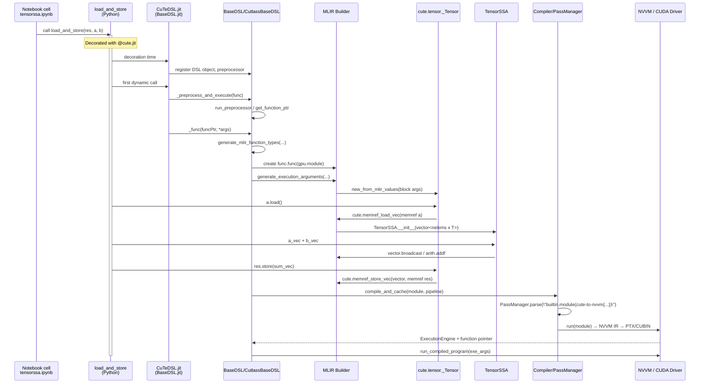
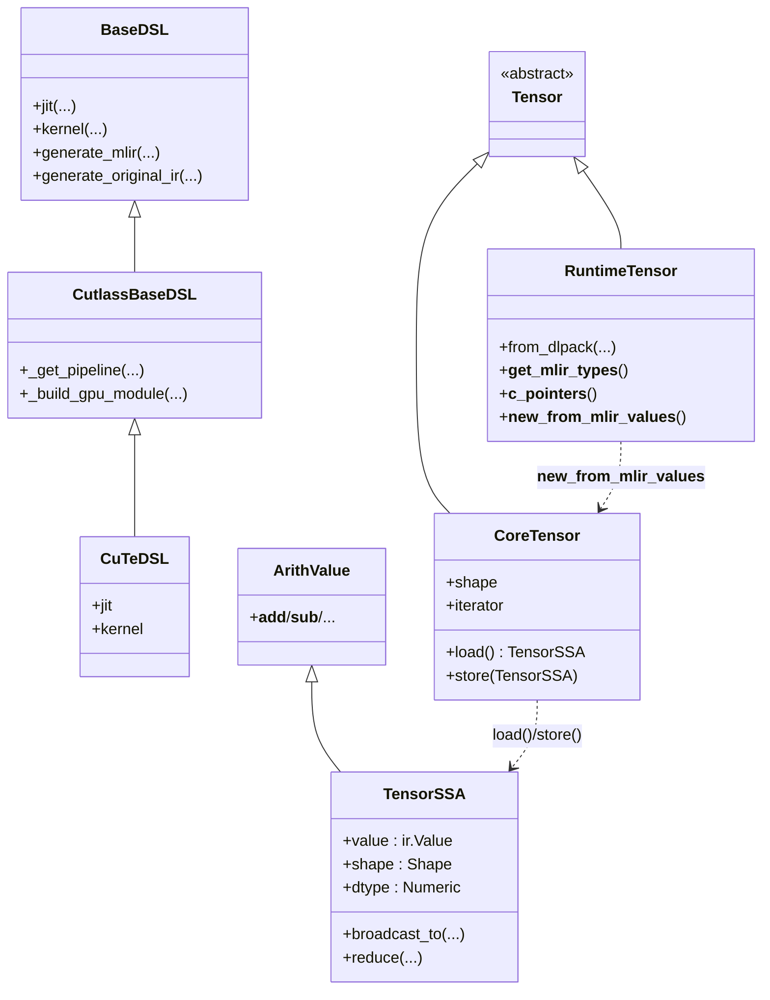

TensorSSA: Python CuTe DSL → MLIR → PTX
======================================

This document traces, frame‑by‑frame, what happens when a `TensorSSA` is created and used in CuTe DSL, using the first example from `examples/python/CuTeDSL/notebooks/tensorssa.ipynb` as the running case:

```python
@cute.jit
def load_and_store(res: cute.Tensor, a: cute.Tensor, b: cute.Tensor):
    a_vec = a.load()
    b_vec = b.load()
    res.store(a_vec + b_vec)
    cute.print_tensor(res)
```

We follow the flow:

- User code (`@cute.jit` function, `a.load()`, `a_vec + b_vec`)
- CuTe DSL parsing / AST preprocessing
- MLIR op creation (`cute.memref_load_vec`, `arith.addf`, `cute.memref_store_vec`, etc.)
- Compilation pipeline (`cute-to-nvvm` → NVVM → CUBIN/PTX)
- A minimal CUDA C++ kernel that approximates what `TensorSSA` does under the hood

All paths and line numbers are relative to the repo root (`/home/jeromeku/cutlass`).

-----------------------------------------------------------------------
Big picture: where TensorSSA fits
-----------------------------------------------------------------------

- **Runtime tensors vs. IR tensors vs. TensorSSA**
  - `from_dlpack(a)` in the notebook returns a *runtime* tensor wrapper: `cutlass.cute.runtime._Tensor` ([python/CuTeDSL/cutlass/cute/runtime.py#L118](../python/CuTeDSL/cutlass/cute/runtime.py#L118)). This wraps a DLPack tensor, owns the device pointer, and knows how to expose a `memref` descriptor to MLIR.
  - Inside JIT‑compiled functions, those runtime tensors are rewrapped as IR‑level tensors: `cutlass.cute.tensor._Tensor` ([python/CuTeDSL/cutlass/cute/tensor.py#L37](../python/CuTeDSL/cutlass/cute/tensor.py#L37)). This object is registered as a value caster for `!cute.memref` / `!cute.coord_tensor` and behaves like a CuTe tensor (`make_tensor`, `__getitem__`, `load`, `store`, etc.).
  - `TensorSSA` ([python/CuTeDSL/cutlass/cute/tensor.py#L1077](../python/CuTeDSL/cutlass/cute/tensor.py#L1077)) is a *value‑semantic, immutable* wrapper around an MLIR `vector` SSA value:
    - Holds a flattened `ir.Value` of type `vector<N x T>` and a nested CuTe `shape`.
    - Inherits `cutlass.base_dsl._mlir_helpers.arith.ArithValue` ([python/CuTeDSL/cutlass/base_dsl/_mlir_helpers/arith.py#L394](../python/CuTeDSL/cutlass/base_dsl/_mlir_helpers/arith.py#L394)), so arithmetic operators generate MLIR `arith.*` ops.
    - Represents **register‑resident, thread‑local** data: "tensor in SSA form".

- **JIT / compiler stack**
  - `cute.jit` is an alias for `CuTeDSL.jit` ([python/CuTeDSL/cutlass/cute/__init__.py#L96](../python/CuTeDSL/cutlass/cute/__init__.py#L96), [python/CuTeDSL/cutlass/cutlass_dsl/cutlass.py#L912](../python/CuTeDSL/cutlass/cutlass_dsl/cutlass.py#L912)), inheriting all behavior from `BaseDSL.jit` ([python/CuTeDSL/cutlass/base_dsl/dsl.py#L504](../python/CuTeDSL/cutlass/base_dsl/dsl.py#L504)).
  - The DSL core lives in `BaseDSL` ([python/CuTeDSL/cutlass/base_dsl/dsl.py#L273](../python/CuTeDSL/cutlass/base_dsl/dsl.py#L273)):
    - AST preprocessing + execution (`DSLPreprocessor`)
    - MLIR module construction (`generate_original_ir`, `generate_mlir`)
    - JIT argument typing (`generate_mlir_function_types`, `generate_execution_arguments`)
  - CuTe‑specific logic is in `CutlassBaseDSL` ([python/CuTeDSL/cutlass/cutlass_dsl/cutlass.py#L214](../python/CuTeDSL/cutlass/cutlass_dsl/cutlass.py#L214)):
    - Builds a `gpu.module` and CUDA kernel entries.
    - Chooses compilation pipeline: `builtin.module(cute-to-nvvm{cubin-format=bin ...})` ([cutlass.py#L244](../python/CuTeDSL/cutlass/cutlass_dsl/cutlass.py#L244)).
  - The actual compilation and JIT are driven by `Compiler` ([python/CuTeDSL/cutlass/base_dsl/compiler.py#L94](../python/CuTeDSL/cutlass/base_dsl/compiler.py#L94)) and `JitCompiledFunction` ([python/CuTeDSL/cutlass/base_dsl/jit_executor.py](../python/CuTeDSL/cutlass/base_dsl/jit_executor.py)).

-----------------------------------------------------------------------
Key files map
-----------------------------------------------------------------------

- Notebook example:
  - [examples/python/CuTeDSL/notebooks/tensorssa.ipynb](../examples/python/CuTeDSL/notebooks/tensorssa.ipynb)
- CuTe front‑end:
  - [python/CuTeDSL/cutlass/cute/__init__.py](../python/CuTeDSL/cutlass/cute/__init__.py)
  - [python/CuTeDSL/cutlass/cute/tensor.py](../python/CuTeDSL/cutlass/cute/tensor.py)
  - [python/CuTeDSL/cutlass/cute/runtime.py](../python/CuTeDSL/cutlass/cute/runtime.py)
- DSL core and JIT:
  - [python/CuTeDSL/cutlass/base_dsl/dsl.py](../python/CuTeDSL/cutlass/base_dsl/dsl.py)
  - [python/CuTeDSL/cutlass/cutlass_dsl/cutlass.py](../python/CuTeDSL/cutlass/cutlass_dsl/cutlass.py)
  - [python/CuTeDSL/cutlass/base_dsl/compiler.py](../python/CuTeDSL/cutlass/base_dsl/compiler.py)
  - [python/CuTeDSL/cutlass/base_dsl/_mlir_helpers/arith.py](../python/CuTeDSL/cutlass/base_dsl/_mlir_helpers/arith.py)
  - [python/CuTeDSL/cutlass/base_dsl/_mlir_helpers/op.py](../python/CuTeDSL/cutlass/base_dsl/_mlir_helpers/op.py)
- MLIR dialect bindings:
  - [python/CuTeDSL/cutlass/_mlir/dialects/_cute_ops_gen.py](../python/CuTeDSL/cutlass/_mlir/dialects/_cute_ops_gen.py)
  - [python/CuTeDSL/cutlass/_mlir/dialects/_arith_ops_gen.py](../python/CuTeDSL/cutlass/_mlir/dialects/_arith_ops_gen.py)

-----------------------------------------------------------------------
Key functions index
-----------------------------------------------------------------------

| Function / Class                         | File                                                        | Purpose |
|------------------------------------------|-------------------------------------------------------------|---------|
| `from_dlpack`                            | [python/CuTeDSL/cutlass/cute/runtime.py#L727](../python/CuTeDSL/cutlass/cute/runtime.py#L727)                | Wraps a DLPack‑compatible tensor in a runtime CuTe `Tensor` that can feed the JIT. |
| `Tensor.load`                            | [python/CuTeDSL/cutlass/cute/tensor.py#L430](../python/CuTeDSL/cutlass/cute/tensor.py#L430)                 | Emits `cute.memref_load_vec` and materializes a `TensorSSA`. |
| `TensorSSA`                              | [python/CuTeDSL/cutlass/cute/tensor.py#L1077](../python/CuTeDSL/cutlass/cute/tensor.py#L1077)                | Immutable register‑level tensor wrapper over an MLIR `vector` SSA value. |
| `TensorSSA.__add__`                      | [python/CuTeDSL/cutlass/cute/tensor.py#L1296](../python/CuTeDSL/cutlass/cute/tensor.py#L1296)                | Elementwise `+`, lowered to `arith.addf/addi` over the underlying `vector`. |
| `dsl_user_op`                            | [python/CuTeDSL/cutlass/base_dsl/_mlir_helpers/op.py#L22](../python/CuTeDSL/cutlass/base_dsl/_mlir_helpers/op.py#L22)    | Decorator that injects MLIR source locations into CuTe user ops. |
| `BaseDSL.jit` / `jit_runner`             | [python/CuTeDSL/cutlass/base_dsl/dsl.py#L504](../python/CuTeDSL/cutlass/base_dsl/dsl.py#L504) / [dsl.py#L464](../python/CuTeDSL/cutlass/base_dsl/dsl.py#L464)       | Implements the `@cute.jit` decorator and its wrapper. |
| `BaseDSL._func`                          | [python/CuTeDSL/cutlass/base_dsl/dsl.py#L1498](../python/CuTeDSL/cutlass/base_dsl/dsl.py#L1498)               | Entry point that builds MLIR, compiles, and runs the host function. |
| `BaseDSL.generate_mlir`                  | [python/CuTeDSL/cutlass/base_dsl/dsl.py#L1332](../python/CuTeDSL/cutlass/base_dsl/dsl.py#L1332)               | Creates MLIR module, compiles via pipeline, and returns `JitCompiledFunction` or result. |
| `BaseDSL.generate_original_ir`           | [python/CuTeDSL/cutlass/base_dsl/dsl.py#L1144](../python/CuTeDSL/cutlass/base_dsl/dsl.py#L1144)               | Builds `gpu.module` + `func.func`, calls the Python body to emit MLIR. |
| `CutlassBaseDSL._get_pipeline`           | [python/CuTeDSL/cutlass/cutlass_dsl/cutlass.py#L244](../python/CuTeDSL/cutlass/cutlass_dsl/cutlass.py#L244)         | Chooses the `cute-to-nvvm` compilation pipeline that produces CUBIN/PTX. |
| `Compiler.compile_and_jit`               | [python/CuTeDSL/cutlass/base_dsl/compiler.py#L146](../python/CuTeDSL/cutlass/base_dsl/compiler.py#L146)           | Runs the MLIR pass pipeline and creates an `ExecutionEngine` backed by NVVM. |

-----------------------------------------------------------------------
Sequence diagram: user → TensorSSA → PTX
-----------------------------------------------------------------------



-----------------------------------------------------------------------
Flowchart: data and type transformations
-----------------------------------------------------------------------

```mermaid
flowchart LR
    subgraph Host
        A[np.ndarray on device<br/>(via framework)]
        B[from_dlpack(a)<br/>runtime._Tensor]
        C[MLIR func args<br/>!cute.memref]
        D[cute.tensor._Tensor<br/>(IR wrapper)]
        E[TensorSSA<br/>vector<N x T> SSA]
        F[MLIR GPU module]
    end

    subgraph Device
        G[Global / Shared memory<br/>(PTX .global/.shared)]
        H[Registers holding vector lanes]
    end

    A -->|DLPack| B
    B -->|__get_mlir_types__| C
    C -->|generate_execution_arguments| D
    D -->|memref_load_vec| E
    E -->|arith/vector ops| E
    E -->|memref_store_vec| D
    D --> F
    F -->|cute-to-nvvm| G
    F -->|vector/arith lowering| H
    H -->|stores| G
```

-----------------------------------------------------------------------
Class diagram: Tensor, TensorSSA, and DSL classes
-----------------------------------------------------------------------



-----------------------------------------------------------------------
Frame‑by‑frame trace: creating a TensorSSA
-----------------------------------------------------------------------

We now walk every relevant frame for the `load_and_store` example.

### Frame 0: User defines `load_and_store` (`tensorssa.ipynb`)

Snippet (from cell 2 of the notebook):

```python
@cute.jit
def load_and_store(res: cute.Tensor, a: cute.Tensor, b: cute.Tensor):
    a_vec = a.load()
    b_vec = b.load()
    res.store(a_vec + b_vec)
    cute.print_tensor(res)
```

- The `cute.Tensor` annotations tell the DSL that `res`, `a`, and `b` are CuTe tensors (runtime wrappers) and should be lowered as `!cute.memref` values.
- The `@cute.jit` decorator wires this function into `CuTeDSL`:
  - `cute.jit` is an alias of `cutlass.cutlass_dsl.CuTeDSL.jit` ([python/CuTeDSL/cutlass/cute/__init__.py#L96](../python/CuTeDSL/cutlass/cute/__init__.py#L96)).
  - `CuTeDSL.jit` is inherited from `BaseDSL.jit` ([python/CuTeDSL/cutlass/base_dsl/dsl.py#L504](../python/CuTeDSL/cutlass/base_dsl/dsl.py#L504)).

### Frame 1: Decorator plumbing (`BaseDSL.jit` / `jit_runner`)

At decoration time, `BaseDSL.jit` builds a wrapper (`jit_runner` → `jit_wrapper`):

```python
class BaseDSL:
    @classmethod
    def jit(cls, *dargs, **dkwargs):                      # dsl.py:504
        frame = inspect.currentframe().f_back
        return BaseDSL.jit_runner(cls, "_func", frame, *dargs, **dkwargs)
```

- `jit_runner` (`dsl.py:464`) wraps the original function in `jit_wrapper`:
  - Attaches `_dsl_cls = CuTeDSL` to the function, so the DSL object can be lazily instantiated later.
  - Optionally records the decorator’s frame (`_decorator_frame`) for better source locations and AST preprocessing.

On first call to `load_and_store`, the wrapper does:

```python
def jit_wrapper(*args, **kwargs):                         # dsl.py:481
    func_ptr = BaseDSL._preprocess_and_execute(func)
    return getattr(func._dsl_object, executor_name)(
        func_ptr, *args, **kwargs
    )
```

- `_preprocess_and_execute` (not shown here) lazily:
  - Builds the `CuTeDSL` instance.
  - Runs the AST preprocessor so the function body becomes a MLIR‑building Python function.
- Then `executor_name="_func"` dispatches into `BaseDSL._func` on the DSL instance.

### Frame 2: Host entry `_func` – orchestrating MLIR generation

`BaseDSL._func` is the common entry point for `@cute.jit` host code ([python/CuTeDSL/cutlass/base_dsl/dsl.py#L1498](../python/CuTeDSL/cutlass/base_dsl/dsl.py#L1498)):

```python
def _func(self, funcBody, *args, **kwargs):               # dsl.py:1498
    if ir.Context.current is None:
        pass
    elif ir.InsertionPoint.current is not None:
        return funcBody(*args, **kwargs)
    ...
    pipeline = kwargs.pop("pipeline", None)
    no_cache = kwargs.pop("no_cache", False)
    compile_only = kwargs.pop("compile_only", False)
    ...
    sig = self._check_arg_count(*args, **kwargs)
    args_spec = inspect.getfullargspec(funcBody)
    canonicalized_args, canonicalized_kwargs = \
        self._canonicalize_args(sig, *args, **kwargs)
    function_name = self.mangle_name(function_name,
                                     canonicalized_args, args_spec)
    self.compile_options.apply_envar_settings(self.envar, function_name)
    ...
    result = self.generate_mlir(
        funcBody,
        canonicalized_kwargs,
        function_name,
        gpu_module_attrs,
        canonicalized_args,
        args_spec,
        pipeline,
        no_cache,
        compile_only,
        frame=decorator_frame,
    )
    return result
```

State at this frame:

- `funcBody` is the preprocessed `load_and_store`.
- `canonicalized_args` are the actual runtime `_Tensor` objects returned from `from_dlpack`.
- `compile_options` already encode any global settings (e.g. `KeepPTX`, `GPUArch`, etc.).
- Control is about to enter `generate_mlir`, which performs argument typing, IR construction, and compilation.

### Frame 3: Typing and collecting dynamic arguments (`generate_mlir`)

The start of `generate_mlir` ([python/CuTeDSL/cutlass/base_dsl/dsl.py#L1332](../python/CuTeDSL/cutlass/base_dsl/dsl.py#L1332)) is:

```python
def generate_mlir(...):
    with ir.Context(), self.get_location(frame):
        # 1) build function signature types
        exe_args, func_types, adapted_args = \
            self.generate_mlir_function_types(
                funcBody, function_name, args, kwargs, args_spec, compile_only
            )
        dynamic_args, dynamic_kwargs = self.extract_dynamic_args(
            funcBody, args, kwargs, args_spec
        )
        original_function_name = funcBody.__name__
        # 2) generate original IR and its hash
        module, module_hash, result = self.generate_original_ir(
            ir,
            func,
            funcBody,
            kwargs,
            function_name,
            func_types,
            gpu_module_attrs,
            args,
            args_spec,
            frame=frame,
        )
        ...
```

Here:

- `generate_mlir_function_types` determines the MLIR types for function parameters (including `res`, `a`, `b`).
- `generate_original_ir` will:
  - Create a `gpu.container_module` with a nested `func.func`.
  - Build a mapping from the `func.func` block arguments back to Python objects representing IR values.
  - Run `funcBody` *once* to emit all MLIR ops for `load_and_store`.

### Frame 4: From runtime tensors to `!cute.memref` types

`generate_mlir_function_types` calls `_generate_jit_func_args` ([python/CuTeDSL/cutlass/base_dsl/dsl.py#L780](../python/CuTeDSL/cutlass/base_dsl/dsl.py#L780)), which for each argument:

1. Checks if it is `Constexpr`.
2. Tries `_generate_jit_func_args_for_known_types` (overridden by `CutlassBaseDSL`).
3. Falls back to:
   - `get_mlir_types(arg)` → uses `arg.__get_mlir_types__()` when present.
   - `get_c_pointers(arg)` or `__c_pointers__()` to build the executable argument list.

Runtime CuTe tensors support `__get_mlir_types__` and `__c_pointers__`:

```python
class _Tensor(Tensor):                                    # runtime.py:118
    @property
    def mlir_type(self) -> ir.Type:                       # runtime.py:290
        return self._dltensor_wrapper.get_type(
            self.element_type.mlir_type, self._assumed_align
        )

    def __get_mlir_types__(self):
        return [self.mlir_type]                           # runtime.py:333

    @lazily_load_dltensor
    def __c_pointers__(self):
        self._memref_desc = self._dltensor_wrapper.build_memref_desc(
            self._assumed_align
        )
        return [_cute_ir.pycapsule_get_pointer(self._memref_desc)]  # runtime.py:322
```

Result at this frame:

- Each `cute.Tensor` argument (`res`, `a`, `b`) appears in the MLIR signature as a single `!cute.memref<ptr, layout>` type, with:
  - Element type = `Float32` (for the notebook examples).
  - Layout shape/stride inferred from the DLPack shape and strides.
- For host execution, the executable argument list contains a pointer to a packed memref descriptor struct matching that type.

### Frame 5: Building the `func.func` and mapping block arguments

`generate_original_ir` constructs the host function body ([python/CuTeDSL/cutlass/base_dsl/dsl.py#L1144](../python/CuTeDSL/cutlass/base_dsl/dsl.py#L1144)):

```python
def generate_original_ir(...):
    def build_ir_module():
        loc = self.get_location(frame)
        module = ir.Module.create(loc=loc)
        module.operation.attributes["gpu.container_module"] = ir.UnitAttr.get()
        with ir.InsertionPoint(module.body):
            self._build_gpu_module(gpu_module_attrs, loc=loc)
            ret_types = self.get_return_types()
            fop = func.FuncOp(function_name, (func_types, ret_types), loc=loc)
            fop.attributes["llvm.emit_c_interface"] = ir.UnitAttr.get()
            entry_block = fop.add_entry_block(arg_locs=[loc] * len(func_types))
            with ir.InsertionPoint(entry_block):
                ir_args, ir_kwargs = self.generate_execution_arguments(
                    args, kwargs, fop, args_spec
                )
                result = funcBody(*ir_args, **ir_kwargs)
                default_ret_values = self.generate_default_return_values(
                    ir.InsertionPoint.current
                )
                func.ReturnOp(default_ret_values, loc=loc)
        ...
```

Key transitions:

- `func.FuncOp` has one block with arguments matching the `!cute.memref` types we computed earlier.
- `generate_execution_arguments` (`dsl.py:596`) walks the original Python arguments (`res`, `a`, `b`) and pairs them with block arguments:

```python
def generate_execution_arguments(...):                    # dsl.py:596
    fop_args = list(fop.regions[0].blocks[0].arguments)
    ir_args, iv_block_args = gen_exec_args(
        args, args_spec.args, args_spec.annotations, fop_args
    )
    ...
```

For runtime CuTe tensors, there is no special handling in `CutlassBaseDSL._generate_execution_arguments_for_known_types`, so the base fallback applies:

```python
if not ir_arg:
    adapter = JitArgAdapterRegistry.get_registered_adapter(type(arg))
    arg = adapter(arg) if adapter else arg
    n_args = len(get_mlir_types(arg))
    blk_args = fop_args[iv_block_args : iv_block_args + n_args]
    ir_arg.append(new_from_mlir_values(arg, blk_args))
    iv_block_args += n_args
```

Now `new_from_mlir_values` sees a `runtime._Tensor` and uses its `__new_from_mlir_values__` (`runtime.py:338`):

```python
def __new_from_mlir_values__(self, values):               # runtime.py:338
    assert len(values) == 1
    assert isinstance(values[0], CoreTensor)
    return CoreTensor(values[0].value, self._dtype)
```

So **inside the MLIR‑building execution of `funcBody`**:

- `res`, `a`, and `b` are now `cutlass.cute.tensor._Tensor` instances wrapping the `func.func` block arguments (memrefs) at the IR level.

### Frame 6: `Tensor.load` – creating TensorSSA from a memref

In the body of `load_and_store`, the first MLIR‑relevant call is `a.load()`. The implementation is in `cutlass.cute.tensor._Tensor.load` ([python/CuTeDSL/cutlass/cute/tensor.py#L430](../python/CuTeDSL/cutlass/cute/tensor.py#L430)):

```python
    @dsl_user_op
    def load(self, *, loc=None, ip=None) -> "TensorSSA":
    if not is_static(self.shape):
        raise ValueError("dynamic layout doesn't support load")
    self._check_can_load_store()
    res_vect = _cute_ir.memref_load_vec(self.value, loc=loc, ip=ip)
    if self.element_type is Boolean:
        ...
    return TensorSSA(res_vect, self.shape, self.element_type)
```

Annotated behavior:

- `@dsl_user_op` ([python/CuTeDSL/cutlass/base_dsl/_mlir_helpers/op.py#L22](../python/CuTeDSL/cutlass/base_dsl/_mlir_helpers/op.py#L22)) injects a `loc` that encodes:
  - The Python filename (`tensorssa.ipynb` translated file).
  - The line/column number where `a.load()` appears.
  - A name location capturing the full statement text.
- `self.shape` and `self.element_type` are taken from the `CoreTensor` (IR `_Tensor`) wrapper:
  - Shape is the static CuTe shape; in the example, `(3, 4)`.
  - Element type is `Float32`.
- `_cute_ir.memref_load_vec(self.value, ...)` dispatches to `cute.memref_load_vec` in the generated dialect bindings ([python/CuTeDSL/cutlass/_mlir/dialects/_cute_ops_gen.py#L2544](../python/CuTeDSL/cutlass/_mlir/dialects/_cute_ops_gen.py#L2544)):

  ```python
  def memref_load_vec(src, *, row_major=None, loc=None, ip=None) -> _ods_ir.Value:
      return MemRefLoadVecOp(src=src, row_major=row_major, loc=loc, ip=ip).result
  ```

  This creates an MLIR op roughly of the form:

  ```mlir
  %vec = cute.memref.load_vec %a : (!cute.memref<...>) -> vector<12xf32>
  ```

- Finally, `TensorSSA(res_vect, self.shape, self.element_type)` constructs a new SSA tensor object.

### Frame 7: `TensorSSA.__init__` – tying MLIR vector to CuTe shape

The constructor is in [python/CuTeDSL/cutlass/cute/tensor.py#L1077](../python/CuTeDSL/cutlass/cute/tensor.py#L1077):

```python
class TensorSSA(cutlass_arith.ArithValue):                # tensor.py:1077
    def __init__(self, value, shape: Shape, dtype: Type[Numeric]):
        if not is_static(shape):
            raise ValueError("dynamic shape is not supported")
        signed = dtype.signed if issubclass(dtype, Integer) else False
        super().__init__(value, signed)
        self._shape = shape
        self._dtype = dtype
        self._layout = None
```

Important details:

- `value` is the MLIR `vector` SSA result from `cute.memref_load_vec`.
- `super().__init__(value, signed)` calls `ArithValue.__init__` (`arith.py:394`), which:
  - Wraps the raw `ir.Value` in an `ArithValue`.
  - Records whether arithmetic should be floating‑point or integer.
- `TensorSSA` stores:
  - `_shape`: nested CuTe shape tree (e.g., `(3, 4)`).
  - `_dtype`: CuTe numeric type class (e.g., `Float32`).
- Every subsequent operation (`+`, `-`, slicing, broadcasting, reduction) works against these fields and produces **new** `TensorSSA` objects:
  - SSA semantics: each operation yields a new value; no mutation.
  - The original vector is never modified; only used as input.

At this point, `a_vec` and `b_vec` in `load_and_store` are both `TensorSSA` instances, each wrapping MLIR values like `%a_vec : vector<12xf32>`.

### Frame 8: Elementwise add – `a_vec + b_vec` → `arith.addf`

The `+` operator is implemented in terms of `_apply_op` ([python/CuTeDSL/cutlass/cute/tensor.py#L1296](../python/CuTeDSL/cutlass/cute/tensor.py#L1296)):

```python
@dsl_user_op
def __add__(self, other, *, loc=None, ip=None) -> "TensorSSA":
    return self._apply_op(operator.add, other, loc=loc, ip=ip)
```

The heavy lifting is `_apply_op` (`tensor.py:1103`):

```python
def _apply_op(self, op, other, flip=False, *, loc=None, ip=None):
    if isinstance(other, (int, float, bool)) or (
        not isinstance(other, TensorSSA)
        and isinstance(other, cutlass_arith.ArithValue)
    ):
        other = as_numeric(other)

    lhs, rhs, res_type = _binary_op_type_promote(self, other)

    if not isinstance(rhs, TensorSSA):
        vect_val = vector.broadcast(lhs.type, rhs.ir_value(loc=loc, ip=ip))
        rhs = TensorSSA(vect_val, lhs.shape, lhs.dtype)

    if flip:
        lhs, rhs = rhs, lhs

    if op in (operator.lt, operator.le, operator.gt,
              operator.ge, operator.eq, operator.ne):
        res_type = Boolean

    # broadcast shapes to match
    res_shape = _infer_broadcast_shape(lhs.shape, rhs.shape)
    lhs = lhs.broadcast_to(res_shape)
    rhs = rhs.broadcast_to(res_shape)

    ...
    lhs_val = lhs.maybe_downcast()
    rhs_val = rhs.maybe_downcast()
    if issubclass(lhs.dtype, Integer):
        lhs_val = lhs_val.with_signedness(lhs.dtype.signed)
    if issubclass(rhs.dtype, Integer):
        rhs_val = rhs_val.with_signedness(rhs.dtype.signed)

    res_vect = op(lhs_val, rhs_val)
    res = TensorSSA(res_vect, lhs._shape, res_type)
    return res
```

Line‑by‑line behavior for `a_vec + b_vec` (both float32 `TensorSSA`):

1. Type promotion `_binary_op_type_promote(self, other)` chooses a common dtype (float32) and returns `lhs`, `rhs`, and `res_type`.
2. Both `lhs` and `rhs` are already `TensorSSA`; no scalar broadcast is needed.
3. `_infer_broadcast_shape(lhs.shape, rhs.shape)` checks shapes and computes a broadcasted shape; for two `(3, 4)` tensors it is `(3, 4)`.
4. `lhs.broadcast_to(res_shape)` / `rhs.broadcast_to(res_shape)` are no‑ops here.
5. `lhs_val = lhs.maybe_downcast()` / `rhs_val = rhs.maybe_downcast()` obtain `ArithValue` wrappers on top of the underlying MLIR vectors.
6. `res_vect = op(lhs_val, rhs_val)` with `op = operator.add` dispatches to `ArithValue.__add__` (`arith.py:447`):

   ```python
   @dsl_user_op
   @_binary_op
   def __add__(self, other, *, loc=None, ip=None) -> "ArithValue":
       if self.is_float:
           return arith.addf(self, other, loc=loc, ip=ip)
       else:
           return arith.addi(self, other, loc=loc, ip=ip)
   ```

   This emits an MLIR `arith.addf` if the element type is float:

   ```mlir
   %sum = arith.addf %a_vec, %b_vec : vector<12xf32>
   ```

7. Finally, `TensorSSA(res_vect, lhs._shape, res_type)` returns another SSA tensor, representing `a_vec + b_vec`.

So a single Python expression `a_vec + b_vec` becomes:

- a broadcast/shape‑check sequence in Python to compute logical shapes, followed by
- one `arith.addf` MLIR op over vector SSA values.

### Frame 9: Storing the result back – `res.store(...)`

The `store` method on IR tensors is the counterpart of `load` ([python/CuTeDSL/cutlass/cute/tensor.py#L452](../python/CuTeDSL/cutlass/cute/tensor.py#L452)):

```python
@dsl_user_op
def store(self, data: "TensorSSA", *, loc=None, ip=None):
    if not isinstance(data, TensorSSA):
        raise ValueError(f"Expected TensorSSA, but got {type(data)}")
    if not is_static(self.shape):
        raise ValueError("Dynamic layout doesn't support vectorized store")
    self._check_can_load_store()

    n_elems = size(self.shape, loc=loc, ip=ip)
    if n_elems != size(data.shape, loc=loc, ip=ip):
        raise ValueError("lhs and rhs must have the same shape, ...")

    elem_mlir_type = cutlass_arith.element_type(data.dtype.mlir_type)
    if cutlass_arith.is_narrow_precision(elem_mlir_type):
        ...

    new_data = self._cvt_to_dest(data, loc=loc, ip=ip)
    return _cute_ir.memref_store_vec(new_data, self.value, loc=loc, ip=ip)
```

Key checks and transformations:

- Ensures the tensor has a static shape and a supported address space (gmem/smem/rmem/generic) via `_check_can_load_store()`.
- Verifies the element count `n_elems` matches between the target `Tensor` and the `TensorSSA` being stored.
- `_cvt_to_dest` handles implicit upcasts and boolean packing:
  - For boolean tensors, values are stored as `i8` in memory.
  - For other types, it checks width and emits casts as needed.
- Finally emits `cute.memref_store_vec` (`_cute_ops_gen.py:2622`):

```python
def memref_store_vec(value, dst, *, row_major=None, loc=None, ip=None):
    return MemRefStoreVecOp(value=value, dst=dst, row_major=row_major, loc=loc, ip=ip)
```

Which becomes an MLIR op:

```mlir
cute.memref.store_vec %sum, %res : (!vector<12xf32>, !cute.memref<...>) -> ()
```

### Frame 10: `cute.print_tensor` – materializing TensorSSA for printing

The notebook often calls `cute.print_tensor(a_vec)` or `cute.print_tensor(res)`. The implementation supports both `Tensor` and `TensorSSA` ([python/CuTeDSL/cutlass/cute/tensor.py#L1679](../python/CuTeDSL/cutlass/cute/tensor.py#L1679)):

```python
@dsl_user_op
def print_tensor(tensor: Union[Tensor, "TensorSSA"], *, verbose: bool = False, loc=None, ip=None):
    if isinstance(tensor, TensorSSA):
        tmp = make_rmem_tensor(tensor.shape, tensor.dtype)
        tmp.store(tensor)
        tensor = tmp
    if isinstance(tensor.type, _cute_ir.MemRefType):
        ...
    _cute_ir.print_view(tensor.value, verbose=verbose, is_signed=signed, loc=loc, ip=ip)
```

When printing a `TensorSSA`:

- It creates a temporary register‑memory tensor (`make_rmem_tensor`) of the same shape and dtype.
- Stores the SSA value into that tensor via `memref_store_vec`.
- Calls the dialect helper `cute.print_view` on the memref to emit host‑side printing code in MLIR.

### Frame 11: Choosing the pipeline – `CutlassBaseDSL._get_pipeline`

Back in `BaseDSL.compile_and_cache`, the pipeline string is chosen via `_get_pipeline` ([python/CuTeDSL/cutlass/base_dsl/dsl.py#L1208](../python/CuTeDSL/cutlass/base_dsl/dsl.py#L1208) calling into [cutlass.py#L244](../python/CuTeDSL/cutlass/cutlass_dsl/cutlass.py#L244)):

```python
class CutlassBaseDSL(BaseDSL):
    def _get_pipeline(self, pipeline):                     # cutlass.py:244
        pipeline = super()._get_pipeline(pipeline)
        if pipeline is None:
            return (
                "builtin.module(cute-to-nvvm{cubin-format=bin "
                + self.compile_options.to_str()
                + "})"
            )
        return pipeline
```

So for the notebook example, unless overridden, the pipeline is roughly:

```text
builtin.module(
  cute-to-nvvm{
    cubin-format=bin
    opt-level=3
    preserve-line-info=...
    dump-ptx-path='...' (if KeepPTX enabled)
    ...
  }
)
```

The pipeline is then preprocessed to enable CUDA dialect hooks (`CutlassBaseDSL.preprocess_pipeline`, [cutlass.py#L252](../python/CuTeDSL/cutlass/cutlass_dsl/cutlass.py#L252)), resulting in `cuda-dialect` integration and external module support.

### Frame 12: Running the pass pipeline and generating PTX/CUBIN

`BaseDSL.compile_and_cache` ultimately calls `Compiler.compile_and_jit` ([python/CuTeDSL/cutlass/base_dsl/compiler.py#L146](../python/CuTeDSL/cutlass/base_dsl/compiler.py#L146)):

```python
class Compiler:
    def compile(self, module, pipeline: str, cuda_toolkit: str = "", arch: str = "", enable_verifier=False):
        pm = self.passmanager.PassManager.parse(pipeline)
        pm.enable_verifier(enable_verifier)
        pm.run(module.operation)
        ...

    def jit(self, module, opt_level: int = 2, shared_libs: Sequence[str] = ()):
        self._check_cuda_dependencies_once(shared_libs)
        return self.execution_engine.ExecutionEngine(
            module, opt_level=opt_level, shared_libs=shared_libs
        )

    def compile_and_jit(self, module, pipeline, shared_libs=(), opt_level: int = 2, cuda_toolkit: str = "", arch: str = ""):
        self.compile(module, pipeline, cuda_toolkit, arch)
        return self.jit(module, opt_level, shared_libs)
```

The `cute-to-nvvm` pipeline (implemented in the underlying C++ extension) performs:

- Canonicalization and lowering of:
  - `cute.memref_load_vec` / `cute.memref_store_vec` into standard `memref` + `vector` operations.
  - `arith.addf`/`vector.multi_reduction` into NVVM‑compatible operations.
- GPU dialect lowering:
  - `gpu.module` / `cuda.kernel` → NVVM `__global__` kernels.
- NVVM translation:
  - NVVM IR → PTX and CUBIN; the `"cubin-format=bin"` option ensures a binary cubin is embedded.
- Optional artifacts:
  - If `KeepPTX(True)` is in the compile options (or `CUTE_DSL_KEEP_PTX=1`), PTX is dumped to `<dump_dir>/<mangled_function_name>.ptx`.
  - Similarly for `KeepCUBIN`.

The resulting `ExecutionEngine` provides a symbol lookup function that `JitCompiledFunction` uses to retrieve the host‑callable function pointer. When `load_and_store` runs, the engine:

- Loads the generated cubin into the CUDA driver.
- Launches the kernel with the memref descriptors for `res`, `a`, `b`.
- On the device, the SSA vector additions from `TensorSSA` become register operations in PTX/SASS (e.g., a sequence of `FADD` instructions operating on registers that collectively implement the original `vector<12xf32>`).

-----------------------------------------------------------------------
Conceptual PTX view for TensorSSA operations
-----------------------------------------------------------------------

While the exact PTX depends on the backend, the shape is conceptually:

```mlir
%a_vec = cute.memref.load_vec %a : (!cute.memref<...>) -> vector<12xf32>
%b_vec = cute.memref.load_vec %b : (!cute.memref<...>) -> vector<12xf32>
%sum   = arith.addf %a_vec, %b_vec : vector<12xf32>
       ...
cute.memref.store_vec %sum, %res : ...
```

Lowering steps:

1. `cute.memref.load_vec` turns into a sequence of scalar/global loads (and possibly vectorized loads) into registers `%r0..%r11`.
2. `arith.addf` over `vector<12xf32>` becomes 12 scalar additions:

   ```ptx
   fadd.rn.f32  r0, a0, b0;
   fadd.rn.f32  r1, a1, b1;
   ...
   fadd.rn.f32  r11, a11, b11;
   ```

3. `cute.memref.store_vec` writes those registers back to memory.

`TensorSSA` is the high‑level object that captures this entire bundle of vector registers and their elementwise arithmetic as a single, immutable "tensor value" in the DSL.

-----------------------------------------------------------------------
Minimal CUDA C++ analog of TensorSSA behavior
-----------------------------------------------------------------------

Below is a minimal CUDA C++ kernel that approximates what `TensorSSA` does for the `load_and_store` example: load a contiguous tile into registers, perform an elementwise add in registers, then store back.

```cpp
// tensorssa_add.cu
#include <cuda_runtime.h>

// Each thread processes 4 contiguous elements using float4,
// roughly analogous to a vector<4xf32> TensorSSA.
__global__ void tensorssa_vec_add(const float* __restrict__ a,
                                  const float* __restrict__ b,
                                  float* __restrict__ c,
                                  int n) {
    int vec_idx = blockIdx.x * blockDim.x + threadIdx.x;
    int base = 4 * vec_idx;
    if (base + 3 >= n) return;

    // "Load": global → registers (float4 lives in registers)
    const float4* a4 = reinterpret_cast<const float4*>(a);
    const float4* b4 = reinterpret_cast<const float4*>(b);
    float4 va = a4[vec_idx];
    float4 vb = b4[vec_idx];

    // "TensorSSA" elementwise add in registers
    float4 vc;
    vc.x = va.x + vb.x;
    vc.y = va.y + vb.y;
    vc.z = va.z + vb.z;
    vc.w = va.w + vb.w;

    // "Store": registers → global memory
    float4* c4 = reinterpret_cast<float4*>(c);
    c4[vec_idx] = vc;
}

// Host helper
void run_tensorssa_vec_add(const float* d_a,
                           const float* d_b,
                           float* d_c,
                           int n,
                           cudaStream_t stream = 0) {
    int elems_per_thread = 4;
    int num_vec = (n + elems_per_thread - 1) / elems_per_thread;
    int block = 128;
    int grid = (num_vec + block - 1) / block;
    tensorssa_vec_add<<<grid, block, 0, stream>>>(d_a, d_b, d_c, n);
}
```

Mapping to CuTe DSL / TensorSSA:

- `float4 va` / `vb` / `vc` correspond to a small `TensorSSA` (`vector<4xf32>`) resident entirely in registers.
- The set of four `+` operations is equivalent to a single `arith.addf` on `vector<4xf32>`, which the NVVM backend expands into four scalar `FADD` instructions.
- The `reinterpret_cast<const float4*>(a)[vec_idx]` and `reinterpret_cast<float4*>(c)[vec_idx]` loads/stores are analogous to `cute.memref_load_vec` / `cute.memref_store_vec`.
- The host helper `run_tensorssa_vec_add` parallels what `JitCompiledFunction` does when launching the generated kernel:
  - Compute grid/block.
  - Call the `<<<grid, block, smem, stream>>>` launch with device pointers.

To mirror the `load_and_store` example, you would:

1. Allocate `a`, `b`, `c` on the device.
2. Copy input data from host to `a` and `b`.
3. Call `run_tensorssa_vec_add(d_a, d_b, d_c, 12)` (for a `(3, 4)` tensor).
4. Copy `c` back and print it – you will see exactly the same numerical result as `load_and_store` in the CuTe DSL tutorial.

-----------------------------------------------------------------------
Summary
-----------------------------------------------------------------------

- `TensorSSA` is the **register‑level SSA representation** of a CuTe tensor: an MLIR `vector` SSA value plus CuTe shape/dtype metadata.
- It is created primarily by `Tensor.load`, which emits a `cute.memref_load_vec` and wraps the result in `TensorSSA`.
- All arithmetic and reduction on `TensorSSA` is expressed in terms of MLIR `arith` / `vector` ops, emitted via the `ArithValue` base class and `@dsl_user_op` source‑location wrapper.
- The CuTe DSL stack (`BaseDSL` → `CutlassBaseDSL` → `CuTeDSL`) builds a `gpu.module`, emits these ops in `func.func` bodies, and runs a `cute-to-nvvm` pipeline to generate PTX/CUBIN.
- On the GPU, these vector operations become scalar register instructions very similar to the hand‑written CUDA C++ `tensorssa_vec_add` kernel above; `TensorSSA` simply gives you a structured, SSA‑friendly way to express them in Python.

-----------------------------------------------------------------------
Appendix: CuTeDSL MLIR Type Mapping
-----------------------------------------------------------------------

This appendix summarizes how the “native” types that appear in CuTeDSL map onto upstream MLIR types and dialects (as documented under the standard MLIR dialect docs). The focus is on the types that show up in the TensorSSA path: scalars, shaped types, CuTe structural types, and CUDA/GPU helper types.

### A.1 Scalar element types (CuTe numeric classes → builtin types)

CuTe numeric classes in `cutlass.base_dsl.typing` (e.g., `Float32`, `Int32`, `Uint8`) are thin wrappers around MLIR builtin integer/float types via `cutlass._mlir.extras.types` (`T`). For example:

```python
class Float32(Float, metaclass=FloatMeta, width=32, mlir_type=T.f32):  # typing.py#L1645
    ...
```

Here `T.f32()` is simply:

```python
from ..ir import F32Type
f32 = lambda: F32Type.get()                                           # types.py#L33
```

So the core mapping is:

| CuTeDSL surface type        | `T` helper                         | Upstream MLIR type (builtin dialect) |
|----------------------------|-------------------------------------|--------------------------------------|
| `cutlass.Float32`          | `T.f32()`                           | `f32` (`builtin.f32`)               |
| `cutlass.Float16`          | `T.f16()`                           | `f16`                                |
| `cutlass.Float64`          | `T.f64()`                           | `f64`                                |
| `cutlass.TFloat32` (TF32)  | `T.tf32()`                          | `!llvm.tensorfloat32`‑like float (via `FloatTF32Type`) |
| `cutlass.Int32`            | `T.i32()`                           | `i32`                                |
| `cutlass.Int64`            | `T.i64()`                           | `i64`                                |
| `cutlass.Uint8`            | `T.i8()` (unsigned in DSL metadata) | `i8` (signless)                      |
| `cutlass.Boolean`          | `T.bool()` (`i1`)                   | `i1`                                 |

All the narrow and extended float types (`Float8E5M2`, `Float4E2M1FN`, etc.) similarly map to custom float element types available in the underlying `ir` module (`Float8E5M2Type`, `Float4E2M1FNType`, …). They are treated as floats by CuTeDSL but lower to the same IR element types that the upstream NVGPU/NVVM paths understand.

### A.2 Shaped types (vector, tensor, memref)

CuTeDSL relies heavily on the helper constructors in `cutlass._mlir.extras.types` to build shaped types:

```python
from ..._mlir.extras import types as T

def vector(*shape, element_type: Type = None, ...):
    return _shaped(*shape, element_type=element_type,
                   type_constructor=partial(VectorType.get, ...))    # types.py#L60

def tensor(*shape, element_type: Type = None, encoding: str = None):
    ...
    return _shaped(*shape, element_type=element_type,
                   type_constructor=partial(RankedTensorType.get, ...))  # types.py#L80

def memref(*shape, element_type: Type = None, memory_space=None, layout=None):
    ...
    return _shaped(*shape, element_type=element_type,
                   type_constructor=partial(MemRefType.get, ...))   # types.py#L97
```

Mapping table:

| CuTeDSL usage / helper         | Underlying MLIR class              | Upstream dialect / type form            |
|--------------------------------|------------------------------------|-----------------------------------------|
| `T.vector(N, T.f32())`         | `VectorType`                       | `vector<Nxf32>` (Vector dialect type)   |
| `T.tensor(M, N, T.f32())`      | `RankedTensorType`                | `tensor<MxNxf32>` (Tensor type)         |
| `T.memref(M, N, element_type)` | `MemRefType` / `UnrankedMemRefType` | `memref<MxNxf32, ...>` (builtin memref) |

In the TensorSSA path specifically:

- `TensorSSA.value` is always an MLIR `VectorType` (e.g., `vector<12xf32>`), i.e., a standard *vector dialect* type.
- Global/shared memory views are ultimately `memref` types (via either `T.memref` in helper code or via cute‑specific wrappers described next).

### A.3 CuTe dialect structural types (`!cute.*`)

The CuTe dialect introduces higher‑level structural types that wrap pointers, layouts, and tensor descriptors. These are created primarily via `ir.Type.parse(...)` and dialect constructors in `cutlass._mlir.dialects.cute` and used by the tensor/runtime wrappers.

#### A.3.1 `!cute.layout` and `!cute.int_tuple`

`SymInt` in `cutlass.cute.typing` exposes dynamic integer tuples as a `!cute.int_tuple`:

```python
def __get_mlir_types__(self) -> List[ir.Type]:                # typing.py#L43
    res_ty = ir.Type.parse(
        f'!cute.int_tuple<"?{{i{self.width} div={self.divisibility}}}">'
    )
    return [res_ty]
```

Layouts for fake tensors are built as:

```python
layout_ty = ir.Type.parse(f'!cute.layout"{shape_str}:{stride_str}"')  # runtime.py#L471
```

Conceptually:

- `!cute.layout<"...">` encodes a nested shape/stride pair, analogous to a structured `memref` layout (like a generalized `strided_layout` attribute), but as a first‑class dialect type.
- `!cute.int_tuple<"...">` is a compact representation for shape/stride tuples that later lower to a sequence of scalar integers (`i32`/`i64`) in upstream IR.

#### A.3.2 `!cute.ptr` and `!cute.memref`

The CuTe “tensor descriptor” type combines a pointer and a layout. For fake tensors in the runtime, you can see this in `_FakeCompactTensor.mlir_type`:

```python
layout_ty = ir.Type.parse(f'!cute.layout"{shape_str}:{stride_str}"')    # runtime.py#L471
ptr_ty = _cute_ir.PtrType.get(self._dtype.mlir_type,
                              self._memspace,
                              self._assumed_align)                      # runtime.py#L472
return _cute_ir.MemRefType.get(ptr_ty, layout_ty)                      # runtime.py#L473
```

So the CuTe dialect types are:

| CuTe dialect type                 | Meaning in CuTeDSL                                  | Rough upstream lowering shape                        |
|-----------------------------------|------------------------------------------------------|------------------------------------------------------|
| `!cute.ptr<elem_ty, space, align>` | Logical pointer into a given address space with alignment | Lowers to a raw pointer / `memref` base pointer (eventually NVVM pointer or GPU address) |
| `!cute.layout<"(shape):(stride)">` | Logical layout (shape + stride)                     | Becomes a combination of integer shape/stride values |
| `!cute.memref<ptr, layout>`       | Full tensor descriptor (iterator + layout)          | Lowers to `memref<...>` with computed `strided` layout or equivalent NVVM descriptor     |
| `!cute.int_tuple<"...">`          | Hierarchical integer tuple type                     | Lowers to a tuple of integers (`i32`/`i64`)          |

In other words, `!cute.memref` is a structured view that CuTeDSL uses during high‑level IR generation; the `cute-to-nvvm` pipeline turns it into standard `memref` + arithmetic + NVVM types.

#### A.3.3 CuTe TensorSSA itself

`TensorSSA` does not introduce a new MLIR type; it is a Python wrapper over a standard `vector` SSA value:

- `TensorSSA.value` is an `ir.Value` whose `type` is `VectorType` (e.g., `vector<12xf32>`).
- The additional `shape` metadata is CuTe‑only and not encoded in the MLIR type; it is used to drive reshapes, broadcasts, and reductions using standard `vector` and `arith` ops (`vector.shape_cast`, `vector.multi_reduction`, `arith.addf`, etc.).

### A.4 CUDA / GPU / NVGPU helper types

The CuTe and Cutlass DSL layers reuse upstream `gpu`, `cuda`, and `nvgpu` dialect types. Examples that appear along the TensorSSA/JIT path:

- `cuda.KernelOp` / `cuda.FuncOp` (`python/CuTeDSL/cutlass/_mlir/dialects/cuda.py#L23`) wrap:
  - Symbol‑named functions whose `type` is an upstream `FunctionType` (from the builtin `func` dialect).
  - These eventually represent NVVM `__global__` kernels.
- `cuda.launch_ex` uses:
  - `cuda.LaunchConfigType` (a dialect type that bundles grid/block/smem/stream config).
  - Upstream `cuda.stream` type (wrapped in `StreamType.get()`).
- `gpu.launch_func` (from the upstream `gpu` dialect) uses:
  - `!gpu.async.token` for asynchronous launches.
  - Standard `index` / `i32` dimensions for grid/block sizes.
- `nvgpu.cvt_fptrunc`, `nvgpu.cvt_fpext` and `nvgpu.mma`/`nvgpu.tma` ops operate over:
  - The same scalar/vector types described above (`f16`, `f32`, `vector<...>`).
  - NVGPU‑specific descriptor types (e.g., SM90 TMA/WGMMA descriptors), which are dialect types internal to `nvgpu` and lowered further to NVVM intrinsics.

Mermaid overview of type flow (high‑level):

```mermaid
flowchart LR
    subgraph CuTeDSL Types
        A1[cutlass.Float32<br/>(T.f32 → f32)]
        A2[TensorSSA<br/>(vector<Nelements x f32>)]
        A3[!cute.memref&lt;ptr, layout&gt;]
    end

    subgraph Upstream MLIR Types
        B1[f32 / i32 / i1<br/>(builtin)]
        B2[vector&lt;Nxf32&gt;<br/>(vector)]
        B3[memref&lt;shape x f32, ...&gt;<br/>(builtin memref)]
        B4[llvm / nvvm pointer,<br/>nvgpu descriptors]
    end

    A1 -->|element_type.mlir_type| B1
    A2 -->|TensorSSA.value.type| B2
    A3 -->|cute-to-nvvm| B3
    B3 -->|NVVM lowering| B4
```

In summary:

- All scalar/element types in CuTeDSL eventually come from the same builtin MLIR integer/float types you’d use in upstream code.
- `TensorSSA` itself is “just” a wrapper over upstream `vector` types, plus CuTe shape metadata.
- CuTe dialect types (`!cute.ptr`, `!cute.layout`, `!cute.memref`, `!cute.int_tuple`) are high‑level assembly types that encapsulate pointer + layout + dynamic shape information; they are lowered to standard `memref` and scalar integer types in the `cute-to-nvvm` pass pipeline.
- CUDA/GPU/NVGPU dialect types used by CuTeDSL (`cuda.kernel`, `gpu.launch_func`, NVGPU descriptors) are the same types described in the upstream `gpu`, `cuda`, and `nvgpu` dialect documentation; CuTeDSL simply wires them together and feeds them with the CuTe‑specific tensor descriptors and `TensorSSA` vectors described in this document.
